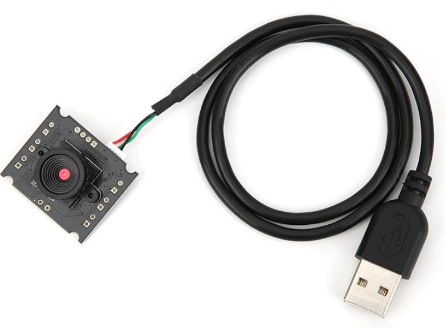
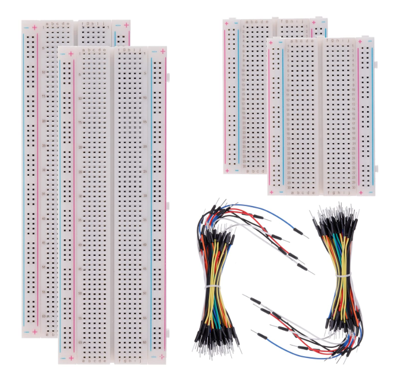
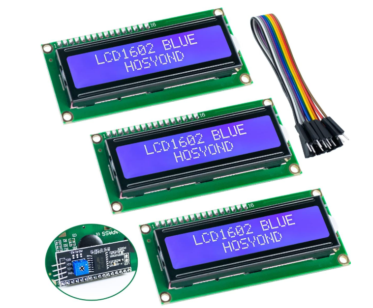
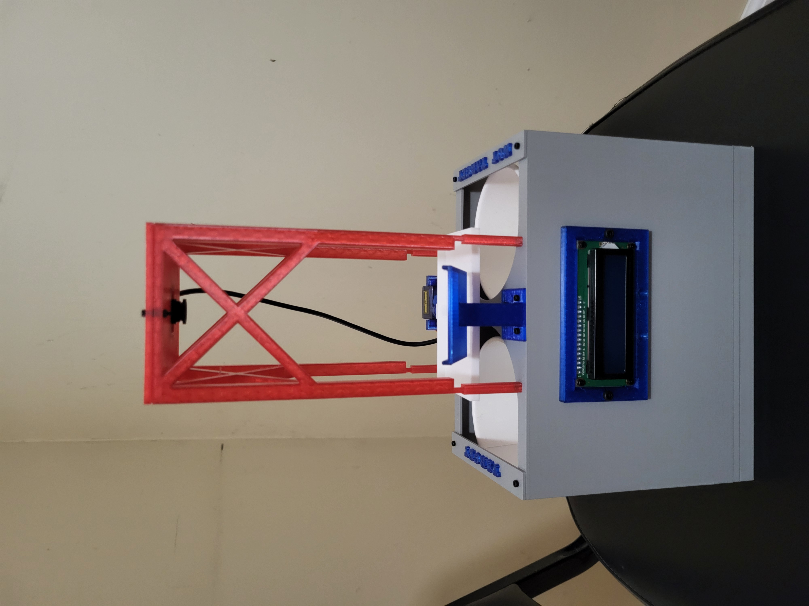
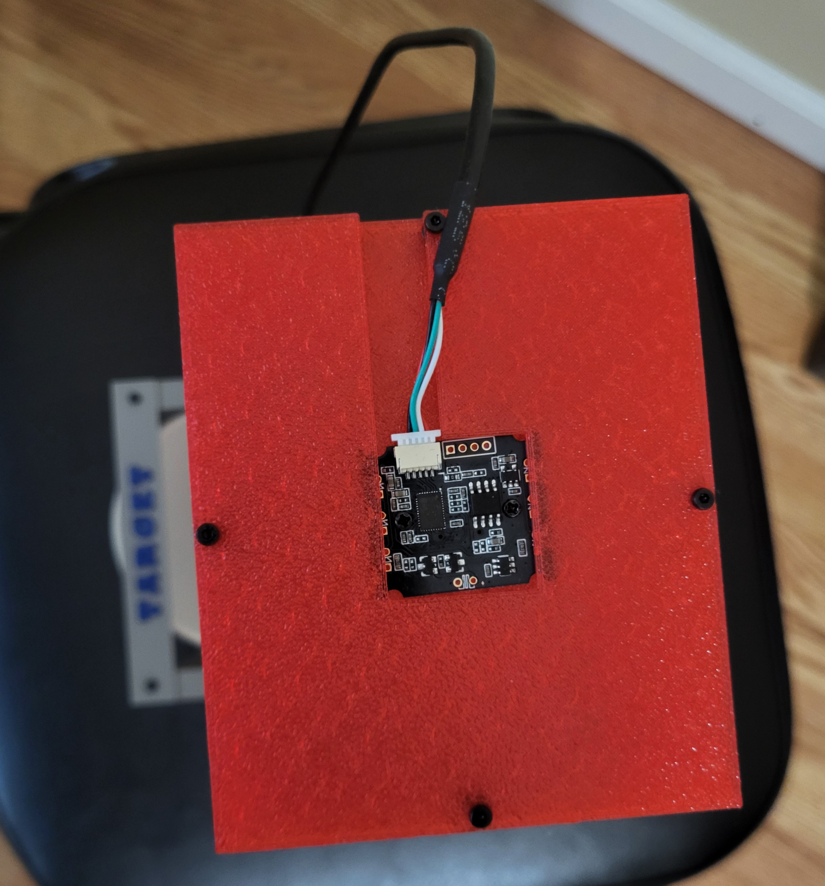
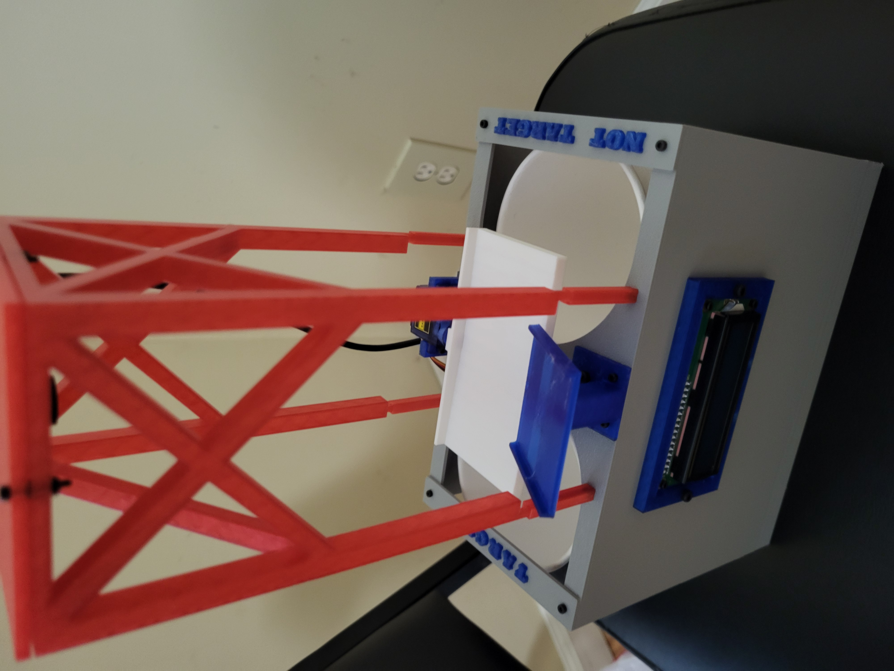
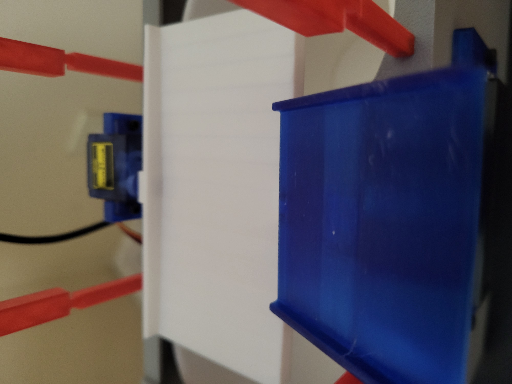
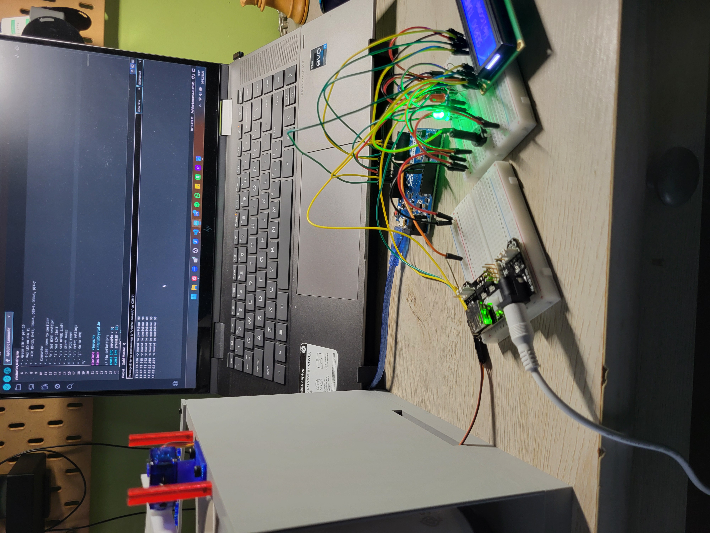
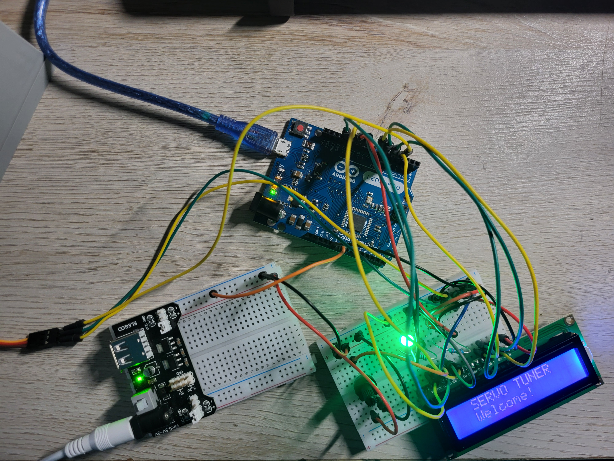
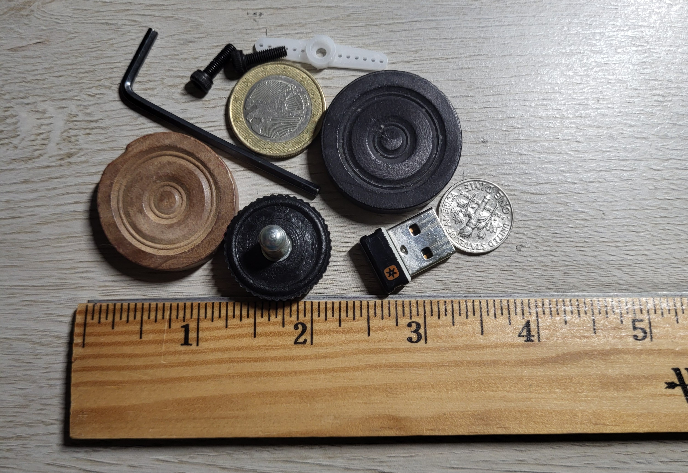

The focus for this page will be new concept path that I am going down. As a reminder, below is the concept image I had drafted when decided to go down this path of development (Note that this is the same one that appears on the Prototype Development Main Page): 


Note that there are a few changes from the concept image to the prototype:

1. **No inclusion of a gravity hopper:** As mentioned a few times across the documentation, object feeding can be considered more of a feature that is nice to have, rather than a requirement for the prototype. In addition, developing a system to feed any kind of objects that have the same relative volume is something more challenging than initially expected. Thus, it makes the most sense to focus on the object detection and sorting more than the feeding into the system, as objects can be manually fed.

2. **LCD Screen is included:** Above, an LCD screen was listed as an optional feature, however, I have decided to include it on the design. One thing to note is that the LCD working is considered lower priority as it is not important to have that working for the prototype to work.

3. **Camera Orientation:** On the concept image, the camera orientation is mounted such that objects would fall into view from up to down and along gravity and the camera would be mounted somewhere on the side to be able to see the object. Upon further reflection, it makes more sense to have the camera be top mounted. This is down to the fact that flat objects such as coins can be made more visible from above, and it won't impact the camera's ability to view other classes of objects. In hindsight, this orientation change helped, as the camera sourced for this project is very zoomed in and has a narrow FOV, which meant I had to mount the camera about 7 inches from the viewing platform. This would not have been possible if I had mounted the camera to face sideways instead of looking down at the objects. 

## Version 2.1

Below is a table of components (not including those in CAD) that need to be integrated. Note that prices are listed in USD and are reflective of those found in early October 2025. 

| Component | Picture | Estimated Unit Cost (on Amazon) |
|-------------------------------------|---------------------------------------|----------------------|
| Walfront USB Camera Module, HBV-W202012HD |  | ~$11-12 |
| MicroServo 9G (SG90) |  | ~$2 (comes in a 4 pack for ~$8) |
| Arduino Leonardo<br/> (**NOTE:** Any microcontroller can be used as long as it meets your requirements) |  | ~$25 | 
| Laptop<br/> (**NOTE:** Laptop must be able to run Python and YOLO, which requires either a decently strong CPU and/or a dedicated GPU. I have the HP ENVY x360 2-in-1 Laptop 15-ew1xxx.)<br/> See Geekbench [here](https://browser.geekbench.com/v5/cpu/22137005) for detailed info about my laptop's specs. |  | ~$800 | 
| 3.3V/5V Breadboard Power Supply Module |  | ~$1.80 (comes in a 5 pack for ~9) | 
| Breadboard and Jumper Cables (and LEDs if desired) |  | ~$10 (for full pack as pictured) | 
| 1602 LCD Screen |  | ~$4.33 (comes in a 3 pack for ~$13) | 
| AC Adapter (9V, 1A Output) |  | ~$8 | 

### Arduino/Microcontroller Pin Usage

An Arduino Leonardo has a total of 12 Digital Pins (7 of which are PWM) and 6 Analog Pins. Before thinking about the CAD, it is important to see how many pins are used for what is listed above. This provides a good baseline and is able to inform future improvements. 

[Click to view a great article that details information about the Arduino Leonardo and its pins.](https://www.etechnophiles.com/leonardo-pinout-schematic-and-specifications/)

| Electrical Component | Description | Pins required on Arduino |
|-------------------------------------|---------------------------------------|----------------------|
| Green LED | Lets user know that an object can be fed into the system for sorting | 1 Digital PWM Pin |
| Red LED | Lets user know that an object can NOT be fed into the system for sorting | 1 Digital PWM Pin |
| Servo | Rotates platform to send object to target or not target bin | 1 Digital PWM Pin | 
| LCD Screen | Lets user know status of system without having to look at Python interface; Displays stats to user at the end of sorting session | 6 Digital Pins |

One of the things I was initially considering was including a gate to physically stop objects from being fed, however that is not necessary on the prototype. Ultimately, I picked including a screen over a gate, due to constraints on pins. This can be considered another improvement that would be nice to have. 

Since most of the pins left are analog pins, this leaves room to include any sensors that may be needed should the information from the camera not be enough for the system to work properly.

### CAD

**Assembly/Subassembly CAD Videos:**

Full Assembly:

Coming soon....

Camera Mounting Subassembly: 

Coming soon....

Sorting System + Body Subassemblies: 

Coming soon....

**Picture Galleries of CAD:**

Various galleries are below to show more details about the components and subassemblies of the CAD. Click thumbnail to enlarge the images.

Camera Mounting Subassembly: 

<div id="gallery1" style="display: flex; flex-wrap: wrap; gap: 10px;"></div>

<!-- Lightbox overlay for Gallery 1 -->
<div id="lightbox1" style="display:none; position:fixed; top:0; left:0; width:100%; height:100%;
  background: rgba(0,0,0,0.9); justify-content:center; align-items:center; z-index:1000; flex-direction: column;">
  <button id="prevBtn1" style="position:absolute; left:20px; top:50%; transform:translateY(-50%); color:white; font-size:2rem; background:none; border:none; cursor:pointer;">&#10094;</button>
  
  <div id="caption1" style="color:white; margin-top:20px; text-align:center; max-width:80%; padding:0 20px;">
    <h3 id="title1" style="margin:10px 0; font-size:1.5rem;"></h3>
    <p id="desc1" style="margin:5px 0; font-size:1rem; opacity:0.9;"></p>
  </div>
  <button id="nextBtn1" style="position:absolute; right:20px; top:50%; transform:translateY(-50%); color:white; font-size:2rem; background:none; border:none; cursor:pointer;">&#10095;</button>
  <button id="closeBtn1" style="position:absolute; top:20px; right:30px; color:white; font-size:2rem; background:none; border:none; cursor:pointer;">&times;</button>
</div>

<style>
  #gallery1 img.thumb, #gallery2 img.thumb, #gallery3 img.thumb, #gallery4 img.thumb {
    width: 100%;
    height: auto;
    max-width: 200px;
    min-width: 150px;
    cursor: pointer;
    border-radius: 6px;
    transition: transform 0.2s;
    object-fit: cover;
    aspect-ratio: 4/3;
  }

  #gallery1 img.thumb:hover, #gallery2 img.thumb:hover, #gallery3 img.thumb:hover, #gallery4 img.thumb:hover {
    transform: scale(1.05);
  }

  @media (max-width: 600px) {
    #gallery1 img.thumb, #gallery2 img.thumb, #gallery3 img.thumb, #gallery4 img.thumb {
      max-width: calc(50% - 5px);
    }
    #lightbox1 img, #lightbox2 img, #lightbox3 img, #lightbox4 img {
      max-width: 95% !important;
      max-height: 60% !important;
    }
  }

  #prevBtn1, #nextBtn1, #closeBtn1, #prevBtn2, #nextBtn2, #closeBtn2, 
  #prevBtn3, #nextBtn3, #closeBtn3, #prevBtn4, #nextBtn4, #closeBtn4 {
    user-select: none;
  }

  #prevBtn1:hover, #nextBtn1:hover, #closeBtn1:hover,
  #prevBtn2:hover, #nextBtn2:hover, #closeBtn2:hover,
  #prevBtn3:hover, #nextBtn3:hover, #closeBtn3:hover,
  #prevBtn4:hover, #nextBtn4:hover, #closeBtn4:hover {
    opacity: 0.7;
  }
</style>

<script>
document.addEventListener("DOMContentLoaded", () => {
    const galleryDiv1 = document.getElementById('gallery1');
    const lightbox1 = document.getElementById('lightbox1');
    const lightboxImg1 = document.getElementById('lightbox-img1');
    const prevBtn1 = document.getElementById('prevBtn1');
    const nextBtn1 = document.getElementById('nextBtn1');
    const closeBtn1 = document.getElementById('closeBtn1');
    const title1 = document.getElementById('title1');
    const desc1 = document.getElementById('desc1');

    // MODIFY THIS: Add your images with titles and captions
    const images1 = [
        {
            src: "../assets/2.1_Camera_1.png",
            title: "Camera Frame Corner Sleeve (1 of 2)",
            caption: "Four are required. Mounts to top and allows camera frame to slide in and out."
        },
        {
            src: "../assets/2.1_Camera_2.png",
            title: "Camera Frame Corner Sleeve (2 of 2)",
            caption: "Four are required. Mounts to top and allows camera frame to slide in and out."
        },
        {
            src: "../assets/2.1_Camera_Frame_1.png",
            title: "Camera Frame (1 of 5)",
            caption: "Keeps camera steady around 7 inches above viewing platform, with hole to allow lens to go through."
        }, 
        {
            src: "../assets/2.1_Camera_Frame_2.png",
            title: "Camera Frame (2 of 5)",
            caption: "Keeps camera steady around 7 inches above viewing platform, with hole to allow lens to go through."
        }, 
        {
            src: "../assets/2.1_Camera_Frame_3.png",
            title: "Camera Frame (3 of 5)",
            caption: "Keeps camera steady around 7 inches above viewing platform, with hole to allow lens to go through."
        }, 
        {
            src: "../assets/2.1_Camera_Frame_4.png",
            title: "Camera Frame (4 of 5)",
            caption: "Keeps camera steady around 7 inches above viewing platform, with hole to allow lens to go through."
        }, 
        {
            src: "../assets/2.1_Camera_Frame_5.png",
            title: "Camera Frame (5 of 5)",
            caption: "Keeps camera steady around 7 inches above viewing platform, with hole to allow lens to go through."
        },
        {
            src: "../assets/2.1_Top_Plate_1.png",
            title: "Top Plate (1 of 3)",
            caption: "Screws onto frame to hold camera in place. Features a channel for the wired connection to go through."
        }, 
        {
            src: "../assets/2.1_Top_Plate_2.png",
            title: "Top Plate (2 of 3)",
            caption: "Screws onto frame to hold camera in place. Features a channel for the wired connection to go through."
        }, 
        {
            src: "../assets/2.1_Top_Plate_3.png",
            title: "Top Plate (3 of 3)",
            caption: "Screws onto frame to hold camera in place. Features a channel for the wired connection to go through."
        },
        {
            src: "../assets/2.1_Camera_Assembly_1.png",
            title: "Camera Mounting Subassembly (1 of 5)",
            caption: "Camera Mounting Subassembly. Mounted on top of prototype."
        },
        {
            src: "../assets/2.1_Camera_Assembly_2.png",
            title: "Camera Mounting Subassembly (2 of 5)",
            caption: "Camera Mounting Subassembly. Mounted on top of prototype."
        },
        {
            src: "../assets/2.1_Camera_Assembly_3.png",
            title: "Camera Mounting Subassembly (3 of 5)",
            caption: "Camera Mounting Subassembly. Mounted on top of prototype."
        },
        {
            src: "../assets/2.1_Camera_Assembly_4.png",
            title: "Camera Mounting Subassembly (4 of 5)",
            caption: "Camera Mounting Subassembly. Mounted on top of prototype."
        },
        {
            src: "../assets/2.1_Camera_Assembly_5.png",
            title: "Camera Mounting Subassembly (5 of 5)",
            caption: "Camera Mounting Subassembly. Mounted on top of prototype."
        }
    ];

    let currentIndex1 = 0;

    // Load thumbnails
    images1.forEach((img, i) => {
        const thumb = document.createElement('img');
        thumb.src = img.src;
        thumb.className = 'thumb';
        thumb.onclick = () => openLightbox1(i);
        galleryDiv1.appendChild(thumb);
    });

    function openLightbox1(index) {
        currentIndex1 = index;
        lightbox1.style.display = "flex";
        lightboxImg1.src = images1[currentIndex1].src;
        title1.textContent = images1[currentIndex1].title;
        desc1.textContent = images1[currentIndex1].caption;
    }

    function closeLightbox1() {
        lightbox1.style.display = "none";
    }

    function showNext1() {
        currentIndex1 = (currentIndex1 + 1) % images1.length;
        lightboxImg1.src = images1[currentIndex1].src;
        title1.textContent = images1[currentIndex1].title;
        desc1.textContent = images1[currentIndex1].caption;
    }

    function showPrev1() {
        currentIndex1 = (currentIndex1 - 1 + images1.length) % images1.length;
        lightboxImg1.src = images1[currentIndex1].src;
        title1.textContent = images1[currentIndex1].title;
        desc1.textContent = images1[currentIndex1].caption;
    }

    // Navigation
    nextBtn1.onclick = (e) => { e.stopPropagation(); showNext1(); };
    prevBtn1.onclick = (e) => { e.stopPropagation(); showPrev1(); };
    closeBtn1.onclick = closeLightbox1;

    // Close on background click
    lightbox1.onclick = (e) => {
        if (e.target === lightbox1) closeLightbox1();
    };

    // Keyboard controls
    document.addEventListener('keydown', (e) => {
        if (lightbox1.style.display === "flex") {
            if (e.key === "ArrowRight") showNext1();
            if (e.key === "ArrowLeft") showPrev1();
            if (e.key === "Escape") closeLightbox1();
        }
    });
});
</script>

<div><br></div>

Sorting System Subassembly: 

<div id="gallery2" style="display: flex; flex-wrap: wrap; gap: 10px;"></div>

<!-- Lightbox overlay for Gallery 2 -->
<div id="lightbox2" style="display:none; position:fixed; top:0; left:0; width:100%; height:100%;
  background: rgba(0,0,0,0.9); justify-content:center; align-items:center; z-index:1000; flex-direction: column;">
  <button id="prevBtn2" style="position:absolute; left:20px; top:50%; transform:translateY(-50%); color:white; font-size:2rem; background:none; border:none; cursor:pointer;">&#10094;</button>
  
  <div id="caption2" style="color:white; margin-top:20px; text-align:center; max-width:80%; padding:0 20px;">
    <h3 id="title2" style="margin:10px 0; font-size:1.5rem;"></h3>
    <p id="desc2" style="margin:5px 0; font-size:1rem; opacity:0.9;"></p>
  </div>
  <button id="nextBtn2" style="position:absolute; right:20px; top:50%; transform:translateY(-50%); color:white; font-size:2rem; background:none; border:none; cursor:pointer;">&#10095;</button>
  <button id="closeBtn2" style="position:absolute; top:20px; right:30px; color:white; font-size:2rem; background:none; border:none; cursor:pointer;">&times;</button>
</div>

<script>
document.addEventListener("DOMContentLoaded", () => {
    const galleryDiv2 = document.getElementById('gallery2');
    const lightbox2 = document.getElementById('lightbox2');
    const lightboxImg2 = document.getElementById('lightbox-img2');
    const prevBtn2 = document.getElementById('prevBtn2');
    const nextBtn2 = document.getElementById('nextBtn2');
    const closeBtn2 = document.getElementById('closeBtn2');
    const title2 = document.getElementById('title2');
    const desc2 = document.getElementById('desc2');

    // MODIFY THIS: Add your images with titles and captions
    const images2 = [
        {
            src: "../assets/2.1_Sorting_Cup_1.png",
            title: "Cup (1 of 2)",
            caption: "In CAD for modelling purposes only. Actual cup used is a styrofoam coffee cup with an approx capacity of 12-14 oz."
        },
        {
            src: "../assets/2.1_Sorting_Cup_2.png",
            title: "Cup (2 of 2)",
            caption: "In CAD for modelling purposes only. Actual cup used is a styrofoam coffee cup with an approx capacity of 12-14 oz."
        },
        {
            src: "../assets/2.1_Sorting_Cup_Base_1.png",
            title: "Cup Base (1 of 4)",
            caption: "Two are required. Used to keep base of cup in place."
        }, 
        {
            src: "../assets/2.1_Sorting_Cup_Base_2.png",
            title: "Cup Base (2 of 4)",
            caption: "Two are required. Used to keep base of cup in place."
        }, 
        {
            src: "../assets/2.1_Sorting_Cup_Base_3.png",
            title: "Cup Base (3 of 4)",
            caption: "Two are required. Used to keep base of cup in place."
        }, 
        {
            src: "../assets/2.1_Sorting_Cup_Base_4.png",
            title: "Cup Base (4 of 4)",
            caption: "Two are required. Used to keep base of cup in place."
        },
        {
            src: "../assets/2.1_Sorting_Cup_Drawer_1.png",
            title: "Cup 'Drawer' (1 of 3)",
            caption: "Two are required. Slots used to slide cup back and forth to easily access and empty cup when needed. Counterbore on bottom allows nut to be recessed and not interfere with motion."
        }, 
        {
            src: "../assets/2.1_Sorting_Cup_Drawer_2.png",
            title: "Cup 'Drawer' (2 of 3)",
            caption: "Two are required. Slots used to slide cup back and forth to easily access and empty cup when needed. Counterbore on bottom allows nut to be recessed and not interfere with motion."
        }, 
        {
            src: "../assets/2.1_Sorting_Cup_Drawer_3.png",
            title: "Cup 'Drawer' (3 of 3)",
            caption: "Two are required. Slots used to slide cup back and forth to easily access and empty cup when needed. Counterbore on bottom allows nut to be recessed and not interfere with motion."
        },
        {
            src: "../assets/2.1_Sorting_Cup_Underside_Assembly_1.png",
            title: "Cup Underside Assembly (1 of 2)",
            caption: "NOTE: White 'washer' was printed to ensure bolt would hold everything together."
        }, 
        {
            src: "../assets/2.1_Sorting_Cup_Underside_Assembly_2.png",
            title: "Cup Underside Assembly (2 of 2)",
            caption: "NOTE: White 'washer' was printed to ensure bolt would hold everything together."
        },
        {
            src: "../assets/2.1_Sorting_Platform_1.png",
            title: "Platform (1 of 6)",
            caption: "Object gets fed onto platform and it rotates to either 'Target' or 'Not Target'."
        },
        {
            src: "../assets/2.1_Sorting_Platform_2.png",
            title: "Platform (2 of 6)",
            caption: "Object gets fed onto platform and it rotates to either 'Target' or 'Not Target'."
        },
        {
            src: "../assets/2.1_Sorting_Platform_3.png",
            title: "Platform (3 of 6)",
            caption: "Object gets fed onto platform and it rotates to either 'Target' or 'Not Target'."
        },
        {
            src: "../assets/2.1_Sorting_Platform_4.png",
            title: "Platform (4 of 6)",
            caption: "Object gets fed onto platform and it rotates to either 'Target' or 'Not Target'."
        },
        {
            src: "../assets/2.1_Sorting_Platform_5.png",
            title: "Platform (5 of 6)",
            caption: "Object gets fed onto platform and it rotates to either 'Target' or 'Not Target'."
        },
        {
            src: "../assets/2.1_Sorting_Platform_6.png",
            title: "Platform (6 of 6)",
            caption: "Object gets fed onto platform and it rotates to either 'Target' or 'Not Target'."
        },
        {
            src: "../assets/2.1_Sorting_Ramp_1.png",
            title: "Ramp (1 of 5)",
            caption: "Object is manually fed from top of ramp and it goes down ramp onto platform. Ramp also has a small part to house one end of the platform to ensure platform stability."
        },
        {
            src: "../assets/2.1_Sorting_Ramp_2.png",
            title: "Ramp (2 of 5)",
            caption: "Object is manually fed from top of ramp and it goes down ramp onto platform. Ramp also has a small part to house one end of the platform to ensure platform stability."
        },
        {
            src: "../assets/2.1_Sorting_Ramp_3.png",
            title: "Ramp (3 of 5)",
            caption: "Object is manually fed from top of ramp and it goes down ramp onto platform. Ramp also has a small part to house one end of the platform to ensure platform stability."
        },
        {
            src: "../assets/2.1_Sorting_Ramp_4.png",
            title: "Ramp (4 of 5)",
            caption: "Object is manually fed from top of ramp and it goes down ramp onto platform. Ramp also has a small part to house one end of the platform to ensure platform stability."
        },
        {
            src: "../assets/2.1_Sorting_Ramp_5.png",
            title: "Ramp (5 of 5)",
            caption: "Object is manually fed from top of ramp and it goes down ramp onto platform. Ramp also has a small part to house one end of the platform to ensure platform stability."
        },
        {
            src: "../assets/2.1_Sorting_Servo_Mount_1.png",
            title: "Servo Mount (1 of 5)",
            caption: "Attaches to shell and holds servo in place."
        },
        {
            src: "../assets/2.1_Sorting_Servo_Mount_2.png",
            title: "Servo Mount (2 of 5)",
            caption: "Attaches to shell and holds servo in place."
        },
        {
            src: "../assets/2.1_Sorting_Servo_Mount_3.png",
            title: "Servo Mount (3 of 5)",
            caption: "Attaches to shell and holds servo in place."
        },
        {
            src: "../assets/2.1_Sorting_Servo_Mount_4.png",
            title: "Servo Mount (4 of 5)",
            caption: "Attaches to shell and holds servo in place."
        },
        {
            src: "../assets/2.1_Sorting_Servo_Mount_5.png",
            title: "Servo Mount (5 of 5)",
            caption: "Attaches to shell and holds servo in place."
        },
        {
            src: "../assets/2.1_Sorting_Assembly_1.png",
            title: "Sorting System Subassembly (1 of 7)",
            caption: "Full sorting subassembly images."
        },
        {
            src: "../assets/2.1_Sorting_Assembly_2.png",
            title: "Sorting System Subassembly (2 of 7)",
            caption: "Full sorting subassembly images."
        },
        {
            src: "../assets/2.1_Sorting_Assembly_3.png",
            title: "Sorting System Subassembly (3 of 7)",
            caption: "Full sorting subassembly images."
        },
        {
            src: "../assets/2.1_Sorting_Assembly_4.png",
            title: "Sorting System Subassembly (4 of 7)",
            caption: "Full sorting subassembly images."
        },
        {
            src: "../assets/2.1_Sorting_Assembly_5.png",
            title: "Sorting System Subassembly (5 of 7)",
            caption: "Full sorting subassembly images."
        },
        {
            src: "../assets/2.1_Sorting_Assembly_6.png",
            title: "Sorting System Subassembly (6 of 7)",
            caption: "Full sorting subassembly images."
        },
        {
            src: "../assets/2.1_Sorting_Assembly_7.png",
            title: "Sorting System Subassembly (7 of 7)",
            caption: "Closeup of Platform and how end sits inside ramp."
        },
    ];

    let currentIndex2 = 0;

    // Load thumbnails
    images2.forEach((img, i) => {
        const thumb = document.createElement('img');
        thumb.src = img.src;
        thumb.className = 'thumb';
        thumb.onclick = () => openLightbox2(i);
        galleryDiv2.appendChild(thumb);
    });

    function openLightbox2(index) {
        currentIndex2 = index;
        lightbox2.style.display = "flex";
        lightboxImg2.src = images2[currentIndex2].src;
        title2.textContent = images2[currentIndex2].title;
        desc2.textContent = images2[currentIndex2].caption;
    }

    function closeLightbox2() {
        lightbox2.style.display = "none";
    }

    function showNext2() {
        currentIndex2 = (currentIndex2 + 1) % images2.length;
        lightboxImg2.src = images2[currentIndex2].src;
        title2.textContent = images2[currentIndex2].title;
        desc2.textContent = images2[currentIndex2].caption;
    }

    function showPrev2() {
        currentIndex2 = (currentIndex2 - 1 + images2.length) % images2.length;
        lightboxImg2.src = images2[currentIndex2].src;
        title2.textContent = images2[currentIndex2].title;
        desc2.textContent = images2[currentIndex2].caption;
    }

    // Navigation
    nextBtn2.onclick = (e) => { e.stopPropagation(); showNext2(); };
    prevBtn2.onclick = (e) => { e.stopPropagation(); showPrev2(); };
    closeBtn2.onclick = closeLightbox2;

    // Close on background click
    lightbox2.onclick = (e) => {
        if (e.target === lightbox2) closeLightbox2();
    };

    // Keyboard controls
    document.addEventListener('keydown', (e) => {
        if (lightbox2.style.display === "flex") {
            if (e.key === "ArrowRight") showNext2();
            if (e.key === "ArrowLeft") showPrev2();
            if (e.key === "Escape") closeLightbox2();
        }
    });
});
</script>

<div><br></div>

Body Subassembly:

<div id="gallery3" style="display: flex; flex-wrap: wrap; gap: 10px;"></div>

<!-- Lightbox overlay for Gallery 3 -->
<div id="lightbox3" style="display:none; position:fixed; top:0; left:0; width:100%; height:100%;
  background: rgba(0,0,0,0.9); justify-content:center; align-items:center; z-index:1000; flex-direction: column;">
  <button id="prevBtn3" style="position:absolute; left:20px; top:50%; transform:translateY(-50%); color:white; font-size:2rem; background:none; border:none; cursor:pointer;">&#10094;</button>
  
  <div id="caption3" style="color:white; margin-top:20px; text-align:center; max-width:80%; padding:0 20px;">
    <h3 id="title3" style="margin:10px 0; font-size:1.5rem;"></h3>
    <p id="desc3" style="margin:5px 0; font-size:1rem; opacity:0.9;"></p>
  </div>
  <button id="nextBtn3" style="position:absolute; right:20px; top:50%; transform:translateY(-50%); color:white; font-size:2rem; background:none; border:none; cursor:pointer;">&#10095;</button>
  <button id="closeBtn3" style="position:absolute; top:20px; right:30px; color:white; font-size:2rem; background:none; border:none; cursor:pointer;">&times;</button>
</div>

<script>
document.addEventListener("DOMContentLoaded", () => {
    const galleryDiv3 = document.getElementById('gallery3');
    const lightbox3 = document.getElementById('lightbox3');
    const lightboxImg3 = document.getElementById('lightbox-img3');
    const prevBtn3 = document.getElementById('prevBtn3');
    const nextBtn3 = document.getElementById('nextBtn3');
    const closeBtn3 = document.getElementById('closeBtn3');
    const title3 = document.getElementById('title3');
    const desc3 = document.getElementById('desc3');

    // MODIFY THIS: Add your images with titles and captions
    const images3 = [
        {
            src: "../assets/2.1_Body_Base_1.png",
            title: "Base (1 of 3)",
            caption: "Provides extra rigidity to overall prototype. Nut sticking out from bottom will go into couterbore holes to allow system to be flush."
        },
        {
            src: "../assets/2.1_Body_Base_2.png",
            title: "Base (2 of 3)",
            caption: "Provides extra rigidity to overall prototype. Nut sticking out from bottom will go into couterbore holes to allow system to be flush."
        },
        {
            src: "../assets/2.1_Body_Base_3.png",
            title: "Base (3 of 3)",
            caption: "Provides extra rigidity to overall prototype. Nut sticking out from bottom will go into couterbore holes to allow system to be flush."
        },
        {
            src: "../assets/2.1_Body_Bottom_1.png",
            title: "Bottom (1 of 3)",
            caption: "Provides mounting points for shell and provides pins for pin-slot mechanism to allow cup 'drawers' to move."
        },
        {
            src: "../assets/2.1_Body_Bottom_2.png",
            title: "Bottom (2 of 3)",
            caption: "Provides mounting points for shell and provides pins for pin-slot mechanism to allow cup 'drawers' to move."
        },
        {
            src: "../assets/2.1_Body_Bottom_3.png",
            title: "Bottom (3 of 3)",
            caption: "Provides mounting points for shell and provides pins for pin-slot mechanism to allow cup 'drawers' to move."
        },
        {
            src: "../assets/2.1_Body_Labels_1.png",
            title: "Bin Label Plates (1 of 1)",
            caption: "Two are used, remain optional to design. Labels bin to avoid confusion. NOTE: Text for labels was added in Bambu Studio (slicing software) and .3mf file is provided later on this page."
        },
        {
            src: "../assets/2.1_Body_LCD_Holder_1.png",
            title: "LCD Screen Frame (1 of 3)",
            caption: "Mounts LCD Screen to shell and provides space to accomodate green and red LEDs."
        },
        {
            src: "../assets/2.1_Body_LCD_Holder_2.png",
            title: "LCD Screen Frame (2 of 3)",
            caption: "Mounts LCD Screen to shell and provides space to accomodate green and red LEDs."
        },
        {
            src: "../assets/2.1_Body_LCD_Holder_3.png",
            title: "LCD Screen Frame (3 of 3)",
            caption: "Mounts LCD Screen to shell and provides space to accomodate green and red LEDs."
        },
        {
            src: "../assets/2.1_Body_Shell_1.png",
            title: "Shell (1 of 7)",
            caption: "Provides height to system, mounting points, and wire routing for servo wires."
        },
        {
            src: "../assets/2.1_Body_Shell_2.png",
            title: "Shell (2 of 7)",
            caption: "Provides height to system, mounting points, and wire routing for servo wires."
        },
        {
            src: "../assets/2.1_Body_Shell_3.png",
            title: "Shell (3 of 7)",
            caption: "Provides height to system, mounting points, and wire routing for servo wires."
        },
        {
            src: "../assets/2.1_Body_Shell_4.png",
            title: "Shell (4 of 7)",
            caption: "Provides height to system, mounting points, and wire routing for servo wires."
        },
        {
            src: "../assets/2.1_Body_Shell_5.png",
            title: "Shell (5 of 7)",
            caption: "Provides height to system, mounting points, and wire routing for servo wires."
        },
        {
            src: "../assets/2.1_Body_Shell_6.png",
            title: "Shell (6 of 7)",
            caption: "Provides height to system, mounting points, and wire routing for servo wires."
        },
        {
            src: "../assets/2.1_Body_Shell_7.png",
            title: "Shell (7 of 7)",
            caption: "Provides height to system, mounting points, and wire routing for servo wires."
        },
        {
            src: "../assets/2.1_Body_Assembly_1.png",
            title: "Body Subassembly (1 of 7)",
            caption: "Pictures of fully assembled body in CAD."
        },
        {
            src: "../assets/2.1_Body_Assembly_2.png",
            title: "Body Subassembly (2 of 7)",
            caption: "Pictures of fully assembled body in CAD."
        },
        {
            src: "../assets/2.1_Body_Assembly_3.png",
            title: "Body Subassembly (3 of 7)",
            caption: "Pictures of fully assembled body in CAD."
        },
        {
            src: "../assets/2.1_Body_Assembly_4.png",
            title: "Body Subassembly (4 of 7)",
            caption: "Pictures of fully assembled body in CAD."
        },
        {
            src: "../assets/2.1_Body_Assembly_5.png",
            title: "Body Subassembly (5 of 7)",
            caption: "Pictures of fully assembled body in CAD."
        },
        {
            src: "../assets/2.1_Body_Assembly_6.png",
            title: "Body Subassembly (6 of 7)",
            caption: "Pictures of fully assembled body in CAD."
        },
        {
            src: "../assets/2.1_Body_Assembly_7.png",
            title: "Body Subassembly (7 of 7)",
            caption: "Pictures of fully assembled body in CAD."
        }
    ];

    let currentIndex3 = 0;

    // Load thumbnails
    images3.forEach((img, i) => {
        const thumb = document.createElement('img');
        thumb.src = img.src;
        thumb.className = 'thumb';
        thumb.onclick = () => openLightbox3(i);
        galleryDiv3.appendChild(thumb);
    });

    function openLightbox3(index) {
        currentIndex3 = index;
        lightbox3.style.display = "flex";
        lightboxImg3.src = images3[currentIndex3].src;
        title3.textContent = images3[currentIndex3].title;
        desc3.textContent = images3[currentIndex3].caption;
    }

    function closeLightbox3() {
        lightbox3.style.display = "none";
    }

    function showNext3() {
        currentIndex3 = (currentIndex3 + 1) % images3.length;
        lightboxImg3.src = images3[currentIndex3].src;
        title3.textContent = images3[currentIndex3].title;
        desc3.textContent = images3[currentIndex3].caption;
    }

    function showPrev3() {
        currentIndex3 = (currentIndex3 - 1 + images3.length) % images3.length;
        lightboxImg3.src = images3[currentIndex3].src;
        title3.textContent = images3[currentIndex3].title;
        desc3.textContent = images3[currentIndex3].caption;
    }

    // Navigation
    nextBtn3.onclick = (e) => { e.stopPropagation(); showNext3(); };
    prevBtn3.onclick = (e) => { e.stopPropagation(); showPrev3(); };
    closeBtn3.onclick = closeLightbox3;

    // Close on background click
    lightbox3.onclick = (e) => {
        if (e.target === lightbox3) closeLightbox3();
    };

    // Keyboard controls
    document.addEventListener('keydown', (e) => {
        if (lightbox3.style.display === "flex") {
            if (e.key === "ArrowRight") showNext3();
            if (e.key === "ArrowLeft") showPrev3();
            if (e.key === "Escape") closeLightbox3();
        }
    });
});
</script>

<div><br></div>

Full Assembly: 

<div id="gallery4" style="display: flex; flex-wrap: wrap; gap: 10px;"></div>

<!-- Lightbox overlay for Gallery 4 -->
<div id="lightbox4" style="display:none; position:fixed; top:0; left:0; width:100%; height:100%;
  background: rgba(0,0,0,0.9); justify-content:center; align-items:center; z-index:1000; flex-direction: column;">
  <button id="prevBtn4" style="position:absolute; left:20px; top:50%; transform:translateY(-50%); color:white; font-size:2rem; background:none; border:none; cursor:pointer;">&#10094;</button>
  
  <div id="caption4" style="color:white; margin-top:20px; text-align:center; max-width:80%; padding:0 20px;">
    <h3 id="title4" style="margin:10px 0; font-size:1.5rem;"></h3>
    <p id="desc4" style="margin:5px 0; font-size:1rem; opacity:0.9;"></p>
  </div>
  <button id="nextBtn4" style="position:absolute; right:20px; top:50%; transform:translateY(-50%); color:white; font-size:2rem; background:none; border:none; cursor:pointer;">&#10095;</button>
  <button id="closeBtn4" style="position:absolute; top:20px; right:30px; color:white; font-size:2rem; background:none; border:none; cursor:pointer;">&times;</button>
</div>

<script>
document.addEventListener("DOMContentLoaded", () => {
    const galleryDiv4 = document.getElementById('gallery4');
    const lightbox4 = document.getElementById('lightbox4');
    const lightboxImg4 = document.getElementById('lightbox-img4');
    const prevBtn4 = document.getElementById('prevBtn4');
    const nextBtn4 = document.getElementById('nextBtn4');
    const closeBtn4 = document.getElementById('closeBtn4');
    const title4 = document.getElementById('title4');
    const desc4 = document.getElementById('desc4');

    // MODIFY THIS: Add your images with titles and captions
    const images4 = [
        {
            src: "../assets/2.1_Full_2.png",
            title: "Full Assembly of Version 2.1 (1 of 5)",
            caption: "Fully assembled version in CAD with semi-accurate color to filament being used to 3D print it."
        },
        {
            src: "../assets/2.1_Full_3.png",
            title: "Full Assembly of Version 2.1 (2 of 5)",
            caption: "Fully assembled version in CAD with semi-accurate color to filament being used to 3D print it."
        },
        {
            src: "../assets/2.1_Full_4.png",
            title: "Full Assembly of Version 2.1 (3 of 5)",
            caption: "Fully assembled version in CAD with semi-accurate color to filament being used to 3D print it."
        },
        {
            src: "../assets/2.1_Full_5.png",
            title: "Full Assembly of Version 2.1 (4 of 5)",
            caption: "Fully assembled version in CAD with semi-accurate color to filament being used to 3D print it."
        },
        {
            src: "../assets/2.1_Full_1.png",
            title: "Full Assembly of Version 2.1 (5 of 5)",
            caption: "Fully assembled version in CAD with semi-accurate color to filament being used to 3D print it."
        }
    ];

    let currentIndex4 = 0;

    // Load thumbnails
    images4.forEach((img, i) => {
        const thumb = document.createElement('img');
        thumb.src = img.src;
        thumb.className = 'thumb';
        thumb.onclick = () => openLightbox4(i);
        galleryDiv4.appendChild(thumb);
    });

    function openLightbox4(index) {
        currentIndex4 = index;
        lightbox4.style.display = "flex";
        lightboxImg4.src = images4[currentIndex4].src;
        title4.textContent = images4[currentIndex4].title;
        desc4.textContent = images4[currentIndex4].caption;
    }

    function closeLightbox4() {
        lightbox4.style.display = "none";
    }

    function showNext4() {
        currentIndex4 = (currentIndex4 + 1) % images4.length;
        lightboxImg4.src = images4[currentIndex4].src;
        title4.textContent = images4[currentIndex4].title;
        desc4.textContent = images4[currentIndex4].caption;
    }

    function showPrev4() {
        currentIndex4 = (currentIndex4 - 1 + images4.length) % images4.length;
        lightboxImg4.src = images4[currentIndex4].src;
        title4.textContent = images4[currentIndex4].title;
        desc4.textContent = images4[currentIndex4].caption;
    }

    // Navigation
    nextBtn4.onclick = (e) => { e.stopPropagation(); showNext4(); };
    prevBtn4.onclick = (e) => { e.stopPropagation(); showPrev4(); };
    closeBtn4.onclick = closeLightbox4;

    // Close on background click
    lightbox4.onclick = (e) => {
        if (e.target === lightbox4) closeLightbox4();
    };

    // Keyboard controls
    document.addEventListener('keydown', (e) => {
        if (lightbox4.style.display === "flex") {
            if (e.key === "ArrowRight") showNext4();
            if (e.key === "ArrowLeft") showPrev4();
            if (e.key === "Escape") closeLightbox4();
        }
    });
});
</script>

<div><br></div>


### Prototype Production

A total of 5 colors were used throughout the printing process. I am listing the color as well as the brand and type of filament.

1. White (Bambu Lab PLA Basic)
2. Black (Bambu Lab PLA Basic)
3. Light Grey (Bambu Lab PLA Basic)
4. Transparent Red (SUNLU Transparent PLA)
5. Transparent Blue (SUNLU Transparent PLA)

Most of the slicing settings are pretty much left untouched, however, there are some notable settings that I used:

* **Infill Pattern:** Gyroid
* **Infill Density:** 15% (can probably go as low as 7-10%)
* **Wall Loops:** 2
* **Supports:** Normal supports with default settings (not tree supports)

Everything else was left as the default settings found in Bambu Studio.

Below are some details that summarizes all relevant details after slicing in Bambu Studio:

**Total Filament Usage (Including Supports):**

| Color | Filament Used|
|-----------------------------------------|-----------------------|
| White | 18.76 g |
| Black | 35.00 g |
| Light Grey | 288.22 g |
| Transparent Red | 91.41 g |
| Transparent Blue | 31.82 g |
|  |  |
| **Total** | **465.20 g** |

**Costs:**

Regardless of actual filament, assume that all filament is acquired at the rate of $23/kg, which is similar to how much Bambu Lab PLA Basic filament costs. 

Total Cost = $0.023/g * 465.20 g = **$10.70**

**Time:** 

Total time spent printing is calculated at 13 hours 56 minutes (across 7 plates) according to Bambu Studio using default settings for speed.

### Assembly

Below are a few tables that show a list of components and hardware required:

| 3D Printed Part | Subsystem | Quantity |
|----------------------------------|-----------------------|------------------|
| Camera Frame Corner Sleeve | Camera Mounting | 4 |
| Camera Frame | Camera Mounting | 1 |
| Top Plate | Camera Mounting | 1 |
| 12-14oz Coffee Cup | Sorting | 2 |
| Cup Base | Sorting | 2 |
| Cup 'Washer' | Sorting | 2 |
| Cup 'Drawer' | Sorting | 2 |
| Platform | Sorting | 1 |
| Ramp | Sorting | 1 |
| Servo Mount | Sorting | 1 |
| Platform | Sorting | 1 |
| Base | Body | 1 |
| Bottom | Body | 1 |
| Bin Label Plates | Body | 2 |
| LCD Screen Frame | Body | 1 |
| Shell | Body | 1 |

| Electrical Component | Quantity | Purpose |
|----------------------------------|-----------------------|------------------|
| 1602 LCD Scren | 1 | Display key information and statistics to user |
| Green LED | 1 | Tells user object can be fed |
| Red LED | 1 | Tells user objects can NOT be fed |
| 10kΩ Potentiometer | 1 | Controls screen brightness |
| MicroServo 9G (SG90) | 1 | Rotate platform to move object for sorting into 'Target' or 'Not Target' bin |
| Walfront Camera Module | 1 | External USB Camera to provide view of object for YOLO to process |
| Arduino Leonardo | 1 | Communicates back and forth with Python app to perform key functions |
| Breadboard | 1 | Connects Arduino to External Power Source |
| Breadboard Power Supply Module + AC Adapter | 1 | Powers Servo, LCD Screen, and Arduino to take load off of Arduino and Laptop |
| M-M Breadboard Jumper Cables | Many | Creates electrical connection between components, power source, and Arduino pins without soldering |
| F-M Breadboard Jumper Cables | Many | Creates electrical connection between components, power source, and Arduino pins without soldering |


| Quantity x Screw Size | Purpose |
|----------------------------------|-----------------------|
| 4 x M3 | Mounts Shell to Bottom; Threads + Nut Sticking out sits flush with base |
| 2 x M3 | Mounts LCD Screen Frame to Shell |
| 4 x M2 | Mounts 1602 LCD Screen to LCD Screen Frame |
| 2 x M3 | Mount Cup Washer + Cup Base + Cup 'Drawer' |
| 4 x M2 | Mount Bin Labels to Top of Shell |
| 6 x M2 <br/> 2 x M3 | Mount Ramp to Top of Shell (not all M2 screws needed; I used 2 x M3 and 2 x M2) |
| 2 x M3 | Mount Servo Mount to Top of Shell |
| 2 x M2 | Mount Servo to Servo Mount |
| 4 x M2 | Mount Camera Frame Corner Sleeve to Top of Shell |
| 4 x M2 | Mount Top Plate to Camera Frame |

**Quick Assembly Notes:**

1) The end of the Platform that has the shaft sticking out had to be sanded/filed down slightly in my case.

2) The holes on the LCD Screen Frame were originally intended to accomodate four M3 screws to hold the screen, but actually work better using four M2 screws.

3) The Camera does not slot in anywhere, but it is instead sanwiched between the Camera Frame and Top Plate to keep it held in place. 

**Pictures (electronics not wired and LEDs not installed):**

<div class="image-grid" markdown>











</div>

Feel free to print this out yourself! Use the .3mf if you have a slicing software that can run it, otherwise I have included the stl/step files needed. Note that the zip files will require you to manually add the names of the bins to the bin labels.

<div align="center">
  <a class="md-button md-button--primary" href="assets/YOLO Object Sorter Version 2.0.3mf" download>
    Download 3MF
  </a>
  <a class="md-button md-button--primary" href="assets/Object Sorter STL Files.zip" download>
    Download STL/STEP ZIP
  </a>
</div>


### Wiring

Below is a wiring diagram: 


### Testing

Note that this section refers to testing beyond any fit checks and clearances between any hardware, holes, etc present while assembling the prototype. In other words, the prototype is FULLY assembled by this point and theoretically, if the Arduino code was inputted for the final product, then the system would run (i.e. no wiring changes, etc).

Before moving on to final integration, the prototype must be tested for a few things to see how it works. This is to ensure that a proof of concept for a strong path forward before working on a more advanced version of the software and integration. 

Here is a list of components and/or systems that MUST function properly to ensure that the full prototype works properly:

* Green LED
* Red LED
* 1602 LCD Screen
* Servo + Platform

The most effective way to test everything at once is to write some code that covers across all components. The code is included below, but first, here are some of the features of the code:

1. Green and Red LEDs are constantly blinking every couple seconds to ensure those are working properly.
2. LCD Screen displays a welcome message and displays the angle that the servo motor is at.
3. Servo and Platform rotation is tracked and can be calibrated so the correct servo angles can be inputted into the final code. Also, platform must be tested to ensure objects can actually fall into both cups for sorting, which is done manually now since the camera is not connected to YOLO.

Code below:

``` cpp title="electronics_testing.ino" linenums="1"
/*
 * Servo Position Tuner with LED & LCD - Arduino Leonardo
 * 
 * Hardware:
 * - Servo on pin 3
 * - Green LED on pin 10
 * - Red LED on pin 11
 * - LCD: RS=13, E=12, DB4=4, DB5=5, DB6=6, DB7=7
 * 
 * Commands:
 * - 0-180: Move to position
 * - 'h': Set HOME position
 * - 'l': Set LOW limit
 * - 'u': Set UPPER limit
 * - 's': Start sweep
 * - 'x': Stop sweep
 * - 'p': Print settings
 * - 'g': Go to HOME
 * - 'o': Go to LOWER LIMIT
 * - 'i': Go to UPPER LIMIT
 */

#include <Servo.h>
#include <LiquidCrystal.h>

// Pin definitions
const int servoPin = 3;
const int greenLED = 10;
const int redLED = 11;

// LCD: RS, E, D4, D5, D6, D7
LiquidCrystal lcd(13, 12, 4, 5, 6, 7);

Servo myServo;

// Position variables
int currentPos = 90;
int homePos = 90;
int lowLimit = 0;
int upperLimit = 180;

// Sweep variables
bool isSweeping = false;
int sweepDirection = 1;
int sweepSpeed = 15;

// LED timing
unsigned long lastLEDToggle = 0;
bool greenState = true;

// Display state
bool showingWelcome = true;

void setup() {
  Serial.begin(9600);
  
  // Setup LEDs
  pinMode(greenLED, OUTPUT);
  pinMode(redLED, OUTPUT);
  digitalWrite(greenLED, HIGH);
  digitalWrite(redLED, LOW);
  
  // Setup servo
  myServo.attach(servoPin);
  delay(100);
  myServo.write(currentPos);
  
  // Setup LCD
  lcd.begin(16, 2);
  delay(50);
  lcd.clear();
  lcd.setCursor(0, 0);
  lcd.print("  SERVO TUNER");
  lcd.setCursor(0, 1);
  lcd.print("  Welcome!");
  
  Serial.println("=== Servo Position Tuner ===");
  Serial.println("Commands:");
  Serial.println("  0-180: Move to position");
  Serial.println("  h: Set HOME position");
  Serial.println("  l: Set LOW limit");
  Serial.println("  u: Set UPPER limit");
  Serial.println("  s: Start sweep");
  Serial.println("  x: Stop sweep");
  Serial.println("  p: Print settings");
  Serial.println("  g: Go to HOME");
  Serial.println("  i: Go to UPPER limit");
  Serial.println("  o: Go to LOWER limit");
  Serial.println("===========================");
  printSettings();
}

void loop() {
  // Handle LED blinking (every 1 second)
  unsigned long currentMillis = millis();
  if (currentMillis - lastLEDToggle >= 1000) {
    lastLEDToggle = currentMillis;
    greenState = !greenState;
    
    if (greenState) {
      digitalWrite(greenLED, HIGH);
      digitalWrite(redLED, LOW);
    } else {
      digitalWrite(greenLED, LOW);
      digitalWrite(redLED, HIGH);
    }
  }
  
  // Handle sweeping
  if (isSweeping) {
    currentPos += sweepDirection;
    
    if (currentPos >= upperLimit) {
      currentPos = upperLimit;
      sweepDirection = -1;
    } else if (currentPos <= lowLimit) {
      currentPos = lowLimit;
      sweepDirection = 1;
    }
    
    myServo.write(currentPos);
    updateLCD();
    delay(sweepSpeed);
  }
  
  // Handle serial commands
  if (Serial.available() > 0) {
    String input = Serial.readStringUntil('\n');
    input.trim();
    
    if (input.length() == 0) return;
    
    // Switch from welcome to angle display on first command
    if (showingWelcome) {
      showingWelcome = false;
      updateLCD();
    }
    
    char cmd = input.charAt(0);
    
    // Check if it's a number
    if (isDigit(cmd)) {
      int pos = input.toInt();
      if (pos >= 0 && pos <= 180) {
        isSweeping = false;
        currentPos = pos;
        myServo.write(currentPos);
        updateLCD();
        Serial.print("Moved to position: ");
        Serial.println(currentPos);
      } else {
        Serial.println("Position must be 0-180");
      }
    }
    // Handle letter commands
    else {
      switch (cmd) {
        case 'h':
        case 'H':
          homePos = currentPos;
          Serial.print("HOME set to: ");
          Serial.println(homePos);
          break;
          
        case 'l':
        case 'L':
          lowLimit = currentPos;
          Serial.print("LOW limit set to: ");
          Serial.println(lowLimit);
          break;
          
        case 'u':
        case 'U':
          upperLimit = currentPos;
          Serial.print("UPPER limit set to: ");
          Serial.println(upperLimit);
          break;
          
        case 's':
        case 'S':
          isSweeping = true;
          sweepDirection = 1;
          Serial.println("Sweeping started");
          break;
          
        case 'x':
        case 'X':
          isSweeping = false;
          Serial.println("Sweeping stopped");
          break;
          
        case 'p':
        case 'P':
          printSettings();
          break;
          
        case 'g':
        case 'G':
          isSweeping = false;
          currentPos = homePos;
          myServo.write(currentPos);
          updateLCD();
          Serial.print("Moved to HOME: ");
          Serial.println(homePos);
          break;
          
        case 'i':
        case 'I':
          isSweeping = false;
          currentPos = upperLimit;
          myServo.write(currentPos);
          updateLCD();
          Serial.print("Moved to UPPER limit: ");
          Serial.println(upperLimit);
          break;
          
        case 'o':
        case 'O':
          isSweeping = false;
          currentPos = lowLimit;
          myServo.write(currentPos);
          updateLCD();
          Serial.print("Moved to LOWER limit: ");
          Serial.println(lowLimit);
          break;
          
        default:
          Serial.println("Unknown command");
      }
    }
  }
}

void updateLCD() {
  lcd.clear();
  lcd.setCursor(0, 0);
  lcd.print("SERVO ANGLE:");
  lcd.setCursor(0, 1);
  lcd.print(currentPos);
}

void printSettings() {
  Serial.println("\n--- Current Settings ---");
  Serial.print("Current Position: ");
  Serial.println(currentPos);
  Serial.print("HOME Position: ");
  Serial.println(homePos);
  Serial.print("LOW Limit: ");
  Serial.println(lowLimit);
  Serial.print("UPPER Limit: ");
  Serial.println(upperLimit);
  Serial.print("Sweeping: ");
  Serial.println(isSweeping ? "YES" : "NO");
  Serial.println("------------------------\n");
}
```

Below is some images and a video of how the electronics test was assembled. Note that it was not assembled on the actual prototype for two reasons:

1) To make sure the concept actually works before fully assembling it and wiring it together.

2) At the time of testing, I didn't have the necessary jumper cables to do a proof of concept test on the actual prototype. This meant that I couldn't assemble it on the actual product just yet, but I was able to test all electronics to see if it was working.

It is also important to note that some may experience difficulties with assembly and/or testing. There are generally two types of issues, one of which is software issues, and the other of which is hardware issues. Common software issues usually fall under either a code that has bugs or code that has faulty logic, both of which can still occur despite using AI tools for coding. Common hardware issues include the following: damaged Arduino pins, faulty chip on the Arduino, loose connections, faulty wires, faulty wiring, faulty breadboard, etc. The only major problem I had with the wiring was actually a faulty breadboard, which meant I had to rewire the entire circuit on a different breadboard. 


<div class="image-grid" markdown>





</div>

<div class="video-wrapper">
  <iframe 
    src="https://www.youtube.com/embed/MREHpypb1wQ?mute=1&rel=0&playsinline=1"
    title="Test Setup"
    frameborder="0"
    allow="autoplay; encrypted-media"
    allowfullscreen>
  </iframe>
</div>

<div class="video-caption" align="center">
  <em>Video showing electronics and wiring</em>
</div>

<div><br></div>

The way I approached testing was to show a proof of concept for all working systems, including mechanical and electrical. The code above was able to get the electronics working, which entailed getting the platform rotated. However, the prototype will only have a good proof of concept if it can theoretically send objects to any bin while also relaying information on the screen. Something important to note is that I am manually telling the servo to move to a certain angle, whereas in the final testing, it will be automated based on the objects fed, the user demands, and of course, the pytorch model loaded.

Therefore, I decided to put it to the test by sending a small sample set of objects. Below are the exact objects I used while testing, and a ruler to give an idea of the general size of these objects:



And now, the test video below:

<div class="video-wrapper">
  <iframe 
    src="https://www.youtube.com/embed/3prBVpu9qB8?mute=1&rel=0&playsinline=1"
    title="Prototype Testing"
    frameborder="0"
    allow="autoplay; encrypted-media"
    allowfullscreen>
  </iframe>
</div>

<div class="video-caption" align="center">
  <em>Video depicting test being carried out</em>
</div>

<div><br></div>

Testing Observations:

* Using the code above, I figured out that the upper limit was 135 degrees and the lower limit was 55 degrees, which gives a sweeping motion of 80 degrees, or about 40 degrees on each side. This was more than I had expected from when I was modelling the prototype in CAD. The final tuning will be done before final testing if needed.
* All the electronics work as expected. The screen turns on, gives a welcome message, and relays the servo angles at all times when there is a change. The LCD also works as expected, and the potentiometer does, in fact, adjust the brightness as required. The LEDs alternate turning on and off while power is being given. The servo also turns as expected, which a relatively quick response time to any inputs.

### Conclusion 

With all the success of the assembly and testing, I think this is a solid prototype to move forward with the project. 

Any changes that have to be made to the prototype are all considered minor, and will be documented and finalized in the integration stage.