## Version 2 vs Version 3

While the minimum software was already achieved in Version 2, there are some better features that can be included to make the prototype more robust:

| Improvement | Scope of Improvement from Version 2 (V2) to Version 3 (V3) |
| -------- | -------- |
| More modernized appearance | While V2 used customtkinter, it did not take full advantage of what customtkinter can do. The buttons are more modern but that's about all. In addition, V2 had a bunch of empty space that served no purpose. <br/> In V3, I aim to modernize the appearance further while also making better use of the space available. |
| Better button placement | In V2, all buttons were laid out at the bottom, and some buttons did not serve much of a purpose beyond being used only once. <br/> In V3, I aim to make better use of the buttons by moving them around and including menus to ensure that buttons that don't need to be accessible are hidden away once they are used. |
| Statistic Tracking | In V2, there was no way to track statistics. <br/> In V3, I aim to add statistic tracking so that final results can be quantified. Some of the important stats include: how much of each object, how many objects, how long sorting takes, overall throughput, etc. This data can also be exported to compare against other sorting sessions. |
| Object Sorting Adjustments | In V2, there was no way to change the order of objects selected and no way to select a few of the objects to sort. What if someone had a bunch of items and were looking for a particular type of item and didn't care about the rest? <br/> In V3, this edge case will be handled to allow more customizable usage. |
| Logs Hidden Away | In V2, the logs were visible to the end user. This was great to see if everything was functioning alright. However, that has potential to overwhelm the user. <br/> In V3, the logs will be tucked away in a separate window to avoid overwhelming the user. |
| Cameras | In V2, the user was limited to using the in built webcam, as at the time, I had envisioned using the laptop's webcam. However, now that I am set on using an external camera, the system must check for all available cameras. <br/> In V3, the system will scan for all cameras upon bootup and then the user can select the one they want. |
| Scanning Mode Replacement | In V2, the inclusion of scanning mode was there so that the system would scan through all objects. However, this has potential to slow workflow down by a lot, especially when there can be as much as 100 objects to sort. <br/> In V3, the user will be able to upload an image with all unique classes of objects that gets scanned by YOLO to inform the system of what is expected to be sorted. This will speed up the workflow and also give the user more information about whether the objects are correctly sorted or not. |

Note, to avoid being redundant, I won't compare Version 3 against the minimum benchmark required for the software, as this version satisfies all major requirements that were needed. This version goes beyond functional and improves on the usability while adding some 'nice to have' features.

## Code
The complete source code is provided below in collapsible sections. Click to expand each section to view the full implementation.


### Python App

??? note "View Full Python Code (Click to Expand)"

    ```py title="appv3.py" linenums="1"
    import customtkinter as ctk
    from tkinter import filedialog, messagebox
    from customtkinter import CTkImage
    from PIL import Image, ImageDraw, ImageFont
    import cv2
    from ultralytics import YOLO
    import csv
    import os
    import serial
    import threading
    from datetime import datetime
    import serial.tools.list_ports
    import time
    import pandas as pd
    from collections import defaultdict
    import json

    # File for pass tracking
    PASS_DATA_FILE = "logs/pass_data.json"

    # ---------------------------
    # 🎯 Window Centering Helper Function
    # ---------------------------
    def center_window(window, width, height):
        """Calculate geometry string to center a window on screen"""
        # Force the window to update and render
        window.update()
        
        # Get actual screen dimensions
        screen_width = window.winfo_screenwidth()
        screen_height = window.winfo_screenheight()
        
        # Calculate center position
        x = max(0, (screen_width - width) // 2)
        y = max(0, (screen_height - height) // 2)
        
        return f"{width}x{height}+{x}+{y}"

    # ---------------------------
    # 🎬 Splash Screen / Loading Window
    # ---------------------------
    class SplashScreen(ctk.CTkToplevel):
        def __init__(self, parent):
            super().__init__(parent)
            self.title("")
            
            # Remove window decorations
            self.overrideredirect(True)
            
            # Set initial size and position
            width, height = 400, 250
            self.geometry(f"{width}x{height}")
            
            # Force multiple updates to ensure proper positioning
            self.update()
            self.update_idletasks()
            
            # Now center it
            screen_width = self.winfo_screenwidth()
            screen_height = self.winfo_screenheight()
            x = (screen_width - width) // 2
            y = (screen_height - height) // 2
            
            # Apply centered position
            self.geometry(f"{width}x{height}+{x}+{y}")
            self.update()
            
            # Make it stay on top
            self.lift()
            self.attributes('-topmost', True)
            
            # Main frame
            main_frame = ctk.CTkFrame(self, fg_color=CARD_BG, corner_radius=15)
            main_frame.pack(fill=ctk.BOTH, expand=True, padx=2, pady=2)
            
            # Title
            title = ctk.CTkLabel(main_frame, text="🤖 YOLO Binary Object Sorter",
                                font=("Segoe UI", 24, "bold"), text_color=ACCENT_COLOR)
            title.pack(pady=(30, 10))
            
            subtitle = ctk.CTkLabel(main_frame, text="Intelligent Sorting System",
                                font=("Segoe UI", 12), text_color=TEXT_COLOR)
            subtitle.pack(pady=(0, 30))
            
            # Progress bar
            self.progress = ctk.CTkProgressBar(main_frame, width=300, 
                                            progress_color=ACCENT_COLOR)
            self.progress.pack(pady=20)
            self.progress.set(0)
            
            # Status label
            self.status_label = ctk.CTkLabel(main_frame, text="Initializing...",
                                            font=("Segoe UI", 11), text_color=TEXT_COLOR)
            self.status_label.pack(pady=10)
            
        def update_progress(self, value, status):
            self.progress.set(value)
            self.status_label.configure(text=status)
            self.update()
            
        def close(self):
            self.destroy()

    # ---------------------------
    # 📋 Log Window (Separate)
    # ---------------------------
    class LogWindow(ctk.CTkToplevel):
        def __init__(self, parent):
            super().__init__(parent)
            self.title("System Logs")
            self.geometry("800x400")
            
            # Don't destroy on close, just hide
            self.protocol("WM_DELETE_WINDOW", self.hide_window)
            
            main_frame = ctk.CTkFrame(self, fg_color=CARD_BG)
            main_frame.pack(fill=ctk.BOTH, expand=True, padx=10, pady=10)
            
            # Header
            header = ctk.CTkFrame(main_frame, fg_color=CARD_BG)
            header.pack(fill=ctk.X, pady=(0, 10))
            
            title = ctk.CTkLabel(header, text="📋 System Logs",
                                font=("Segoe UI", 18, "bold"), text_color=ACCENT_COLOR)
            title.pack(side=ctk.LEFT)
            
            clear_btn = ctk.CTkButton(header, text="Clear Logs", width=100,
                                    command=self.clear_logs)
            clear_btn.pack(side=ctk.RIGHT, padx=5)
            
            # Log text area
            self.log_text = ctk.CTkTextbox(main_frame, fg_color=WINDOW_BG,
                                        text_color=TEXT_COLOR, wrap="word")
            self.log_text.pack(fill=ctk.BOTH, expand=True)
            
            # Start hidden
            self.withdraw()
            
        def add_log(self, message):
            self.log_text.insert(ctk.END, message + "\n")
            self.log_text.see(ctk.END)
            
        def clear_logs(self):
            self.log_text.delete("1.0", ctk.END)
            
        def show_window(self):
            self.deiconify()
            self.lift()
            
        def hide_window(self):
            self.withdraw()
            
        def toggle(self):
            if self.winfo_viewable():
                self.hide_window()
            else:
                self.show_window()

    # ---------------------------
    # ⚙️ CONFIGURATION
    # ---------------------------
    WINDOW_TITLE = "YOLO Binary Object Sorter"
    WINDOW_BG = "#0a0e27"
    CARD_BG = "#1a1f3a"
    ACCENT_COLOR = "#00d9ff"
    SUCCESS_COLOR = "#00ff88"
    WARNING_COLOR = "#ffaa00"
    ERROR_COLOR = "#ff4444"
    TEXT_COLOR = "#e0e0e0"
    FRAME_RATE_MS = 100  # Slower frame rate for more stable detections (100ms = ~10 fps)
    LOG_DIR = "logs"
    STATS_DIR = "logs/stats"

    # Performance settings
    YOLO_CONF_THRESHOLD = 0.65  # Confidence threshold for detections
    YOLO_IMG_SIZE = 416  # Smaller image size for faster inference (default is 640)

    # Detection cooldown (seconds between detections)
    DETECTION_COOLDOWN = 1.5  # Wait for servo to move object out of frame (800ms servo + buffer)

    # ---------------------------
    # 📁 Ensure Folders Exist
    # ---------------------------
    os.makedirs(LOG_DIR, exist_ok=True)
    os.makedirs(STATS_DIR, exist_ok=True)

    # ---------------------------
    # 🎨 Set CustomTkinter Theme
    # ---------------------------
    ctk.set_appearance_mode("dark")
    ctk.set_default_color_theme("blue")

    def generate_csv_name():
        now = datetime.now()
        return f"{LOG_DIR}/scan_log_{now.strftime('%Y-%m-%d_%H-%M-%S')}.csv"

    def generate_stats_filename():
        now = datetime.now()
        return f"{STATS_DIR}/session_stats_{now.strftime('%Y-%m-%d_%H-%M-%S')}.csv"

    # ---------------------------
    # 🎥 Camera Detection
    # ---------------------------
    def detect_cameras():
        """Detect all available cameras"""
        cameras = []
        # Suppress OpenCV warnings during detection
        import logging
        logging.getLogger('cv2').setLevel(logging.ERROR)
        
        for i in range(5):  # Check first 5 indices (reduced to speed up)
            try:
                cap = cv2.VideoCapture(i, cv2.CAP_DSHOW)  # Use DirectShow on Windows
                if cap.isOpened():
                    ret, _ = cap.read()
                    if ret:
                        cameras.append(i)
                    cap.release()
                    cv2.destroyAllWindows()  # Clean up
            except:
                pass
        
        # If no cameras found with CAP_DSHOW, try default backend
        if not cameras:
            for i in range(3):
                try:
                    cap = cv2.VideoCapture(i)
                    if cap.isOpened():
                        ret, _ = cap.read()
                        if ret:
                            cameras.append(i)
                        cap.release()
                        cv2.destroyAllWindows()
                except:
                    pass
        
        return cameras

    # ---------------------------
    # 🔌 Arduino Functions
    # ---------------------------
    def find_arduino_port():
        ports = serial.tools.list_ports.comports()
        for port in ports:
            if "Leonardo" in port.description or (port.vid == 0x2341 and port.pid == 0x8036):
                return port.device
        return None

    def send_objects_to_eeprom(item_list, arduino_serial):
        try:
            object_string = ",".join(item_list[:20])
            command = f"STORE_OBJECTS:{object_string}\n"
            arduino_serial.write(command.encode())
            return True
        except Exception as e:
            print(f"❌ Failed to send objects: {e}")
            return False

    def get_unique_classes_from_csv(path):
        unique_classes = set()
        try:
            with open(path, newline='') as f:
                reader = csv.reader(f)
                for row in reader:
                    if len(row) >= 2:
                        unique_classes.add(row[1])
        except Exception as e:
            print(f"Error reading CSV: {e}")
        return list(unique_classes)

    # ---------------------------
    # 📷 Camera Selection Dialog
    # ---------------------------
    class CameraSelectionDialog(ctk.CTkToplevel):
        def __init__(self, parent, cameras):
            super().__init__(parent)
            self.title("Select Camera")
            self.geometry("400x250")
            self.selected_camera = None
            self.cameras = cameras
            
            # Center the window
            self.transient(parent)
            self.grab_set()
            
            # Main frame
            main_frame = ctk.CTkFrame(self, fg_color=CARD_BG)
            main_frame.pack(fill=ctk.BOTH, expand=True, padx=20, pady=20)
            
            # Title
            title = ctk.CTkLabel(main_frame, text="🎥 Select Camera", 
                                font=("Segoe UI", 20, "bold"), text_color=ACCENT_COLOR)
            title.pack(pady=(10, 20))
            
            # Info text
            info = ctk.CTkLabel(main_frame, 
                            text="Choose the camera for object detection:",
                            font=("Segoe UI", 12))
            info.pack(pady=(0, 15))
            
            # Camera dropdown
            if cameras:
                self.camera_var = ctk.StringVar(value=f"Camera {cameras[0]}")
                camera_options = [f"Camera {idx}" for idx in cameras]
                
                self.camera_menu = ctk.CTkOptionMenu(
                    main_frame,
                    values=camera_options,
                    variable=self.camera_var,
                    width=250,
                    height=40,
                    font=("Segoe UI", 14),
                    fg_color=ACCENT_COLOR,
                    button_color=ACCENT_COLOR,
                    button_hover_color="#00a8cc"
                )
                self.camera_menu.pack(pady=10)
            else:
                error_label = ctk.CTkLabel(main_frame, 
                                        text="❌ No cameras detected!",
                                        text_color=ERROR_COLOR,
                                        font=("Segoe UI", 14, "bold"))
                error_label.pack(pady=20)
            
            # Confirm button
            confirm_btn = ctk.CTkButton(
                main_frame,
                text="Continue",
                command=self.confirm,
                width=200,
                height=40,
                font=("Segoe UI", 14, "bold"),
                fg_color=SUCCESS_COLOR,
                hover_color="#00cc66"
            )
            confirm_btn.pack(pady=(20, 10))
            
        def confirm(self):
            if self.cameras:
                selected_text = self.camera_var.get()
                self.selected_camera = int(selected_text.split()[-1])
            self.destroy()

    # ---------------------------
    # 🖼️ Image Detection & Correction Window
    # ---------------------------
    class ImageDetectionWindow(ctk.CTkToplevel):
        def __init__(self, parent, model):
            super().__init__(parent)
            self.title("Object Detection Setup ")
            self.geometry("1000x700")  # Reduced from 1200x800
            self.model = model
            self.detected_objects = {}  # {class_name: count}
            self.image_path = None

            # Make modal
            self.transient(parent)
            self.grab_set()
            
            # Main container
            main_frame = ctk.CTkFrame(self, fg_color=WINDOW_BG)
            main_frame.pack(fill=ctk.BOTH, expand=True)
            
            # Top bar
            top_bar = ctk.CTkFrame(main_frame, fg_color=CARD_BG, height=70)
            top_bar.pack(fill=ctk.X, padx=10, pady=10)
            top_bar.pack_propagate(False)
            
            title = ctk.CTkLabel(top_bar, text="📸 Object Detection Setup",
                                font=("Segoe UI", 24, "bold"), text_color=ACCENT_COLOR)
            title.pack(side=ctk.LEFT, padx=20)
            
            # Content area
            content = ctk.CTkFrame(main_frame, fg_color=WINDOW_BG)
            content.pack(fill=ctk.BOTH, expand=True, padx=10, pady=(0, 10))
            
            # Left: Image display
            left_frame = ctk.CTkFrame(content, fg_color=CARD_BG)
            left_frame.pack(side=ctk.LEFT, fill=ctk.BOTH, expand=True, padx=(0, 5))
            
            self.image_label = ctk.CTkLabel(left_frame, text="")
            self.image_label.pack(fill=ctk.BOTH, expand=True, padx=20, pady=20)
            
            # Right: Detection list and controls
            right_frame = ctk.CTkFrame(content, fg_color=CARD_BG, width=300)  # Reduced from 350
            right_frame.pack(side=ctk.RIGHT, fill=ctk.BOTH, padx=(5, 0))
            right_frame.pack_propagate(False)
            
            # Detected objects title
            det_title = ctk.CTkLabel(right_frame, text="📋 Detected Objects",
                                    font=("Segoe UI", 18, "bold"))
            det_title.pack(pady=(10, 5))
            
            # Info text
            info_text = ctk.CTkLabel(right_frame, 
                                    text="These objects will be used for sorting",
                                    font=("Segoe UI", 10),
                                    text_color=TEXT_COLOR)
            info_text.pack(pady=(0, 10))
            
            # Scrollable frame for detections
            self.detection_frame = ctk.CTkScrollableFrame(right_frame, fg_color=WINDOW_BG)
            self.detection_frame.pack(fill=ctk.BOTH, expand=True, padx=10, pady=10)
            
            # Bottom buttons
            btn_frame = ctk.CTkFrame(right_frame, fg_color=CARD_BG)
            btn_frame.pack(fill=ctk.X, padx=10, pady=10)
            
            upload_btn = ctk.CTkButton(btn_frame, text="📁 Upload Image",
                                    command=self.upload_image,
                                    height=40, font=("Segoe UI", 14, "bold"),
                                    fg_color=ACCENT_COLOR, hover_color="#00a8cc")
            upload_btn.pack(fill=ctk.X, pady=5)
            
            self.confirm_btn = ctk.CTkButton(btn_frame, text="✅ Use These Objects",
                                            command=self.confirm,
                                            height=40, font=("Segoe UI", 14, "bold"),
                                            fg_color=SUCCESS_COLOR, hover_color="#00cc66",
                                            state=ctk.DISABLED)
            self.confirm_btn.pack(fill=ctk.X, pady=5)
            
        def upload_image(self):
            filepath = filedialog.askopenfilename(
                title="Select Image with Objects",
                filetypes=[("Image Files", "*.jpg *.jpeg *.png *.bmp")]
            )
            if not filepath:
                return
                
            self.image_path = filepath
            self.run_detection()
            
        def run_detection(self):
            # Load and run YOLO with performance optimizations
            img = cv2.imread(self.image_path)
            results = self.model(img, conf=YOLO_CONF_THRESHOLD, imgsz=YOLO_IMG_SIZE, verbose=False)[0]
            annotated = results.plot()
            
            # Count detections
            self.detected_objects.clear()
            for box in results.boxes:
                cls_id = int(box.cls[0])
                class_name = self.model.names[cls_id]
                self.detected_objects[class_name] = self.detected_objects.get(class_name, 0) + 1
            
            # Display annotated image
            rgb_frame = cv2.cvtColor(annotated, cv2.COLOR_BGR2RGB)
            pil_img = Image.fromarray(rgb_frame)
            
            # Resize to fit (use FAST for better performance)
            max_width, max_height = 800, 700
            pil_img.thumbnail((max_width, max_height), Image.NEAREST)
            
            ctk_img = CTkImage(light_image=pil_img, dark_image=pil_img, 
                            size=pil_img.size)
            self.image_label.configure(image=ctk_img)
            self.image_label.image = ctk_img
            
            # Update detection list
            self.update_detection_list()
            self.confirm_btn.configure(state=ctk.NORMAL)
            
        def update_detection_list(self):
            # Clear existing
            for widget in self.detection_frame.winfo_children():
                widget.destroy()
            
            if not self.detected_objects:
                no_det = ctk.CTkLabel(self.detection_frame, 
                                    text="No objects detected",
                                    font=("Segoe UI", 12))
                no_det.pack(pady=20)
                return
            
            # Display detected objects (read-only)
            for i, (class_name, count) in enumerate(self.detected_objects.items(), 1):
                obj_frame = ctk.CTkFrame(self.detection_frame, fg_color=CARD_BG)
                obj_frame.pack(fill=ctk.X, pady=5, padx=5)
                
                # Position number
                position = ctk.CTkLabel(obj_frame, 
                                    text=f"{i}.",
                                    font=("Segoe UI", 14, "bold"),
                                    width=30)
                position.pack(side=ctk.LEFT, padx=10, pady=10)
                
                # Object name and count
                info = ctk.CTkLabel(obj_frame, 
                                text=f"{class_name}",
                                font=("Segoe UI", 13, "bold"),
                                anchor=ctk.W)
                info.pack(side=ctk.LEFT, padx=5, pady=10, fill=ctk.X, expand=True)
                
                # Count badge
                count_badge = ctk.CTkLabel(obj_frame,
                                        text=f"×{count}",
                                        font=("Segoe UI", 11),
                                        text_color=ACCENT_COLOR)
                count_badge.pack(side=ctk.RIGHT, padx=10, pady=10)
        
        def confirm(self):
            if not self.detected_objects:
                messagebox.showerror("Error", "No objects detected!")
                return
            self.destroy()

    # ---------------------------
    # 📊 Statistics Window
    # ---------------------------
    class StatsWindow(ctk.CTkToplevel):
        def __init__(self, parent, stats_data):
            super().__init__(parent)
            self.title("Sorting Session Statistics")
            self.geometry("800x600")
            self.stats_data = stats_data

            # Make modal - forces user to interact with this window
            self.transient(parent)
            self.grab_set()
            self.lift()
            self.focus_force()
            
            # Main frame
            main_frame = ctk.CTkFrame(self, fg_color=WINDOW_BG)
            main_frame.pack(fill=ctk.BOTH, expand=True)
            
            # Title
            title = ctk.CTkLabel(main_frame, text="📊 Session Statistics",
                                font=("Segoe UI", 24, "bold"), text_color=ACCENT_COLOR)
            title.pack(pady=20)
            
            # Stats display
            stats_frame = ctk.CTkScrollableFrame(main_frame, fg_color=CARD_BG)
            stats_frame.pack(fill=ctk.BOTH, expand=True, padx=20, pady=(0, 20))
            
            # Display stats
            for key, value in stats_data.items():
                row = ctk.CTkFrame(stats_frame, fg_color=WINDOW_BG)
                row.pack(fill=ctk.X, pady=5, padx=10)
                
                label = ctk.CTkLabel(row, text=f"{key}:", 
                                    font=("Segoe UI", 14, "bold"),
                                    anchor=ctk.W)
                label.pack(side=ctk.LEFT, padx=10)
                
                value_label = ctk.CTkLabel(row, text=str(value),
                                        font=("Segoe UI", 14),
                                        text_color=SUCCESS_COLOR)
                value_label.pack(side=ctk.RIGHT, padx=10)
            
            # Buttons
            btn_frame = ctk.CTkFrame(main_frame, fg_color=WINDOW_BG)
            btn_frame.pack(fill=ctk.X, padx=20, pady=(0, 20))
            
            save_btn = ctk.CTkButton(btn_frame, text="💾 Save Full Report",
                                    command=self.save_report,
                                    height=40, font=("Segoe UI", 14, "bold"),
                                    fg_color=ACCENT_COLOR, hover_color="#00a8cc")
            save_btn.pack(side=ctk.LEFT, expand=True, padx=5)
            
            close_btn = ctk.CTkButton(btn_frame, text="Close",
                                    command=self.destroy,
                                    height=40, font=("Segoe UI", 14, "bold"))
            close_btn.pack(side=ctk.RIGHT, expand=True, padx=5)
            
        def save_report(self):
            filepath = generate_stats_filename()
            try:
                with open(filepath, 'w', newline='', encoding='utf-8') as f:
                    writer = csv.writer(f)
                    writer.writerow(['Metric', 'Value'])
                    for key, value in self.stats_data.items():
                        writer.writerow([key, value])
                messagebox.showinfo("Success", f"Report saved to:\n{filepath}")
            except Exception as e:
                messagebox.showerror("Error", f"Failed to save report:\n{e}")

    # ---------------------------
    # 🧙 Setup Wizard (Multi-Step)
    # ---------------------------
    class SetupWizard(ctk.CTkToplevel):
        def __init__(self, parent, app):
            super().__init__(parent)
            self.title("Setup Sorting Session")
            self.geometry("850x750")
            self.resizable(True, True)
            self.app = app  # Reference to main app
            
            # Make modal
            self.transient(parent)
            self.grab_set()
            self.lift()
            self.focus_force()
            
            # Wizard state
            self.current_step = 1
            self.total_steps = 3
            
            # Hardware selections
            self.selected_camera = None
            self.arduino_connected = False
            
            # Main container
            main_frame = ctk.CTkFrame(self, fg_color=WINDOW_BG)
            main_frame.pack(fill=ctk.BOTH, expand=True)
            
            # Header
            self.create_header(main_frame)
            
            # Content area (changes per step)
            self.content_frame = ctk.CTkFrame(main_frame, fg_color=WINDOW_BG)
            self.content_frame.pack(fill=ctk.BOTH, expand=True, padx=20, pady=10)
            
            # Footer with navigation
            self.create_footer(main_frame)
            
            # Show first step
            self.show_step(1)
            
        def create_header(self, parent):
            """Create wizard header with progress indicator"""
            header = ctk.CTkFrame(parent, fg_color=CARD_BG, height=80)
            header.pack(fill=ctk.X, padx=10, pady=10)
            header.pack_propagate(False)
            
            # Title
            self.title_label = ctk.CTkLabel(header, text="Step 1: Hardware Setup",
                                        font=("Segoe UI", 22, "bold"),
                                        text_color=ACCENT_COLOR)
            self.title_label.pack(pady=10)
            
            # Progress indicator
            progress_frame = ctk.CTkFrame(header, fg_color=CARD_BG)
            progress_frame.pack(fill=ctk.X, padx=40)
            
            self.progress_bar = ctk.CTkProgressBar(progress_frame, 
                                                progress_color=ACCENT_COLOR,
                                                height=8)
            self.progress_bar.pack(fill=ctk.X, pady=5)
            self.progress_bar.set(0.33)
            
            self.progress_label = ctk.CTkLabel(progress_frame, 
                                            text="Step 1 of 3",
                                            font=("Segoe UI", 10))
            self.progress_label.pack()
            
        def create_footer(self, parent):
            """Create footer with Back/Next buttons"""
            footer = ctk.CTkFrame(parent, fg_color=CARD_BG, height=80)
            footer.pack(fill=ctk.X, padx=10, pady=10)
            footer.pack_propagate(False)
            
            btn_frame = ctk.CTkFrame(footer, fg_color=CARD_BG)
            btn_frame.pack(expand=True)
            
            # Back button
            self.back_btn = ctk.CTkButton(btn_frame, text="← Back",
                                        command=self.go_back,
                                        width=150, height=45,
                                        font=("Segoe UI", 14),
                                        state=ctk.DISABLED)
            self.back_btn.pack(side=ctk.LEFT, padx=10)
            
            # Next/Finish button
            self.next_btn = ctk.CTkButton(btn_frame, text="Next →",
                                        command=self.go_next,
                                        width=150, height=45,
                                        font=("Segoe UI", 14, "bold"),
                                        fg_color=SUCCESS_COLOR,
                                        hover_color="#00cc66",
                                        state=ctk.DISABLED)
            self.next_btn.pack(side=ctk.LEFT, padx=10)
            
        def show_step(self, step):
            """Display the appropriate step content"""
            self.current_step = step
            
            # Clear content frame
            for widget in self.content_frame.winfo_children():
                widget.destroy()
            
            # Update header
            step_titles = {
                1: "Step 1: Hardware Setup",
                2: "Step 2: Load Model",
                3: "Step 3: Detect Objects"
            }
            self.title_label.configure(text=step_titles[step])
            self.progress_bar.set(step / self.total_steps)
            self.progress_label.configure(text=f"Step {step} of {self.total_steps}")
            
            # Show appropriate content
            if step == 1:
                self.show_hardware_step()
            elif step == 2:
                self.show_model_step()
            elif step == 3:
                self.show_objects_step()
            
            # Update navigation buttons
            self.back_btn.configure(state=ctk.NORMAL if step > 1 else ctk.DISABLED)
            
        def show_hardware_step(self):
            """Step 1: Arduino and Camera setup"""
            # Arduino section
            arduino_frame = ctk.CTkFrame(self.content_frame, fg_color=CARD_BG)
            arduino_frame.pack(fill=ctk.X, pady=10)
            
            arduino_title = ctk.CTkLabel(arduino_frame, text="🔌 Arduino Connection",
                                        font=("Segoe UI", 18, "bold"))
            arduino_title.pack(pady=10, padx=20, anchor=ctk.W)
            
            arduino_status_frame = ctk.CTkFrame(arduino_frame, fg_color=WINDOW_BG)
            arduino_status_frame.pack(fill=ctk.X, padx=20, pady=10)
            
            self.arduino_status_label = ctk.CTkLabel(arduino_status_frame,
                                                    text="🔴 Not Connected",
                                                    font=("Segoe UI", 14),
                                                    text_color=ERROR_COLOR)
            self.arduino_status_label.pack(side=ctk.LEFT, padx=10)
            
            arduino_connect_btn = ctk.CTkButton(arduino_status_frame,
                                            text="Connect Arduino",
                                            command=self.connect_arduino_wizard,
                                            height=40,
                                            font=("Segoe UI", 12, "bold"))
            arduino_connect_btn.pack(side=ctk.RIGHT, padx=10)
            
            # Separator
            separator1 = ctk.CTkFrame(self.content_frame, fg_color=CARD_BG, height=2)
            separator1.pack(fill=ctk.X, pady=20)
            
            # Camera section
            camera_frame = ctk.CTkFrame(self.content_frame, fg_color=CARD_BG)
            camera_frame.pack(fill=ctk.X, pady=10)
            
            camera_title = ctk.CTkLabel(camera_frame, text="📷 Camera Selection",
                                        font=("Segoe UI", 18, "bold"))
            camera_title.pack(pady=10, padx=20, anchor=ctk.W)
            
            camera_select_frame = ctk.CTkFrame(camera_frame, fg_color=WINDOW_BG)
            camera_select_frame.pack(fill=ctk.X, padx=20, pady=10)
            
            cam_label = ctk.CTkLabel(camera_select_frame, text="Select Camera:",
                                    font=("Segoe UI", 12))
            cam_label.pack(side=ctk.LEFT, padx=10)
            
            # Camera dropdown
            if self.app.available_cameras:
                self.camera_var = ctk.StringVar(value=f"Camera {self.app.available_cameras[0]}")
                camera_options = [f"Camera {idx}" for idx in self.app.available_cameras]
                
                self.camera_dropdown = ctk.CTkOptionMenu(
                    camera_select_frame,
                    values=camera_options,
                    variable=self.camera_var,
                    width=200,
                    font=("Segoe UI", 12)
                )
                self.camera_dropdown.pack(side=ctk.LEFT, padx=10)
            else:
                no_cam_label = ctk.CTkLabel(camera_select_frame,
                                            text="❌ No cameras detected",
                                            text_color=ERROR_COLOR,
                                            font=("Segoe UI", 12, "bold"))
                no_cam_label.pack(side=ctk.LEFT, padx=10)
            
            test_cam_btn = ctk.CTkButton(camera_select_frame,
                                        text="Test Camera",
                                        command=self.test_camera_wizard,
                                        height=40,
                                        font=("Segoe UI", 12, "bold"))
            test_cam_btn.pack(side=ctk.LEFT, padx=10)
            
            self.camera_status_label = ctk.CTkLabel(camera_select_frame,
                                                    text="",
                                                    font=("Segoe UI", 11))
            self.camera_status_label.pack(side=ctk.LEFT, padx=10)
            
            # Check if both are already connected from previous session
            self.check_hardware_ready()
            
        def connect_arduino_wizard(self):
            """Connect to Arduino from wizard"""
            self.app.connect_to_arduino()
            # Wait a moment for connection
            self.after(2500, self.check_arduino_status)
            
        def check_arduino_status(self):
            """Check if Arduino connected successfully"""
            if self.app.arduino and self.app.arduino.is_open:
                self.arduino_connected = True
                self.arduino_status_label.configure(text="🟢 Connected",
                                                text_color=SUCCESS_COLOR)
                self.app.update_checklist('arduino', True)  # ✅ Update main checklist
                self.check_hardware_ready()
            else:
                self.arduino_status_label.configure(text="🔴 Failed to Connect",
                                                text_color=ERROR_COLOR)
                self.app.update_checklist('arduino', False)  # ❌ Update main checklist
                
        def test_camera_wizard(self):
            """Test selected camera"""
            if not self.app.available_cameras:
                self.camera_status_label.configure(text="❌ No cameras",
                                                text_color=ERROR_COLOR)
                return
            
            selected = self.camera_var.get()
            cam_index = int(selected.split()[-1])
            
            self.camera_status_label.configure(text="Testing...",
                                            text_color=WARNING_COLOR)
            self.update()
            
            # Test the camera (just verify it works, don't keep it running)
            if self.app.test_camera(cam_index):
                self.selected_camera = cam_index
                self.camera_status_label.configure(text="✅ Working",
                                                text_color=SUCCESS_COLOR)
                self.app.update_checklist('camera', True)
                self.app.log(f"✅ Camera {cam_index} tested successfully")
                self.check_hardware_ready()
            else:
                self.camera_status_label.configure(text="❌ Not working",
                                                text_color=ERROR_COLOR)
                self.app.update_checklist('camera', False)
        
        def check_hardware_ready(self):
            """Enable Next button if both Arduino and Camera are ready"""
            if self.arduino_connected and self.selected_camera is not None:
                self.next_btn.configure(state=ctk.NORMAL)
            else:
                self.next_btn.configure(state=ctk.DISABLED)
                
        def show_model_step(self):
            """Step 2: Model loading"""
            info_frame = ctk.CTkFrame(self.content_frame, fg_color=CARD_BG)
            info_frame.pack(fill=ctk.BOTH, expand=True, pady=20)
            
            title = ctk.CTkLabel(info_frame, text="📁 Load YOLO Model",
                                font=("Segoe UI", 18, "bold"))
            title.pack(pady=20)
            
            desc = ctk.CTkLabel(info_frame,
                            text="Select your trained YOLO model file (.pt)\n"
                                    "This model will be used to detect and classify objects.",
                            font=("Segoe UI", 12),
                            justify=ctk.CENTER)
            desc.pack(pady=10)
            
            # Model status
            self.model_status_frame = ctk.CTkFrame(info_frame, fg_color=WINDOW_BG)
            self.model_status_frame.pack(pady=20, padx=40, fill=ctk.X)
            
            if self.app.model:
                status_text = f"✅ Model Loaded: {os.path.basename(self.app.model_path)}"
                status_color = SUCCESS_COLOR
            else:
                status_text = "⚠️ No model loaded"
                status_color = WARNING_COLOR
            
            self.model_status_label = ctk.CTkLabel(self.model_status_frame,
                                                text=status_text,
                                                font=("Segoe UI", 13, "bold"),
                                                text_color=status_color)
            self.model_status_label.pack(pady=10)
            
            # Browse button
            browse_btn = ctk.CTkButton(info_frame,
                                    text="📁 Browse for Model",
                                    command=self.load_model_wizard,
                                    width=250,
                                    height=50,
                                    font=("Segoe UI", 14, "bold"),
                                    fg_color=ACCENT_COLOR,
                                    hover_color="#00a8cc")
            browse_btn.pack(pady=20)
            
            # Enable next if model already loaded
            if self.app.model:
                self.next_btn.configure(state=ctk.NORMAL)
            else:
                self.next_btn.configure(state=ctk.DISABLED)
        
        def load_model_wizard(self):
            """Load model from wizard"""
            path = filedialog.askopenfilename(
                title="Select YOLO Model",
                filetypes=[("PyTorch Model", "*.pt")]
            )
            if path:
                try:
                    self.app.model_path = path
                    self.app.model = YOLO(self.app.model_path)
                    self.app.log(f"✅ Model loaded: {os.path.basename(self.app.model_path)}")
                    self.app.update_checklist('model', True)
                    
                    # Update display
                    self.model_status_label.configure(
                        text=f"✅ Model Loaded: {os.path.basename(path)}",
                        text_color=SUCCESS_COLOR
                    )
                    self.next_btn.configure(state=ctk.NORMAL)
                except Exception as e:
                    self.app.log(f"❌ Failed to load model: {e}")
                    messagebox.showerror("Error", f"Failed to load model:\n{e}")
        
        def show_objects_step(self):
            """Step 3: Object detection and ordering"""
            info_frame = ctk.CTkFrame(self.content_frame, fg_color=CARD_BG)
            info_frame.pack(fill=ctk.BOTH, expand=True, pady=20)
            
            title = ctk.CTkLabel(info_frame, text="📸 Detect Objects",
                                font=("Segoe UI", 18, "bold"))
            title.pack(pady=20)
            
            desc = ctk.CTkLabel(info_frame,
                            text="Upload an image containing all object types you want to sort.\n"
                                    "Ensure your YOLO model is properly trained for accurate detection.",
                            font=("Segoe UI", 12),
                            justify=ctk.CENTER)
            desc.pack(pady=10)
            
            # Detection status
            if self.app.sort_classes:
                status_text = f"✅ Detected {len(self.app.sort_classes)} object types"
                status_color = SUCCESS_COLOR
                btn_text = "📸 Re-detect Objects"
            else:
                status_text = "⚠️ No objects detected yet"
                status_color = WARNING_COLOR
                btn_text = "📸 Upload & Detect"
            
            self.objects_status_label = ctk.CTkLabel(info_frame,
                                                    text=status_text,
                                                    font=("Segoe UI", 13, "bold"),
                                                    text_color=status_color)
            self.objects_status_label.pack(pady=10)
            
            # Detect button
            detect_btn = ctk.CTkButton(info_frame,
                                    text=btn_text,
                                    command=self.detect_objects_wizard,
                                    width=250,
                                    height=50,
                                    font=("Segoe UI", 14, "bold"),
                                    fg_color=ACCENT_COLOR,
                                    hover_color="#00a8cc")
            detect_btn.pack(pady=20)
            
            # Show detected objects if any
            if self.app.sort_classes:
                objects_frame = ctk.CTkFrame(info_frame, fg_color=WINDOW_BG)
                objects_frame.pack(pady=10, padx=40, fill=ctk.BOTH, expand=True)
                
                objects_label = ctk.CTkLabel(objects_frame,
                                            text="Detected Objects:",
                                            font=("Segoe UI", 12, "bold"))
                objects_label.pack(pady=5)
                
                for i, obj in enumerate(self.app.sort_classes, 1):
                    obj_label = ctk.CTkLabel(objects_frame,
                                            text=f"{i}. {obj}",
                                            font=("Segoe UI", 11))
                    obj_label.pack(anchor=ctk.W, padx=20, pady=2)
            
            # Enable finish button if objects detected
            if self.app.sort_classes:
                self.next_btn.configure(state=ctk.NORMAL, text="Finish Setup →")
            else:
                self.next_btn.configure(state=ctk.DISABLED, text="Finish Setup →")
        
        def detect_objects_wizard(self):
            """Open object detection from wizard"""
            if not self.app.model:
                messagebox.showerror("Error", "Model not loaded!")
                return
            
            # Open detection window (reuse existing)
            detection_window = ImageDetectionWindow(self, self.app.model)
            self.wait_window(detection_window)
            
            if detection_window.detected_objects:
                self.app.sort_classes = list(detection_window.detected_objects.keys())
                self.app.log(f"✅ Detected {len(self.app.sort_classes)} unique objects")
                self.app.log(f"📋 Objects: {', '.join(self.app.sort_classes)}")
                self.app.update_checklist('objects', True)
                
                # Show sorting order dialog
                self.app.show_sorting_order_dialog()
                
                # Refresh step 3 display
                self.show_step(3)
        
        def go_back(self):
            """Go to previous step"""
            if self.current_step > 1:
                self.show_step(self.current_step - 1)
                
        def go_next(self):
            """Go to next step or finish"""
            if self.current_step < self.total_steps:
                self.show_step(self.current_step + 1)
            else:
                # Finish wizard
                self.finish_wizard()
        
        def finish_wizard(self):
            """Complete the wizard and prepare for sorting"""
            # Verify everything is ready
            if not (self.arduino_connected and self.selected_camera is not None 
                    and self.app.model and self.app.sort_classes):
                messagebox.showerror("Error", "Please complete all setup steps!")
                return
            
            # Start the camera feed now (deferred until wizard completes)
            self.app.log(f"📷 Starting camera {self.selected_camera} for sorting...")
            if not self.app.start_camera_feed(self.selected_camera):
                messagebox.showerror("Error", "Failed to start camera feed!")
                return
            
            # Auto-send objects to Arduino
            if self.app.arduino and self.app.arduino.is_open:
                self.app.log("📤 Auto-sending objects to Arduino...")
                if not send_objects_to_eeprom(self.app.sort_classes, self.app.arduino):
                    messagebox.showerror("Error", "Failed to send objects to Arduino!")
                    return
                
                self.app.log(f"✅ Sent {len(self.app.sort_classes)} objects to Arduino")
                self.app.arduino_ready_to_sort = True
                
                # Update progressive button to "ready" state
                self.app.update_progressive_button("ready")
            
            messagebox.showinfo("Setup Complete", 
                            "All setup steps completed!\n\n"
                            "Camera feed is now active.\n"
                            "Click 'Begin Sorting Session' to start.")
            
            self.destroy()

    # ---------------------------
    # 🖥️ Main Application
    # ---------------------------
    class YOLOApp:
        def __init__(self, root, camera_index, available_cameras):
            self.root = root
            self.root.title(WINDOW_TITLE)
            self.root.geometry("1500x950")  # Slightly larger for 3-column layout
            
            # FIXED: Convert camera integers to formatted strings
            self.available_cameras = available_cameras if available_cameras else []
            self.camera_options = [f"Camera {i}" for i in self.available_cameras] if self.available_cameras else ["No Cameras Found"]
            
            self.camera_index = camera_index  # Can be None initially
            self.cap = None  # No camera opened yet
            self.camera_ready = False  # Track if camera is ready
            
            self.arduino = None
            self.is_running = False
            self.feed_active = False  # Track if live feed is on
            self.mode = None
            self.model = None
            self.model_path = ""
            
            # Binary sorting
            self.sort_classes = []
            self.current_sort_index = 0
            self.current_target_class = None
            self.sorting_in_progress = False
            self.arduino_ready_to_sort = False
            self.waiting_for_pass_data = None  # Track which pass we're expecting data for
            
            # ========================================
            # SERVO-BASED COUNTING (ENHANCED)
            # ========================================
            # Per-pass counts stored to file
            self.pass_counts = {}  # {pass_number: {'class': str, 'target_count': int}}
            self.first_pass_total = 0  # Ground truth from first pass
            self.current_pass_target_count = 0  # Target count for current pass
            self.current_pass_number = 0  # Track which pass we're on
            
            # Statistics tracking
            self.session_start_time = None
            self.objects_sorted = defaultdict(int)
            
            # Logs - MUST BE INITIALIZED BEFORE init_pass_data_file()
            self.log_visible = False
            self.log_messages = []
            self.log_window = None  # Will be created on first use
            
            # Initialize pass data file (AFTER log_messages is created)
            self.init_pass_data_file()
            
            # Flag to prevent premature closing
            self.initialized = False
            
            # Checklist items (will be created in setup_ui)
            self.check_arduino = None
            self.check_camera = None
            self.check_model = None
            self.check_objects = None

            # Status labels (for compatibility with existing code)
            self.arduino_status = None
            self.camera_status = None

            # Multi-frame detection confirmation
            self.detection_buffer = []  # Store recent detections
            self.detection_confirmation_frames = 2  # Require 2 consecutive detections
            self.last_confirmed_detection = None
            self.last_confirmed_time = 0
            
            try:
                self.setup_ui()
                self.log_window = LogWindow(self.root)  # Create log window
                self.log("🟢 System initialized")
                self.log("🚀 Click 'Setup New Sorting Session' to begin")
                self.initialized = True
            except Exception as e:
                import traceback
                print("="*60)
                print("INITIALIZATION ERROR:")
                traceback.print_exc()
                print("="*60)
                messagebox.showerror("Initialization Error", f"Failed to initialize UI:\n{e}")
                root.quit()
        
        def init_pass_data_file(self):
            """Initialize or clear the pass data file"""
            try:
                os.makedirs(LOG_DIR, exist_ok=True)
                with open(PASS_DATA_FILE, 'w') as f:
                    json.dump({'passes': [], 'first_pass_total': 0}, f)
                self.log("📄 Pass data file initialized")
            except Exception as e:
                self.log(f"❌ Error initializing pass data file: {e}")
        
        def save_pass_data(self):
            """Save current pass data to file"""
            try:
                # Read existing data
                if os.path.exists(PASS_DATA_FILE):
                    with open(PASS_DATA_FILE, 'r') as f:
                        data = json.load(f)
                else:
                    data = {'passes': [], 'first_pass_total': 0}
                
                # Update data
                data['first_pass_total'] = self.first_pass_total
                data['passes'] = list(self.pass_counts.values())
                
                # DEBUG
                self.log(f"💾 Saving to file: {data}")
                
                # Write to file
                with open(PASS_DATA_FILE, 'w') as f:
                    json.dump(data, f, indent=2)
                
                self.log(f"✅ Pass data saved: {len(data['passes'])} passes recorded")
            except Exception as e:
                self.log(f"❌ Error saving pass data: {e}")
                import traceback
                self.log(f"❌ Traceback: {traceback.format_exc()}")
        
        def load_pass_data(self):
            """Load pass data from file"""
            try:
                if os.path.exists(PASS_DATA_FILE):
                    with open(PASS_DATA_FILE, 'r') as f:
                        data = json.load(f)
                    return data
                return {'passes': [], 'first_pass_total': 0}
            except Exception as e:
                self.log(f"❌ Error loading pass data: {e}")
                return {'passes': [], 'first_pass_total': 0}
        
        def clear_pass_data_file(self):
            """Clear pass data file after session ends"""
            try:
                if os.path.exists(PASS_DATA_FILE):
                    os.remove(PASS_DATA_FILE)
                    self.log("🗑️ Pass data file cleared")
            except Exception as e:
                self.log(f"❌ Error clearing pass data: {e}")
            
        def setup_ui(self):
            # Main container
            container = ctk.CTkFrame(self.root, fg_color=WINDOW_BG)
            container.pack(fill=ctk.BOTH, expand=True)
            
            # Top bar
            self.create_top_bar(container)

            # Main content area (3 columns: checklist + video + stats)
            content = ctk.CTkFrame(container, fg_color=WINDOW_BG)
            content.pack(fill=ctk.BOTH, expand=True, padx=10, pady=(0, 10))
            
            # LEFT: Setup Checklist Sidebar
            self.create_checklist_sidebar(content)
            
            # CENTER: Video feed
            video_container = ctk.CTkFrame(content, fg_color=CARD_BG)
            video_container.pack(side=ctk.LEFT, fill=ctk.BOTH, expand=True, padx=5)
            
            video_header = ctk.CTkFrame(video_container, fg_color=CARD_BG, height=50)
            video_header.pack(fill=ctk.X)
            video_header.pack_propagate(False)
            
            video_title = ctk.CTkLabel(video_header, text="📹 Live Feed",
                                    font=("Segoe UI", 16, "bold"))
            video_title.pack(side=ctk.LEFT, padx=20, pady=10)
            
            self.video_frame = ctk.CTkLabel(video_container, text="")
            self.video_frame.pack(fill=ctk.BOTH, expand=True, padx=10, pady=(0, 10))
            
            # Create placeholder
            placeholder = Image.new("RGB", (640, 480), (10, 14, 39))
            draw = ImageDraw.Draw(placeholder)
            try:
                font = ImageFont.truetype("arial.ttf", 24)
            except:
                font = ImageFont.load_default()
            text = "CAMERA STANDBY"
            bbox = draw.textbbox((0, 0), text, font=font)
            tw = bbox[2] - bbox[0]
            th = bbox[3] - bbox[1]
            draw.text(((640-tw)//2, (480-th)//2), text, fill=(0, 217, 255), font=font)
            
            self.placeholder_img = CTkImage(light_image=placeholder, dark_image=placeholder, size=(640, 480))
            self.video_frame.configure(image=self.placeholder_img)
            self.video_frame.image = self.placeholder_img
            
            # RIGHT: Sidebar (stats)
            self.create_sidebar(content)
            
            # Progressive button (below video feed)
            self.create_progressive_button(video_container)
            
        def create_top_bar(self, parent):
            self.topbar = ctk.CTkFrame(parent, fg_color=CARD_BG, height=70)
            self.topbar.pack(fill=ctk.X, padx=10, pady=10)
            self.topbar.pack_propagate(False)
            
            # Title
            title = ctk.CTkLabel(self.topbar, text="🤖 YOLO Binary Object Sorter",
                                font=("Segoe UI", 24, "bold"), text_color=ACCENT_COLOR)
            title.pack(side=ctk.LEFT, padx=20)
            
            # Utility buttons (right side, icon-only)
            utility_frame = ctk.CTkFrame(self.topbar, fg_color=CARD_BG)
            utility_frame.pack(side=ctk.RIGHT, padx=20)
            
            # Logs button
            log_btn = ctk.CTkButton(utility_frame, text="📋 Logs",
                                command=self.open_log_window,
                                width=100, height=50,
                                font=("Segoe UI", 20),
                                fg_color=ACCENT_COLOR,
                                hover_color="#00a8cc")
            log_btn.pack(side=ctk.LEFT, padx=5)
            
            # Reset button
            reset_btn = ctk.CTkButton(utility_frame, text="🔄 Reset",
                                    command=self.reset_session,
                                    width=100, height=50,
                                    font=("Segoe UI", 20),
                                    fg_color=WARNING_COLOR,
                                    hover_color="#cc8800")
            reset_btn.pack(side=ctk.LEFT, padx=5)
            
            # Exit button
            exit_btn = ctk.CTkButton(utility_frame, text="🚪 Exit",
                                    command=self.exit_app,
                                    width=100, height=50,
                                    font=("Segoe UI", 20),
                                    fg_color=ERROR_COLOR,
                                    hover_color="#cc0000")
            exit_btn.pack(side=ctk.LEFT, padx=5)

        def create_checklist_sidebar(self, parent):
            """Left sidebar with setup progress checklist"""
            checklist_sidebar = ctk.CTkFrame(parent, fg_color=CARD_BG, width=200)
            checklist_sidebar.pack(side=ctk.LEFT, fill=ctk.Y, padx=(0, 5))
            checklist_sidebar.pack_propagate(False)
            
            # Title
            checklist_title = ctk.CTkLabel(checklist_sidebar, text="📋 Setup",
                                        font=("Segoe UI", 18, "bold"))
            checklist_title.pack(pady=(20, 10))
            
            # Checklist items
            checklist_frame = ctk.CTkFrame(checklist_sidebar, fg_color=WINDOW_BG)
            checklist_frame.pack(fill=ctk.BOTH, expand=True, padx=10, pady=10)
            
            # Arduino
            self.check_arduino = self.create_checklist_item(checklist_frame, "Arduino")
            
            # Camera
            self.check_camera = self.create_checklist_item(checklist_frame, "Camera")
            
            # Model
            self.check_model = self.create_checklist_item(checklist_frame, "Model")
            
            # Objects
            self.check_objects = self.create_checklist_item(checklist_frame, "Objects")
        
        def create_progressive_button(self, parent):
            """Create the main progressive action button below video feed"""
            btn_container = ctk.CTkFrame(parent, fg_color=CARD_BG, height=80)
            btn_container.pack(fill=ctk.X, padx=10, pady=(0, 10))
            btn_container.pack_propagate(False)
            
            # The main progressive button
            self.progressive_btn = ctk.CTkButton(
                btn_container,
                text="🚀 Setup New Sorting Session",
                command=self.progressive_btn_action,
                height=60,
                font=("Segoe UI", 16, "bold"),
                fg_color=ACCENT_COLOR,
                hover_color="#00a8cc"
            )
            self.progressive_btn.pack(fill=ctk.BOTH, expand=True, padx=20, pady=10)
            
            # Track current state
            self.btn_state = "setup"  # States: setup, ready, pass_N, complete_pass_N, finish
            
        def progressive_btn_action(self):
            """Handle progressive button clicks based on current state"""
            if self.btn_state == "setup":
                self.open_setup_wizard()
            elif self.btn_state == "ready":
                self.begin_sorting_session()
            elif self.btn_state.startswith("pass_"):
                # Extract pass number: "pass_1" -> 1
                pass_num = int(self.btn_state.split("_")[1])
                self.start_pass(pass_num)
            elif self.btn_state.startswith("complete_pass_"):
                # Extract pass number: "complete_pass_1" -> 1
                pass_num = int(self.btn_state.split("_")[2])
                self.complete_pass(pass_num)
            elif self.btn_state == "finish":
                self.finish_sorting()
        
        def update_progressive_button(self, state, text=None, color=None):
            """Update the progressive button's state, text, and color"""
            self.btn_state = state
            
            # Default text based on state
            if text is None:
                state_texts = {
                    "setup": "🚀 Setup New Sorting Session",
                    "ready": "▶️ Begin Sorting Session",
                    "finish": "✅ Finish Sorting Session"
                }
                
                if state in state_texts:
                    text = state_texts[state]
                elif state.startswith("pass_"):
                    pass_num = int(state.split("_")[1])
                    text = f"▶️ Begin Pass {pass_num}"
                elif state.startswith("complete_pass_"):
                    pass_num = int(state.split("_")[2])
                    text = f"⏸️ Complete Pass {pass_num}"
            
            # Default color based on state
            if color is None:
                if state == "setup":
                    color = ACCENT_COLOR
                elif state == "ready":
                    color = SUCCESS_COLOR
                elif state.startswith("pass_"):
                    color = SUCCESS_COLOR
                elif state.startswith("complete_pass_"):
                    color = WARNING_COLOR
                elif state == "finish":
                    color = SUCCESS_COLOR
            
            self.progressive_btn.configure(text=text, fg_color=color)

        def open_setup_wizard(self):
            """Open the setup wizard modal"""
            wizard = SetupWizard(self.root, self)
            self.root.wait_window(wizard)
            
        def begin_sorting_session(self):
            """Begin the sorting session after setup is complete"""
            # Initialize the session
            self.session_start_time = datetime.now()
            self.objects_sorted.clear()
            self.current_sort_index = 0
            self.sorting_in_progress = False
            
            # Reset servo-based counting
            self.pass_counts = {}
            self.current_pass_target_count = 0
            self.current_pass_number = 0
            self.first_pass_total = 0
            
            # Initialize pass data file for this session
            self.init_pass_data_file()
            
            # Set mode
            self.mode = "sort"
            
            # Verify camera is active
            if not self.feed_active:
                messagebox.showerror("Error", "Camera feed must be active!")
                return
            
            # Calculate passes
            actual_passes = len(self.sort_classes) - 1 if len(self.sort_classes) > 1 else len(self.sort_classes)
            self.log(f"🚀 Sorting session starting! ({actual_passes} pass(es) needed)")
            self.log("💡 Click 'Begin Pass 1' to start first pass")
            
            # Update progressive button for first pass
            self.update_progressive_button("pass_1")
            
            self.update_sidebar_stats()
            
        def start_pass(self, pass_num):
            """Start a specific pass"""
            self.start_next_pass()
            
        def complete_pass(self, pass_num):
            """Complete a specific pass"""
            self.pause_current_pass()
            
        def create_checklist_item(self, parent, label_text):
            """Create a single checklist item with checkbox and label"""
            item_frame = ctk.CTkFrame(parent, fg_color=CARD_BG, height=50)
            item_frame.pack(fill=ctk.X, pady=5, padx=5)
            item_frame.pack_propagate(False)
            
            # Checkbox (we'll use a label that changes)
            checkbox = ctk.CTkLabel(item_frame, text="☐",
                                font=("Segoe UI", 20),
                                text_color=TEXT_COLOR)
            checkbox.pack(side=ctk.LEFT, padx=10)
            
            # Label
            label = ctk.CTkLabel(item_frame, text=label_text,
                                font=("Segoe UI", 12),
                                anchor=ctk.W)
            label.pack(side=ctk.LEFT, padx=5, fill=ctk.X, expand=True)
            
            # Store both for easy updates
            return {'checkbox': checkbox, 'label': label, 'frame': item_frame}
        
        def update_checklist(self, item_name, is_complete):
            """Update a checklist item (check/uncheck)"""
            checklist_map = {
                'arduino': self.check_arduino,
                'camera': self.check_camera,
                'model': self.check_model,
                'objects': self.check_objects
            }
            
            if item_name.lower() in checklist_map:
                item = checklist_map[item_name.lower()]
                if item is None:  # Safety check
                    return
                if is_complete:
                    item['checkbox'].configure(text="☑", text_color=SUCCESS_COLOR)
                    item['frame'].configure(fg_color=WINDOW_BG)
                else:
                    item['checkbox'].configure(text="☐", text_color=TEXT_COLOR)
                    item['frame'].configure(fg_color=CARD_BG)
            
        def create_sidebar(self, parent):
            sidebar = ctk.CTkFrame(parent, fg_color=CARD_BG, width=300)
            sidebar.pack(side=ctk.RIGHT, fill=ctk.Y)
            sidebar.pack_propagate(False)
            
            # Sidebar title
            sidebar_title = ctk.CTkLabel(sidebar, text="📊 Session Info",
                                        font=("Segoe UI", 18, "bold"))
            sidebar_title.pack(pady=(20, 10))
            
            # Stats cards
            self.create_stat_card(sidebar, "⏱️ Session Time", "00:00:00", "time")
            self.create_stat_card(sidebar, "📦 Total Sorted", "0", "total")
            self.create_stat_card(sidebar, "🎯 Current Target", "None", "target")
            self.create_stat_card(sidebar, "📈 Throughput", "0 obj/min", "throughput")
            
            # Sorting progress
            progress_frame = ctk.CTkFrame(sidebar, fg_color=WINDOW_BG)
            progress_frame.pack(fill=ctk.X, padx=10, pady=10)
            
            progress_label = ctk.CTkLabel(progress_frame, text="Sorting Progress",
                                        font=("Segoe UI", 12, "bold"))
            progress_label.pack(pady=5)
            
            self.progress_bar = ctk.CTkProgressBar(progress_frame, 
                                                progress_color=SUCCESS_COLOR)
            self.progress_bar.pack(fill=ctk.X, padx=10, pady=5)
            self.progress_bar.set(0)
            
            self.progress_text = ctk.CTkLabel(progress_frame, text="0/0 passes",
                                            font=("Segoe UI", 10))
            self.progress_text.pack()
            
        def create_stat_card(self, parent, title, value, key):
            card = ctk.CTkFrame(parent, fg_color=WINDOW_BG)
            card.pack(fill=ctk.X, padx=10, pady=5)
            
            title_label = ctk.CTkLabel(card, text=title, 
                                    font=("Segoe UI", 11),
                                    anchor=ctk.W)
            title_label.pack(anchor=ctk.W, padx=10, pady=(5, 0))
            
            value_label = ctk.CTkLabel(card, text=value,
                                    font=("Segoe UI", 16, "bold"),
                                    text_color=ACCENT_COLOR,
                                    anchor=ctk.W)
            value_label.pack(anchor=ctk.W, padx=10, pady=(0, 5))
            
            # Store reference
            setattr(self, f"stat_{key}", value_label)
            
        def open_log_window(self):
            """Open the separate log window"""
            if self.log_window:
                self.log_window.show_window()
            
        def clear_logs(self):
            if self.log_window:
                self.log_window.clear_logs()
            self.log_messages.clear()
            
        def log(self, message):
            timestamp = datetime.now().strftime("[%H:%M:%S]")
            full_message = f"{timestamp} {message}"
            self.log_messages.append(full_message)
            
            # Add to log window if it exists
            if self.log_window:
                self.log_window.add_log(full_message)

        def toggle_feed(self):
            """Stop live camera feed (used for cleanup)"""
            if self.feed_active:
                # Turn off feed
                self.feed_active = False
                self.is_running = False
                if hasattr(self, "cap") and self.cap is not None and self.cap.isOpened():
                    try:
                        self.cap.release()
                    except:
                        pass
                    self.cap = None
                self.video_frame.configure(image=self.placeholder_img)
                self.video_frame.image = self.placeholder_img
                if self.camera_status:
                    self.camera_status.configure(text="...", text_color=...)
                self.update_checklist('camera', False)  # ❌ Update checklist
                self.log("⏸️ Live feed stopped")
        
        def test_camera(self, cam_index):
            """Test if a camera works and produces valid frames"""
            try:
                self.log(f"🔍 Testing Camera {cam_index}...")
                test_cap = cv2.VideoCapture(cam_index, cv2.CAP_DSHOW if os.name == 'nt' else 0)
                
                if test_cap is None or not test_cap.isOpened():
                    self.log(f"❌ Camera {cam_index}: Failed to open")
                    if test_cap:
                        test_cap.release()
                    return False
                
                # Get camera properties
                width = test_cap.get(cv2.CAP_PROP_FRAME_WIDTH)
                height = test_cap.get(cv2.CAP_PROP_FRAME_HEIGHT)
                fps = test_cap.get(cv2.CAP_PROP_FPS)
                self.log(f"📹 Camera {cam_index} properties: {int(width)}x{int(height)} @ {fps:.1f}fps")
                
                # Try to read multiple frames to ensure camera is working
                success_count = 0
                frame_means = []
                frame_sizes = []
                
                for i in range(5):  # Test 5 frames
                    ret, test_frame = test_cap.read()
                    
                    if ret and test_frame is not None and test_frame.size > 0:
                        mean_val = test_frame.mean()
                        frame_means.append(mean_val)
                        frame_sizes.append(test_frame.size)
                        
                        # Check if frame has variation (not static/frozen)
                        std_val = test_frame.std()
                        
                        self.log(f"  Frame {i+1}: mean={mean_val:.2f}, std={std_val:.2f}, size={test_frame.size}")
                        
                        # Frame must have actual data AND some variation
                        if mean_val > 1.0 and std_val > 1.0:  # Not blank AND not uniform
                            success_count += 1
                    else:
                        self.log(f"  Frame {i+1}: Failed to read")
                    
                    time.sleep(0.1)  # Small delay between reads
                
                test_cap.release()
                
                # Check if frames are changing (live camera, not static image)
                frames_vary = False
                if len(frame_means) >= 3:
                    mean_variation = max(frame_means) - min(frame_means)
                    self.log(f"📊 Frame variation: {mean_variation:.2f}")
                    if mean_variation > 0.5:  # Frames are changing
                        frames_vary = True
                
                # Camera is valid if at least 3 out of 5 frames were good AND frames vary
                if success_count >= 3 and frames_vary:
                    self.log(f"✅ Camera {cam_index} test PASSED ({success_count}/5 frames valid, variation detected)")
                    return True
                else:
                    self.log(f"❌ Camera {cam_index} test FAILED ({success_count}/5 frames valid, variation: {frames_vary})")
                    return False
                    
            except Exception as e:
                self.log(f"❌ Camera {cam_index} test error: {e}")
                return False
        
        def start_camera_feed(self, cam_index):
            """Start camera feed with a specific camera index"""
            # Stop existing feed if any
            if self.feed_active:
                self.toggle_feed()
            
            # Update the camera index
            self.camera_index = cam_index
            # Note: camera_var is only in wizard, not main app anymore
            
            # Open the camera
            self.cap = cv2.VideoCapture(cam_index, cv2.CAP_DSHOW if os.name == 'nt' else 0)
            if self.cap is None or not self.cap.isOpened():
                if self.camera_status:
                    self.camera_status.configure(text="...", text_color=...)
                self.update_checklist('camera', False)
                self.log(f"❌ Could not open Camera {cam_index}")
                self.cap = None
                return False
            
            # Verify camera works
            ret, test_frame = self.cap.read()
            if not ret or test_frame is None:
                if self.camera_status:
                    self.camera_status.configure(text="...", text_color=...)
                self.update_checklist('camera', False)
                self.log(f"❌ Camera {cam_index} opened but cannot read frames")
                self.cap.release()
                self.cap = None
                return False
            
            # Success - start feed
            self.feed_active = True
            self.is_running = True
            if self.camera_status:
                self.camera_status.configure(text="...", text_color=...)
            self.update_checklist('camera', True)
            self.log(f"✅ Camera {cam_index} started successfully")
            
            # Start frame loop
            self.update_frame()
            return True

        def update_sidebar_stats(self):
            """Update sidebar statistics"""
            try:            
                # Session time
                if self.session_start_time:
                    elapsed = datetime.now() - self.session_start_time
                    hours = elapsed.seconds // 3600
                    minutes = (elapsed.seconds % 3600) // 60
                    seconds = elapsed.seconds % 60
                    self.stat_time.configure(text=f"{hours:02d}:{minutes:02d}:{seconds:02d}")
                    
                    # Throughput (only calculate after first pass completes)
                    if elapsed.seconds > 0 and self.first_pass_total > 0:
                        throughput = (self.first_pass_total / elapsed.seconds) * 60
                        self.stat_throughput.configure(text=f"{throughput:.1f} obj/min")
                    else:
                        self.stat_throughput.configure(text="--")
                
                # Total objects (from first pass)
                if self.first_pass_total > 0:
                    self.stat_total.configure(text=str(self.first_pass_total))
                else:
                    self.stat_total.configure(text="--")
                
                # Current pass target count
                if self.sorting_in_progress:
                    if self.current_pass_number == 1:
                        # First pass shows total sweep count
                        self.stat_pass_count.configure(text=f"{self.current_pass_target_count} (all)")
                    else:
                        # Other passes show target count only
                        self.stat_pass_count.configure(text=str(self.current_pass_target_count))
                else:
                    self.stat_pass_count.configure(text="0")
                
                # Current target (with detection status indicator)
                if self.current_target_class:
                    target_text = self.current_target_class
                    
                    # Show detection buffer status
                    if len(self.detection_buffer) > 0:
                        confirmed = len(self.detection_buffer)
                        needed = self.detection_confirmation_frames
                        target_text = f"{self.current_target_class} ({confirmed}/{needed})"
                    elif hasattr(self, 'last_confirmed_time'):
                        time_since = time.time() - self.last_confirmed_time
                        if time_since < DETECTION_COOLDOWN:
                            target_text = f"{self.current_target_class} ⏱️"
                    
                    self.stat_target.configure(text=target_text)
                else:
                    self.stat_target.configure(text="None")
                    
                # Force update
                self.root.update_idletasks()
                
            except Exception as e:
                self.log(f"❌ Error updating stats: {e}")
            
            # Progress - show completed passes correctly
            if self.sort_classes:
                actual_passes = len(self.sort_classes) - 1 if len(self.sort_classes) > 1 else len(self.sort_classes)
                completed_passes = self.current_sort_index
                
                progress = completed_passes / actual_passes if actual_passes > 0 else 0
                self.progress_bar.set(progress)
                
                if self.sorting_in_progress:
                    self.progress_text.configure(text=f"Pass {self.current_pass_number}/{actual_passes} active")
                else:
                    self.progress_text.configure(text=f"{completed_passes}/{actual_passes} passes done")
            else:
                self.progress_bar.set(0)
                self.progress_text.configure(text="0/0 passes")
                
        def open_detection_window(self):
            if self.model is None:
                messagebox.showerror("Error", "Please load a model first!")
                return
                
            detection_window = ImageDetectionWindow(self.root, self.model)
            self.root.wait_window(detection_window)
            
            if detection_window.detected_objects:
                self.sort_classes = list(detection_window.detected_objects.keys())
                self.log(f"✅ Detected {len(self.sort_classes)} unique objects")
                self.log(f"📋 Objects: {', '.join(self.sort_classes)}")
                self.update_checklist('objects', True)  # ✅ Update checklist
                
                # Show sorting order selection
                self.show_sorting_order_dialog()
                
        def show_sorting_order_dialog(self):
            """Allow user to customize sorting order with drag-and-drop"""
            dialog = ctk.CTkToplevel(self.root)
            dialog.title("Customize Sorting Order")
            dialog.geometry("500x650")
            dialog.transient(self.root)
            dialog.grab_set()
            
            main_frame = ctk.CTkFrame(dialog, fg_color=CARD_BG)
            main_frame.pack(fill=ctk.BOTH, expand=True, padx=20, pady=20)
            
            title = ctk.CTkLabel(main_frame, text="🎯 Customize Sorting Order",
                                font=("Segoe UI", 20, "bold"), text_color=ACCENT_COLOR)
            title.pack(pady=(10, 20))
            
            info = ctk.CTkLabel(main_frame, 
                            text="Use ⬆️ and ⬇️ buttons to reorder. Uncheck to skip objects.",
                            font=("Segoe UI", 12))
            info.pack(pady=(0, 10))
            
            # Scrollable frame for objects
            scroll_frame = ctk.CTkScrollableFrame(main_frame, fg_color=WINDOW_BG, height=350)
            scroll_frame.pack(fill=ctk.BOTH, expand=True, pady=10)
            
            # Store references to object frames and their data
            object_entries = []
            
            def create_object_row(obj, index):
                obj_frame = ctk.CTkFrame(scroll_frame, fg_color=CARD_BG)
                obj_frame.pack(fill=ctk.X, pady=5, padx=5)
                
                # Checkbox
                var = ctk.BooleanVar(value=True)
                cb = ctk.CTkCheckBox(obj_frame, text="", variable=var, width=30)
                cb.pack(side=ctk.LEFT, padx=10)
                
                # Position number
                position_label = ctk.CTkLabel(obj_frame, text=f"{index+1}.", 
                                            font=("Segoe UI", 12, "bold"),
                                            width=30)
                position_label.pack(side=ctk.LEFT, padx=5)
                
                # Object name entry
                entry = ctk.CTkEntry(obj_frame, width=200, font=("Segoe UI", 12))
                entry.insert(0, obj)
                entry.pack(side=ctk.LEFT, padx=10, fill=ctk.X, expand=True)
                
                # Move buttons
                btn_frame = ctk.CTkFrame(obj_frame, fg_color=CARD_BG)
                btn_frame.pack(side=ctk.RIGHT, padx=5)
                
                up_btn = ctk.CTkButton(btn_frame, text="⬆️", width=40, height=30,
                                    command=lambda: move_up(obj_frame))
                up_btn.pack(side=ctk.LEFT, padx=2)
                
                down_btn = ctk.CTkButton(btn_frame, text="⬇️", width=40, height=30,
                                        command=lambda: move_down(obj_frame))
                down_btn.pack(side=ctk.LEFT, padx=2)
                
                return {
                    'frame': obj_frame,
                    'checkbox': var,
                    'entry': entry,
                    'position': position_label
                }
            
            def move_up(frame):
                children = list(scroll_frame.winfo_children())
                idx = children.index(frame)
                if idx > 0:
                    frame.pack_forget()
                    frame.pack(before=children[idx-1], fill=ctk.X, pady=5, padx=5)
                    update_positions()
            
            def move_down(frame):
                children = list(scroll_frame.winfo_children())
                idx = children.index(frame)
                if idx < len(children) - 1:
                    frame.pack_forget()
                    children[idx+1].pack_forget()
                    frame.pack(fill=ctk.X, pady=5, padx=5)
                    children[idx+1].pack(fill=ctk.X, pady=5, padx=5)
                    update_positions()
            
            def update_positions():
                for i, child in enumerate(scroll_frame.winfo_children()):
                    # Find the position label in this frame
                    for widget in child.winfo_children():
                        if isinstance(widget, ctk.CTkLabel) and widget.cget("text").endswith("."):
                            widget.configure(text=f"{i+1}.")
                            break
            
            # Create all object rows
            for i, obj in enumerate(self.sort_classes):
                entry_data = create_object_row(obj, i)
                object_entries.append(entry_data)
            
            def confirm():
                new_order = []
                for child in scroll_frame.winfo_children():
                    # Extract data from each frame
                    checkbox_var = None
                    entry_widget = None
                    
                    for widget in child.winfo_children():
                        if isinstance(widget, ctk.CTkCheckBox):
                            checkbox_var = widget.cget("variable")
                        elif isinstance(widget, ctk.CTkEntry):
                            entry_widget = widget
                    
                    if checkbox_var and entry_widget:
                        if checkbox_var.get():  # If checked
                            obj_name = entry_widget.get().strip()
                            if obj_name:
                                new_order.append(obj_name)
                
                if not new_order:
                    messagebox.showerror("Error", "Please select at least one object!")
                    return
                
                self.sort_classes = new_order
                actual_passes = len(self.sort_classes) - 1 if len(self.sort_classes) > 1 else len(self.sort_classes)
                self.log(f"✅ Sorting order set: {', '.join(self.sort_classes)}")
                self.log(f"📊 Will require {actual_passes} pass(es)")
                
                # Auto-send to Arduino after confirming order
                # DISABLED - Wizard handles this in finish_wizard()
                # if self.arduino and self.arduino.is_open:
                #     self.send_objects_to_arduino()
                
                dialog.destroy()
            
            confirm_btn = ctk.CTkButton(main_frame, text="✅ Confirm Order",
                                    command=confirm, height=40,
                                    font=("Segoe UI", 14, "bold"),
                                    fg_color=SUCCESS_COLOR, hover_color="#00cc66")
            confirm_btn.pack(pady=10)
        
        def send_objects_to_arduino(self):
            """Manual function to send detected objects to Arduino"""
            if self.arduino is None or not self.arduino.is_open:
                messagebox.showerror("Error", "Arduino not connected!")
                return
            
            if not self.sort_classes:
                messagebox.showerror("Error", "No objects detected! Please use 'Detect Objects' first.")
                return
            
            self.log("📤 Sending objects to Arduino EEPROM...")
            if not send_objects_to_eeprom(self.sort_classes, self.arduino):
                messagebox.showerror("Error", "Failed to send objects to Arduino!")
                return
            
            self.log(f"✅ Sent {len(self.sort_classes)} objects to Arduino")
            self.log("⏳ Waiting for Arduino confirmation...")
            self.arduino_ready_to_sort = True  # Mark as ready
            
            # Update progressive button to "ready" state
            self.update_progressive_button("ready")
            
            messagebox.showinfo("Success", f"Sent {len(self.sort_classes)} objects to Arduino!\n\nObjects: {', '.join(self.sort_classes)}")
        
        def start_sorting_session(self):
            if self.model is None:
                messagebox.showerror("Error", "Please load a model first!")
                return
                
            if self.arduino is None or not self.arduino.is_open:
                messagebox.showerror("Error", "Arduino not connected!")
                return
                
            if not self.sort_classes:
                messagebox.showerror("Error", "Please detect objects first!")
                return
            
            if not self.arduino_ready_to_sort:
                messagebox.showerror("Error", "Please send objects to Arduino first!\n\nClick '📤 Send Objects to Arduino' button.")
                return
            
            # Initialize statistics
            self.session_start_time = datetime.now()
            self.objects_sorted.clear()
            self.current_sort_index = 0
            self.sorting_in_progress = False
            
            # Reset servo-based counting
            self.pass_servo_counts = {}
            self.current_pass_servo_count = 0
            self.total_servo_movements = 0
            self.first_pass_total = 0
            
            # Enable controls
            self.next_pass_btn.configure(state=ctk.NORMAL)
            self.finish_btn.configure(state=ctk.NORMAL)
            
            # Set mode
            self.mode = "sort"
            
            # Ensure camera feed is running
            if not self.feed_active:
                messagebox.showerror("Error", "Camera feed must be active!\n\nPlease start camera from Setup Wizard first.")
                return
            
            self.log("📹 Using active camera feed for sorting")
            
            actual_passes = len(self.sort_classes) - 1 if len(self.sort_classes) > 1 else len(self.sort_classes)
            self.log(f"🚀 Sorting session ready! ({actual_passes} pass(es) needed)")
            self.log("💡 Click 'Begin Pass 1' to start")
            
            # Update progressive button for first pass
            self.update_progressive_button("pass_1")
            
            self.update_sidebar_stats()
            
        def start_next_pass(self):
            actual_passes = len(self.sort_classes) - 1 if len(self.sort_classes) > 1 else len(self.sort_classes)
            
            if self.current_sort_index >= actual_passes:
                self.log("✅ All passes completed!")
                self.finish_sorting()
                return
            
            # Reset counters for new pass
            self.current_pass_target_count = 0
            self.current_pass_number = self.current_sort_index + 1
            self.last_detection_time = 0

            # Reset detection buffer for new pass
            self.detection_buffer = []
            self.last_confirmed_detection = None
            self.last_confirmed_time = 0
            
            self.current_target_class = self.sort_classes[self.current_sort_index]
            self.sorting_in_progress = True
            
            pass_num = self.current_pass_number
            self.log(f"▶️ Pass {pass_num}/{actual_passes}: Sorting '{self.current_target_class}'")
            
            if pass_num == 1:
                self.log(f"📊 FIRST PASS - Will count ALL objects (target + non-target)")
            else:
                self.log(f"🎯 Pass {pass_num} - Counting TARGET objects only")
            
            # Disable button during active sorting
            self.progressive_btn.configure(state=ctk.DISABLED, text=f"⏳ Pass {pass_num} Active...")
            
            self.log(f"🟢 GREEN LED: Feed objects now")
            
            # Send commands to Arduino in sequence
            self.send_to_arduino(f"SET_TARGET:{self.current_target_class}")
            time.sleep(0.1)  # Small delay between commands
            self.send_to_arduino("GREEN_LED_ON")
            time.sleep(0.1)  # Small delay between commands
            
            self.log("🔄 Starting new pass - Waiting for servo movements...")
            
            self.update_sidebar_stats()
            
            # Update progressive button to "Complete Pass N" and re-enable
            actual_passes = len(self.sort_classes) - 1 if len(self.sort_classes) > 1 else len(self.sort_classes)
            
            if self.current_sort_index + 1 == actual_passes:
                # This is the LAST pass
                self.update_progressive_button(f"complete_pass_{pass_num}", 
                                            text=f"⏸️ Finish Pass {pass_num}")
            else:
                # Not the last pass
                self.update_progressive_button(f"complete_pass_{pass_num}",
                                            text=f"⏸️ Complete Pass {pass_num}")
            
            # Re-enable button now that sorting is active
            self.progressive_btn.configure(state=ctk.NORMAL)

            # Force sidebar update to show new target
            self.update_sidebar_stats()
            
        def pause_current_pass(self):
            if self.sorting_in_progress:
                self.sorting_in_progress = False
                
                pass_num = self.current_sort_index + 1
                self.log(f"⏸️ Pausing pass {pass_num}...")
                
                # Calculate total passes needed (used throughout this method)
                actual_passes = len(self.sort_classes) - 1 if len(self.sort_classes) > 1 else len(self.sort_classes)
                
                # Disable the progressive button immediately
                self.progressive_btn.configure(state=ctk.DISABLED, text="⏳ Processing...")
                
                # Check Arduino connection
                if not self.arduino or not self.arduino.is_open:
                    self.log("❌ Arduino not connected! Cannot receive pass data.")
                    messagebox.showerror("Arduino Error", "Arduino is not connected!\n\nPass data will not be recorded.")
                else:
                    # Mark which pass we're waiting for
                    self.waiting_for_pass_data = self.current_pass_number
                    initial_pass_count = len(self.pass_counts)
                    
                    # Send PAUSE_SORT once
                    self.log(f"📤 Sending PAUSE_SORT to Arduino (Pass {self.current_pass_number})...")
                    self.send_to_arduino("PAUSE_SORT")
                    
                    # Log what we're expecting
                    self.log(f"📋 Expecting data for pass {self.current_pass_number} (target: {self.current_target_class})")
                    
                    # Wait for response with longer timeout
                    self.log("⏳ Waiting for PASS_COMPLETE message...")
                    start_wait = time.time()
                    timeout = 3.0  # 3 second timeout (Arduino sends after 1s + delays)
                    
                    while (time.time() - start_wait) < timeout:
                        # Check Arduino connection
                        if not self.arduino or not self.arduino.is_open:
                            self.log("❌ Arduino disconnected!")
                            break
                        
                        # Check if we received new pass data
                        if len(self.pass_counts) > initial_pass_count:
                            elapsed = time.time() - start_wait
                            self.log(f"✅ Pass data received after {elapsed:.2f}s")
                            break
                        
                        # Allow event loop to process messages
                        self.root.update()
                        time.sleep(0.05)  # Check every 50ms
                    else:
                        # Timeout - FATAL ERROR
                        self.log(f"❌ FATAL: No pass data received after {timeout}s")
                        self.log(f"❌ Arduino communication failed - aborting session")
                        
                        # Stop everything
                        self.sorting_in_progress = False
                        self.is_running = False
                        self.mode = None
                        
                        # Turn off LEDs
                        self.send_to_arduino("RED_LED_OFF")
                        self.send_to_arduino("GREEN_LED_OFF")
                        
                        # Show error and reset
                        messagebox.showerror(
                            "Communication Failure",
                            f"Arduino failed to respond for Pass {self.current_pass_number}!\n\n"
                            f"Possible causes:\n"
                            f"• Arduino disconnected\n"
                            f"• Serial communication error\n"
                            f"• Arduino firmware issue\n\n"
                            f"The sorting session has been aborted.\n"
                            f"Please check connections and restart."
                        )
                        
                        # Reset to initial state
                        self.video_frame.configure(image=self.placeholder_img)
                        self.video_frame.image = self.placeholder_img
                        self.update_progressive_button("setup")
                        self.progressive_btn.configure(state=ctk.NORMAL)
                        
                        return  # Exit - session is aborted
                
                self.log(f"🔴 RED LED: Stop feeding objects")
                
                # Increment AFTER pausing (actual_passes already calculated above)
                self.current_sort_index += 1
                
                # Update button state based on whether there are more passes
                if self.current_sort_index < actual_passes:
                    next_pass = self.current_sort_index + 1
                    self.log(f"📋 Next pass will sort: '{self.sort_classes[self.current_sort_index]}'")
                    self.update_progressive_button(f"pass_{next_pass}", text=f"▶️ Begin Pass {next_pass}")
                    # Re-enable button NOW that data is received
                    self.progressive_btn.configure(state=ctk.NORMAL)
                else:
                    self.log("🎉 All passes completed!")
                    self.update_progressive_button("finish", text="✅ Finish Sorting Session")
                    # Re-enable button NOW that data is received
                    self.progressive_btn.configure(state=ctk.NORMAL)
                
                # Force UI update
                self.root.update_idletasks()
                
        def finish_sorting(self):
            self.sorting_in_progress = False
            self.is_running = False
            self.mode = None
            
            # Final request for counts from Arduino
            time.sleep(0.5)
            
            # Load all pass data from file
            pass_data = self.load_pass_data()
            
            # DEBUG: Log what we loaded
            self.log(f"🔍 DEBUG: Loaded pass_data: {pass_data}")
            self.log(f"🔍 DEBUG: self.pass_counts: {self.pass_counts}")
            self.log(f"🔍 DEBUG: self.first_pass_total: {self.first_pass_total}")
            self.log(f"🔍 DEBUG: self.sort_classes: {self.sort_classes}")
            
            # Calculate statistics
            session_duration = datetime.now() - self.session_start_time if self.session_start_time else None
            
            stats = {
                "Session Duration": str(session_duration).split('.')[0] if session_duration else "N/A",
                "Total Objects Sorted": str(self.first_pass_total) if self.first_pass_total > 0 else "N/A",
                "Unique Object Types": len(self.sort_classes),
                "Passes Completed": len(pass_data['passes'])
            }
            
            # Object breakdown
            stats[""] = ""
            stats["📦 Object Breakdown:"] = ""
            
            # Calculate each object count
            object_counts = {}
            
            for pass_info in pass_data['passes']:
                class_name = pass_info.get('class', 'Unknown')
                target_count = pass_info.get('target_count', 0)
                object_counts[class_name] = target_count
            
            # For last object (if we completed all passes)
            if len(self.sort_classes) > 1 and self.first_pass_total > 0:
                total_accounted = sum(object_counts.values())
                last_object = self.sort_classes[-1]
                
                if last_object not in object_counts:
                    last_count = self.first_pass_total - total_accounted
                    object_counts[last_object] = last_count
                    self.log(f"  Final object ({last_object}): {last_count} (calculated)")
            
            # Display object counts in order
            for obj_class in self.sort_classes:
                if obj_class in object_counts:
                    stats[f"  • {obj_class}"] = f"{object_counts[obj_class]} objects"
            
            # Throughput
            if session_duration and session_duration.seconds > 0 and self.first_pass_total > 0:
                throughput = (self.first_pass_total / session_duration.seconds) * 60
                stats[""] = ""
                stats["⚡ Average Throughput"] = f"{throughput:.2f} objects/min"
            
            self.log("✅ Sorting session finished")
            self.log(f"📊 Final Statistics:")
            self.log(f"   Total Objects: {self.first_pass_total}")
            for obj_class, count in object_counts.items():
                self.log(f"   • {obj_class}: {count}")
            
            # Cleanup Arduino
            self.send_to_arduino("FINISH_SORT")
            self.send_to_arduino("RED_LED_OFF")
            self.send_to_arduino("GREEN_LED_OFF")
            
            # Clear pass data file
            self.clear_pass_data_file()
            
            # Reset UI
            self.video_frame.configure(image=self.placeholder_img)
            self.video_frame.image = self.placeholder_img
            self.update_progressive_button("setup")
            
            # Show stats window
            StatsWindow(self.root, stats)
            
        def update_frame(self):
            if not self.is_running or not self.feed_active:
                return
            
            ret, frame = self.cap.read()
            if not ret:
                self.log("❌ Failed to grab frame")
                self.stop_detection()
                return
            
            # Only run YOLO if model is loaded and we're in sort mode
            if self.model and self.mode == "sort" and self.sorting_in_progress:
                # Run detection with performance settings
                results = self.model(frame, conf=YOLO_CONF_THRESHOLD, imgsz=YOLO_IMG_SIZE, verbose=False)[0]
                annotated = results.plot()
                self.handle_sorting(results)
            elif self.model:
                # Just annotate without processing
                results = self.model(frame, conf=YOLO_CONF_THRESHOLD, imgsz=YOLO_IMG_SIZE, verbose=False)[0]
                annotated = results.plot()
            else:
                # No model, just show raw feed
                annotated = frame
            
            # Display frame (optimized)
            rgb_frame = cv2.cvtColor(annotated, cv2.COLOR_BGR2RGB)
            img = Image.fromarray(rgb_frame)
            
            # Resize for display (fixed size for performance)
            display_width, display_height = 640, 480
            img = img.resize((display_width, display_height), Image.NEAREST)
            
            ctk_img = CTkImage(light_image=img, dark_image=img, size=(display_width, display_height))
            self.video_frame.configure(image=ctk_img)
            self.video_frame.image = ctk_img
            
            # Update stats less frequently
            if hasattr(self, '_frame_count'):
                self._frame_count += 1
                if self._frame_count % 10 == 0:  # Update stats every 10 frames
                    self.update_sidebar_stats()
            else:
                self._frame_count = 0
            
            self.root.after(FRAME_RATE_MS, self.update_frame)
        
        def handle_sorting(self, results):
            """
            Multi-frame detection confirmation handler.
            Requires consistent detection across multiple frames before acting.
            This prevents false positives from shadows, lighting changes, or brief occlusions.
            """
            if not self.current_target_class:
                return
            
            current_time = time.time()
            
            # Check global cooldown (prevent processing same object multiple times)
            if current_time - self.last_confirmed_time < DETECTION_COOLDOWN:
                return  # Still in cooldown from last confirmed detection
            
            # Extract detected class from results
            detected_class = None
            if len(results.boxes) > 0:
                # Get highest confidence detection
                best_box = max(results.boxes, key=lambda box: float(box.conf[0]))
                cls_id = int(best_box.cls[0])
                detected_class = self.model.names[cls_id]
                confidence = float(best_box.conf[0])
                
                # Log detection with confidence
                if detected_class == self.current_target_class:
                    self.log(f"👁️ Detecting: {detected_class} (conf: {confidence:.2f})")
                else:
                    self.log(f"👁️ Detecting: {detected_class} (conf: {confidence:.2f})")
            
            # Add to detection buffer
            self.detection_buffer.append({
                'class': detected_class,
                'time': current_time
            })
            
            # Keep only recent detections (last N frames)
            buffer_window = self.detection_confirmation_frames
            self.detection_buffer = self.detection_buffer[-buffer_window:]
            
            # Check if we have enough frames
            if len(self.detection_buffer) < self.detection_confirmation_frames:
                return  # Not enough data yet
            
            # Check if all recent detections are the same class
            detected_classes = [d['class'] for d in self.detection_buffer]
            
            # All detections must be non-None and the same
            if None in detected_classes:
                return  # Some frames had no detection
            
            if len(set(detected_classes)) == 1:
                # All frames detected the same object!
                confirmed_class = detected_classes[0]
                
                # Prevent re-confirming the same object
                if confirmed_class == self.last_confirmed_detection:
                    return  # Already processed this object
                
                # CONFIRMED DETECTION - Send to Arduino
                self.last_confirmed_detection = confirmed_class
                self.last_confirmed_time = current_time
                
                if confirmed_class == self.current_target_class:
                    self.log(f"✅ CONFIRMED TARGET: {confirmed_class} ({self.detection_confirmation_frames} frames)")
                    self.send_to_arduino(f"SORT_TARGET:{confirmed_class}")
                else:
                    self.log(f"✅ CONFIRMED OTHER: {confirmed_class} ({self.detection_confirmation_frames} frames)")
                    self.send_to_arduino(f"SORT_OTHER:{confirmed_class}")
                
                # Clear ALL detection state immediately
                self.detection_buffer = []
                self.last_confirmed_detection = None  # Allow same object to be detected again after it's sorted
                
                self.log(f"⏳ Waiting {DETECTION_COOLDOWN}s for object to move...")
            else:
                # Inconsistent detections - keep waiting
                unique_classes = set(d for d in detected_classes if d is not None)
                if len(unique_classes) > 1:
                    self.log(f"⚠️ Inconsistent detections: {unique_classes}")
        
        def reset_session(self):
            """Reset the application to initial state without closing"""
            # Confirm with user
            confirm = messagebox.askyesno(
                "Reset Session", 
                "This will clear all current data:\n\n"
                "• Loaded model\n"
                "• Detected objects\n"
                "• Session statistics\n"
                "• Arduino object list\n\n"
                "Are you sure you want to reset?"
            )
            
            if not confirm:
                return
            
            # Stop any active sorting/detection
            self.is_running = False
            self.feed_active = False
            self.sorting_in_progress = False
            self.mode = None
            
            # Reset model
            self.model = None
            self.model_path = ""
            self.update_checklist('model', False)  # ❌ Reset checklist
            self.update_checklist('objects', False)  # ❌ Reset checklist
            
            # Reset camera if feed is active
            if self.feed_active:
                self.toggle_feed()
            self.update_checklist('camera', False)  # ❌ Reset checklist
            
            # Reset sorting data
            self.sort_classes = []
            self.current_sort_index = 0
            self.current_target_class = None
            self.arduino_ready_to_sort = False
            
            # Reset servo counting
            self.pass_counts = {}
            self.current_pass_target_count = 0
            self.current_pass_number = 0
            self.first_pass_total = 0
            
            # Clear pass data file
            self.init_pass_data_file()
            
            # Reset statistics
            self.session_start_time = None
            self.objects_sorted.clear()
            
            # Clear Arduino EEPROM
            if self.arduino and self.arduino.is_open:
                self.send_to_arduino("CLEAR_OBJECTS")
            
            # Reset UI
            self.video_frame.configure(image=self.placeholder_img)
            self.video_frame.image = self.placeholder_img
            
            # Reset progressive button
            self.update_progressive_button("setup")
            
            # Update sidebar
            self.stat_time.configure(text="00:00:00")
            self.stat_total.configure(text="0")
            self.stat_target.configure(text="None")
            self.stat_throughput.configure(text="0 obj/min")
            self.progress_bar.set(0)
            self.progress_text.configure(text="0/0 passes")
            
            # Turn off LEDs
            self.send_to_arduino("RED_LED_OFF")
            self.send_to_arduino("GREEN_LED_OFF")
            
            self.log("🔄 Session reset - Ready for new sorting task")
            messagebox.showinfo("Reset Complete", "Application has been reset.\n\nYou can now start a new sorting session.")
                
        def stop_detection(self):
            self.is_running = False
            self.feed_active = False
            self.mode = None
            self.video_frame.configure(image=self.placeholder_img)
            self.video_frame.image = self.placeholder_img
            self.feed_toggle_btn.configure(text="▶️ Start Feed", fg_color=SUCCESS_COLOR)
            self.send_to_arduino("stop")
            self.log("🛑 Detection stopped")
            
        def connect_to_arduino(self):
            """Connect or reconnect to Arduino"""
            # Check if already connected
            if self.arduino and self.arduino.is_open:
                self.log("⚠️ Arduino already connected, skipping reconnect")
                return
            
            port = find_arduino_port()
            if port:
                try:
                    self.arduino = serial.Serial(port, 9600, timeout=2)
                    self.log(f"🟡 Connecting to Arduino on {port}...")
                    
                    time.sleep(2)
                    
                    start_time = time.time()
                    ready_line = ""
                    while time.time() - start_time < 5:
                        if self.arduino.in_waiting > 0:
                            ready_line = self.arduino.readline().decode().strip()
                            if ready_line == "READY":
                                break
                            elif ready_line:
                                self.log(f"Arduino: {ready_line}")
                    
                    if ready_line == "READY":
                        self.log("✅ Arduino connected!")
                        if self.arduino_status:
                            self.arduino_status.configure(text="🟢 Arduino", text_color=SUCCESS_COLOR)
                        self.update_checklist('arduino', True)  # ✅ Update checklist
                        self.log("🎧 Starting Arduino listener thread...")
                        self.start_arduino_listener()
                        self.log("✅ Arduino listener thread started")
                    else:
                        self.log(f"⚠️ Unexpected response: {ready_line}")
                        if self.arduino_status:
                            self.arduino_status.configure(text="⚠️ Arduino", text_color=WARNING_COLOR)
                        self.update_checklist('arduino', False)  # ❌ Update checklist
                except Exception as e:
                    self.log(f"❌ Connection failed: {e}")
                    if self.arduino_status:
                        self.arduino_status.configure(text="🔴 Arduino", text_color=ERROR_COLOR)
                    self.update_checklist('arduino', False)  # ❌ Update checklist
            else:
                self.log("⚠️ No Arduino detected")
                if self.arduino_status:
                    self.arduino_status.configure(text="🔴 Arduino", text_color=ERROR_COLOR)
                self.update_checklist('arduino', False)  # ❌ Update checklist
                
                # Re-enable reconnect if it exists (for wizard compatibility)
                if hasattr(self, 'reconnect_btn') and self.reconnect_btn:
                    self.reconnect_btn.configure(state=ctk.NORMAL, text="Reconnect")
                
        def start_arduino_listener(self):
            def listen():
                self.log("🎧 Arduino listener thread started")
                while self.arduino and self.arduino.is_open:
                    try:
                        if self.arduino.in_waiting > 0:
                            message = self.arduino.readline().decode().strip()
                            if message:
                                self.log(f"📥 Arduino raw: {message}")  # Log EVERY message
                                
                                # Process message
                                if message == "READY_TO_SORT":
                                    self.arduino_ready_to_sort = True
                                    self.log("🟢 Arduino ready to sort")
                                elif message.startswith("SORTED_TARGET:"):
                                    try:
                                        count = int(message.split(":")[1])
                                        self.current_pass_target_count = count
                                        self.log(f"🎯 TARGET servo movement detected (count: {count})")
                                        self.root.after_idle(self.update_sidebar_stats)
                                    except Exception as e:
                                        self.log(f"❌ Error parsing SORTED_TARGET: {e}")
                                elif message.startswith("SORTED_OTHER:"):
                                    try:
                                        count = int(message.split(":")[1])
                                        self.log(f"📦 OTHER servo movement detected")
                                    except Exception as e:
                                        self.log(f"❌ Error parsing SORTED_OTHER: {e}")
                                elif message.startswith("PASS_COMPLETE:"):
                                    try:
                                        parts = message.split(":")
                                        target_count = int(parts[1]) if len(parts) > 1 else 0
                                        other_count = int(parts[2]) if len(parts) > 2 else 0
                                        total_count = target_count + other_count
                                        
                                        # Check if we're waiting for pass data
                                        if hasattr(self, 'waiting_for_pass_data') and self.waiting_for_pass_data is not None:
                                            expected_pass = self.waiting_for_pass_data
                                            
                                            # Check if we already processed this pass
                                            if expected_pass in self.pass_counts:
                                                # Duplicate - Arduino sends 3 times, ignore extras
                                                continue
                                            
                                            self.log(f"📥 PASS_COMPLETE received for pass {expected_pass}")
                                            self.log(f"   🎯 Target: {target_count}")
                                            self.log(f"   📦 Other: {other_count}")
                                            self.log(f"   📈 Total: {total_count}")
                                            
                                            # Clear the wait flag immediately
                                            self.waiting_for_pass_data = None
                                        else:
                                            # Not waiting - ignore
                                            continue
                                        
                                        pass_num = self.current_pass_number
                                        target_class = self.current_target_class
                                        
                                        self.log(f"📊 Pass {pass_num} complete:")
                                        self.log(f"   🎯 Target ({target_class}): {target_count}")
                                        self.log(f"   📦 Non-target: {other_count}")
                                        self.log(f"   📈 Total: {total_count}")
                                        
                                        if pass_num == 1:
                                            self.first_pass_total = total_count
                                            self.log(f"✅ FIRST PASS TOTAL (Ground Truth): {total_count} objects")
                                            
                                            self.pass_counts[pass_num] = {
                                                'pass': pass_num,
                                                'class': target_class,
                                                'target_count': target_count,
                                                'other_count': other_count,
                                                'total': total_count
                                            }
                                        else:
                                            self.pass_counts[pass_num] = {
                                                'pass': pass_num,
                                                'class': target_class,
                                                'target_count': target_count
                                            }
                                        
                                        self.log(f"💾 Saving pass_counts: {self.pass_counts}")
                                        self.save_pass_data()
                                        
                                        self.current_pass_target_count = target_count
                                        self.root.after(1, self.update_sidebar_stats)
                                        
                                    except Exception as e:
                                        self.log(f"❌ Error processing pass completion: {e}")
                                        import traceback
                                        self.log(f"❌ Traceback: {traceback.format_exc()}")
                                elif message.startswith("CURRENT_PASS_TARGET:"):
                                    try:
                                        count = int(message.split(":")[1])
                                        self.current_pass_target_count = count
                                        self.root.after_idle(self.update_sidebar_stats)
                                    except Exception as e:
                                        self.log(f"❌ Error parsing CURRENT_PASS_TARGET: {e}")
                                elif message.startswith("CURRENT_PASS_OTHER:"):
                                    pass  # Just for logging, we don't display this separately
                                else:
                                    self.log(f"Arduino: {message}")
                        
                        # Small sleep to prevent CPU hogging
                        time.sleep(0.01)
                    except Exception as e:
                        if self.arduino and self.arduino.is_open:
                            self.log(f"❌ Error reading Arduino: {e}")
                            import traceback
                            self.log(f"❌ Traceback: {traceback.format_exc()}")
                        break
                
                self.log("🛑 Arduino listener thread stopped")
            
            listener_thread = threading.Thread(target=listen, daemon=True)
            listener_thread.start()
            
        def send_to_arduino(self, message):
            try:
                if self.arduino and self.arduino.is_open:
                    self.arduino.write((message + "\n").encode())
                    # Log every message we send
                    self.log(f"📤 TO ARDUINO: {message}")
                    # Flush the serial buffer to ensure immediate send
                    self.arduino.flush()
            except Exception as e:
                self.log(f"❌ Error sending to Arduino: {e}")
                
        def exit_app(self):
            """Exit application with confirmation"""
            # Check if sorting is active
            if self.sorting_in_progress:
                confirm = messagebox.askyesno(
                    "Exit Application",
                    "Sorting session is currently active!\n\n"
                    "Are you sure you want to exit?\n"
                    "All progress will be lost."
                )
            else:
                confirm = messagebox.askyesno(
                    "Exit Application",
                    "Are you sure you want to exit?"
                )
            
            if not confirm:
                return
            
            self.log("👋 Exiting application...")
            self.is_running = False
            
            try:
                if self.arduino and self.arduino.is_open:
                    self.send_to_arduino("CLEAR_OBJECTS")
                    self.send_to_arduino("RED_LED_OFF")
                    self.send_to_arduino("GREEN_LED_OFF")
                    time.sleep(0.5)
                    self.arduino.close()
            except:
                pass
            
            try:
                if hasattr(self, 'cap') and self.cap and self.cap.isOpened():
                    self.cap.release()
            except:
                pass
            
            try:
                cv2.destroyAllWindows()
            except:
                pass
            
            self.root.quit()
            self.root.destroy()

    # ---------------------------
    # 🚀 Main Entry Point
    # ---------------------------
    if __name__ == "__main__":
        import os
        import traceback
        os.environ['OPENCV_LOG_LEVEL'] = 'ERROR'

        try:
            root = ctk.CTk()
            root.withdraw()

            # Show splash screen
            splash = SplashScreen(root)
            splash.update()

            # Step 1: Detect cameras
            splash.update_progress(0.2, "🔍 Detecting cameras...")
            time.sleep(0.3)
            cameras = detect_cameras()

            # Step 2: Initialize UI (skip camera selection dialog)
            splash.update_progress(0.6, "🎨 Building interface...")
            time.sleep(0.3)

            root.deiconify()
            root.update()

            splash.update_progress(0.8, "🤖 Initializing systems...")
            time.sleep(0.2)

            # Pass the camera list but not a selected one yet
            app = YOLOApp(root, None, cameras)

            splash.update_progress(1.0, "✅ Ready!")
            time.sleep(0.3)

            splash.close()

            # Start app
            if app.initialized:
                root.protocol("WM_DELETE_WINDOW", app.exit_app)
                root.mainloop()
            else:
                root.quit()

        except Exception as e:
            try:
                splash.close()
            except:
                pass
            print(f"\n{'='*60}")
            print(f"FATAL ERROR: {type(e).__name__}")
            print(f"{'='*60}")
            print(f"Error message: {e}")
            print(f"\nFull traceback:")
            traceback.print_exc()
            print(f"{'='*60}\n")
            
            try:
                messagebox.showerror("Fatal Error", f"Application crashed:\n{type(e).__name__}: {e}\n\nCheck console for details")
            except:
                pass
            try:
                root.quit()
            except:
                pass
    ```

### Arduino

??? note "View Full Arduino Code (Click to Expand)"

    ```cpp title="arduino_v3.ino" linenums="1"
    #include <Arduino.h>
    #include <EEPROM.h>
    #include <Servo.h>
    #include <LiquidCrystal.h>

    // ===== HARDWARE CONFIGURATION =====
    // TODO: Update these pin numbers to match your wiring

    // Servo Configuration - change angle values as needed
    const int SERVO_PIN = 3;              // PWM pin for servo
    const int TARGET_ANGLE = 135;          // Servo angle for target pile
    const int NOT_TARGET_ANGLE = 53;       // Servo angle for other pile  
    const int NEUTRAL_ANGLE = 93;         // Servo neutral/center position

    // LED Configuration
    const int GREEN_LED_PIN = 10;          // Green LED (ready to sort)
    const int RED_LED_PIN = 11;            // Red LED (stop/processing)

    // LCD Configuration (1602 Display)
    // LCD RS, E, D4, D5, D6, D7
    const int LCD_RS = 13;
    const int LCD_E = 12;
    const int LCD_D4 = 4;
    const int LCD_D5 = 5;
    const int LCD_D6 = 6;
    const int LCD_D7 = 7;

    // ===== HARDWARE OBJECTS =====
    Servo sortingServo;
    LiquidCrystal lcd(LCD_RS, LCD_E, LCD_D4, LCD_D5, LCD_D6, LCD_D7);

    // ===== STORAGE CONSTANTS =====
    const uint8_t MAX_ITEMS = 30;
    const uint8_t MAX_STR_LEN = 50;
    const int EEPROM_START_ADDR = 0;
    const int NUM_ITEMS_ADDR = 0;
    const int ITEMS_START_ADDR = 1;

    // ===== STATE VARIABLES =====
    String storedItems[MAX_ITEMS];
    uint8_t numStoredItems = 0;
    bool itemsLoaded = false;

    // Binary Sorting State
    String currentTargetClass = "";
    bool binarySortActive = false;

    // ========================================
    // SERVO-BASED COUNTING (GROUND TRUTH)
    // ========================================
    int currentPassTargetCount = 0;     // Target objects in current pass
    int currentPassOtherCount = 0;      // Non-target objects in current pass
    int totalSessionServoCount = 0;     // Total across all passes
    String lastSortedItem = "";
    unsigned long lastSortTime = 0;
    const unsigned long SORT_COOLDOWN = 1500; // 1.5 seconds between operations

    // Mode tracking
    String currentMode = "";
    String lastModeMessage = "";
    unsigned long lastModeTime = 0;
    const unsigned long MODE_MESSAGE_COOLDOWN = 5000;

    // LCD State
    String currentLCDMessage = "";
    unsigned long lastLCDUpdate = 0;
    const unsigned long LCD_UPDATE_INTERVAL = 500; // Update LCD every 500ms

    // ===== FUNCTION DECLARATIONS =====
    void performTargetSortAction();
    void performOtherSortAction();
    void updateLCD(String line1, String line2);
    void setLEDState(bool greenOn, bool redOn);
    void returnServoToNeutral();
    void incrementServoCount();

    // ===== EEPROM FUNCTIONS =====
    void storeObjectsInEEPROM(String objects[], uint8_t count) {
    EEPROM.write(NUM_ITEMS_ADDR, count);
    
    int addr = ITEMS_START_ADDR;
    for (uint8_t i = 0; i < count; i++) {
        String item = objects[i];
        uint8_t len = min(item.length(), (unsigned int)(MAX_STR_LEN - 1));
        EEPROM.write(addr, len);
        addr++;
        
        for (uint8_t j = 0; j < len; j++) {
        EEPROM.write(addr, item[j]);
        addr++;
        }
        
        for (uint8_t j = len; j < MAX_STR_LEN - 1; j++) {
        EEPROM.write(addr, 0);
        addr++;
        }
    }
    
    Serial.println("✅ Objects stored in EEPROM");
    updateLCD("Objects Stored", String(count) + " items");
    }

    void loadObjectsFromEEPROM() {
    numStoredItems = EEPROM.read(NUM_ITEMS_ADDR);
    
    if (numStoredItems > MAX_ITEMS) {
        numStoredItems = 0;
        Serial.println("⚠️ Invalid EEPROM data");
        updateLCD("EEPROM Error", "Data invalid");
        return;
    }
    
    if (numStoredItems == 0) {
        Serial.println("📭 No objects in EEPROM");
        updateLCD("Ready", "No objects");
        return;
    }
    
    int addr = ITEMS_START_ADDR;
    for (uint8_t i = 0; i < numStoredItems; i++) {
        uint8_t len = EEPROM.read(addr);
        addr++;
        
        if (len >= MAX_STR_LEN) len = 0;
        
        String item = "";
        for (uint8_t j = 0; j < len; j++) {
        char c = EEPROM.read(addr);
        if (c != 0) item += c;
        addr++;
        }
        
        addr += (MAX_STR_LEN - 1 - len);
        storedItems[i] = item;
    }
    
    if (numStoredItems > 0) {
        itemsLoaded = true;
        Serial.println("📥 Objects loaded:");
        for (uint8_t i = 0; i < numStoredItems; i++) {
        Serial.print("  ");
        Serial.println(storedItems[i]);
        }
        updateLCD("Objects Loaded", String(numStoredItems) + " items");
        Serial.println("READY_TO_SORT");
    }
    }

    void processObjectList(String objectListString) {
    String tempItems[MAX_ITEMS];
    uint8_t count = 0;
    
    int startIdx = 0;
    int commaIdx = objectListString.indexOf(',');
    
    while (commaIdx != -1 && count < MAX_ITEMS) {
        tempItems[count] = objectListString.substring(startIdx, commaIdx);
        tempItems[count].trim();
        count++;
        startIdx = commaIdx + 1;
        commaIdx = objectListString.indexOf(',', startIdx);
    }
    
    if (startIdx < (int)objectListString.length() && count < MAX_ITEMS) {  // Cast to int
        tempItems[count] = objectListString.substring(startIdx);
        tempItems[count].trim();
        count++;
    }
    
    if (count > 0) {
        storeObjectsInEEPROM(tempItems, count);
        loadObjectsFromEEPROM();
    }
    }

    // ===== LCD CONTROL =====
    void updateLCD(String line1, String line2) {
    lcd.clear();
    lcd.setCursor(0, 0);
    lcd.print(line1.substring(0, 16)); // Limit to 16 chars
    lcd.setCursor(0, 1);
    lcd.print(line2.substring(0, 16));
    currentLCDMessage = line1 + "|" + line2;
    }

    // ===== LED CONTROL =====
    void setLEDState(bool greenOn, bool redOn) {
    digitalWrite(GREEN_LED_PIN, greenOn ? HIGH : LOW);
    digitalWrite(RED_LED_PIN, redOn ? HIGH : LOW);
    }

    // ===== SERVO CONTROL =====
    void returnServoToNeutral() {
    sortingServo.write(NEUTRAL_ANGLE);
    delay(300); // Allow servo to reach position
    }

    // ========================================
    // SERVO COUNTING FUNCTIONS
    // ========================================
    void performTargetSortAction() {
    Serial.println("🎯 → TARGET pile");
    
    // Move servo
    sortingServo.write(TARGET_ANGLE);
    delay(800);
    returnServoToNeutral();
    
    // INCREMENT COUNTERS
    currentPassTargetCount++;
    totalSessionServoCount++;
    
    // Update LCD
    int total = currentPassTargetCount + currentPassOtherCount;
    updateLCD("Sorting: T" + String(currentPassTargetCount), "Total: " + String(total));
    
    // Send count back to Python
    Serial.print("SORTED_TARGET:");
    Serial.println(currentPassTargetCount);
    }

    void performOtherSortAction() {
    Serial.println("📦 → OTHER pile");
    
    // Move servo
    sortingServo.write(NOT_TARGET_ANGLE);
    delay(800);
    returnServoToNeutral();
    
    // INCREMENT COUNTERS
    currentPassOtherCount++;
    totalSessionServoCount++;
    
    // Update LCD
    int total = currentPassTargetCount + currentPassOtherCount;
    updateLCD("Sorting: O" + String(currentPassOtherCount), "Total: " + String(total));
    
    // Send count back to Python
    Serial.print("SORTED_OTHER:");
    Serial.println(currentPassOtherCount);
    }

    // ===== SORTING LOGIC =====
    void handleBinarySortTarget(String itemClass) {
    unsigned long currentTime = millis();
    
    // Cooldown to prevent duplicate sorts
    if (itemClass != lastSortedItem || (currentTime - lastSortTime) > SORT_COOLDOWN) {
        Serial.print("🎯 TARGET: ");
        Serial.println(itemClass);
        
        performTargetSortAction();
        
        lastSortedItem = itemClass;
        lastSortTime = currentTime;
    } else {
        Serial.println("⏱️ Cooldown active, skipping duplicate");
    }
    }

    void handleBinarySortOther(String itemClass) {
    unsigned long currentTime = millis();
    
    // Cooldown to prevent duplicate sorts
    if (itemClass != lastSortedItem || (currentTime - lastSortTime) > SORT_COOLDOWN) {
        Serial.print("📦 OTHER: ");
        Serial.println(itemClass);
        
        performOtherSortAction();
        
        lastSortedItem = itemClass;
        lastSortTime = currentTime;
    } else {
        Serial.println("⏱️ Cooldown active, skipping duplicate");
    }
    }

    // ===== SETUP =====
    void setup() {
    Serial.begin(9600);
    while (!Serial);
    delay(1000);
    
    Serial.println("🤖 Arduino Binary Sorter V3 - Servo Counting");
    
    // Initialize LCD
    lcd.begin(16, 2);
    updateLCD("System Starting", "Please wait...");
    
    // Initialize LEDs
    pinMode(GREEN_LED_PIN, OUTPUT);
    pinMode(RED_LED_PIN, OUTPUT);
    setLEDState(false, true); // Red LED on during startup
    
    // Initialize Servo
    sortingServo.attach(SERVO_PIN);
    sortingServo.write(NEUTRAL_ANGLE);
    delay(500);
    
    Serial.println("✅ Hardware initialized");
    
    // Load existing objects
    loadObjectsFromEEPROM();
    
    // Ready state
    updateLCD("System Ready", "Waiting...");
    setLEDState(false, false); // All LEDs off
    
    Serial.println("READY");
    }

    // ===== MAIN LOOP =====
    void loop() {
    if (Serial.available()) {
        String input = Serial.readStringUntil('\n');
        input.trim();
        
        if (input.startsWith("STORE_OBJECTS:")) {
        String objectList = input.substring(14);
        Serial.print("📥 Storing: ");
        Serial.println(objectList);
        processObjectList(objectList);
        
        } else if (input.startsWith("SET_TARGET:")) {
            currentTargetClass = input.substring(11);
            currentPassTargetCount = 0;  // Reset target counter
            currentPassOtherCount = 0;   // Reset other counter
            binarySortActive = true;
            
            Serial.print("🎯 Target set: ");
            Serial.println(currentTargetClass);
            Serial.println("PASS_COUNTER_RESET:0");
            
            updateLCD("Target: " + currentTargetClass.substring(0, 8), "Count: 0");

        } else if (input.startsWith("SORT_TARGET:")) {
        if (binarySortActive) {
            String detectedClass = input.substring(12);
            handleBinarySortTarget(detectedClass);
        }
        
        } else if (input.startsWith("SORT_OTHER:")) {
        if (binarySortActive) {
            String detectedClass = input.substring(11);
            handleBinarySortOther(detectedClass);
        }
        
        } else if (input == "GREEN_LED_ON") {
        setLEDState(true, false);
        Serial.println("🟢 Green LED ON - Ready to feed");
        
        } else if (input == "RED_LED_ON") {
        setLEDState(false, true);
        Serial.println("🔴 Red LED ON - Stop feeding");
        
        } else if (input == "GREEN_LED_OFF") {
        setLEDState(false, false);
        Serial.println("🟢 Green LED OFF");
        
        } else if (input == "RED_LED_OFF") {
        setLEDState(false, false);
        Serial.println("🔴 Red LED OFF");
        
        } else if (input == "PAUSE_SORT") {
            Serial.println("🛑 PAUSE_SORT received");
            Serial.print("📊 Current counts - Target: ");
            Serial.print(currentPassTargetCount);
            Serial.print(", Other: ");
            Serial.println(currentPassOtherCount);
            
            // Stop sorting immediately
            binarySortActive = false;
            setLEDState(false, true);  // Red LED on
            
            Serial.println("⏳ Waiting for servo to settle...");
            // Wait for any in-progress servo movements to complete
            delay(1000);
            
            Serial.println("📤 Sending PASS_COMPLETE...");
            // Send complete pass information THREE TIMES to ensure receipt
            for (int i = 0; i < 3; i++) {
                Serial.print("PASS_COMPLETE:");
                Serial.print(currentPassTargetCount);
                Serial.print(":");
                Serial.println(currentPassOtherCount);
                delay(100);  // Small delay between sends
            }
            Serial.println("✅ PASS_COMPLETE sent 3 times");
            
            int total = currentPassTargetCount + currentPassOtherCount;
            updateLCD("Pass Complete", "Total: " + String(total));
            Serial.println("✅ Pass data sent");
            
            currentTargetClass = "";
            lastSortedItem = "";
            returnServoToNeutral();
        
        } else if (input == "FINISH_SORT") {
        binarySortActive = false;
        currentTargetClass = "";
        lastSortedItem = "";
        Serial.print("✅ Session finished - Total movements: ");
        Serial.println(totalSessionServoCount);
        updateLCD("Session Done", String(totalSessionServoCount) + " total");
        setLEDState(false, false);
        returnServoToNeutral();
        delay(2000);
        
        // Reset counters for next session
        currentPassTargetCount = 0;
        currentPassOtherCount = 0;
        totalSessionServoCount = 0;
        
        updateLCD("System Ready", "Waiting...");
        
        } else if (input == "LOAD_OBJECTS") {
        loadObjectsFromEEPROM();
        
        } else if (input == "LIST_OBJECTS") {
        if (itemsLoaded && numStoredItems > 0) {
            Serial.println("📋 Object list:");
            for (uint8_t i = 0; i < numStoredItems; i++) {
            Serial.print("  ");
            Serial.print(i + 1);
            Serial.print(": ");
            Serial.println(storedItems[i]);
            }
            if (binarySortActive) {
            Serial.print("🎯 Current target: ");
            Serial.println(currentTargetClass);
            Serial.print("🔧 Pass target count: ");
            Serial.println(currentPassTargetCount);
            Serial.print("🔧 Pass other count: ");
            Serial.println(currentPassOtherCount);
            int total = currentPassTargetCount + currentPassOtherCount;
            Serial.print("🔧 Pass total: ");
            Serial.println(total);
            }
        } else {
            Serial.println("🔭 No objects stored");
        }
        
        } else if (input == "CLEAR_OBJECTS") {
        EEPROM.write(NUM_ITEMS_ADDR, 0);
        numStoredItems = 0;
        itemsLoaded = false;
        binarySortActive = false;
        currentTargetClass = "";
        currentPassTargetCount = 0;
        currentPassOtherCount = 0;
        totalSessionServoCount = 0;
        Serial.println("🗑️ Objects cleared & counters reset");
        updateLCD("Objects Cleared", "Memory empty");
        } else if (input == "stop") {
        binarySortActive = false;
        Serial.println("🛑 Stopped");
        updateLCD("System Stopped", "Standby mode");
        setLEDState(false, false);
        returnServoToNeutral();
        lastSortedItem = "";
        
        } else {
        Serial.print("❓ Unknown: ");
        Serial.println(input);
        }
    }
    
    // Periodic LCD updates during active sorting
    unsigned long currentTime = millis();
    if (binarySortActive && currentTargetClass != "" && 
        (currentTime - lastLCDUpdate) > LCD_UPDATE_INTERVAL) {
        
        String statusLine1 = "Tgt:" + currentTargetClass.substring(0, 12);
        int totalPass = currentPassTargetCount + currentPassOtherCount;
        String statusLine2 = "T:" + String(currentPassTargetCount) + " O:" + String(currentPassOtherCount);
        
        if (currentLCDMessage != (statusLine1 + "|" + statusLine2)) {
        updateLCD(statusLine1, statusLine2);
        }
        
        lastLCDUpdate = currentTime;
    }
    }
    ```

## Software Features

### Core Features

#### **Intelligent Multi-Pass Sorting**
- **Binary sorting algorithm** that separates objects into categories through multiple passes
- **Automatic pass calculation** - system determines the optimal number of passes needed (n-1 passes for n object types)
- **First-pass ground truth** - establishes total object count in the initial pass for accurate tracking
- **Sequential processing** - each pass isolates one object type until all are sorted

#### **Advanced Object Detection**
- **YOLO-based real-time detection** with customizable confidence thresholds
- **Multi-frame confirmation system** - requires consistent detection across multiple frames to prevent false positives
- **Shadow and lighting compensation** - filters out inconsistent detections caused by environmental factors
- **Configurable detection parameters**:
  - Confidence threshold
  - Frame confirmation count
  - Detection cooldown period
  - Frame processing rate

#### **Performance Optimization**
- **Adjustable speed settings** - balance between accuracy and throughput:
  - **Frame rate**: 75-150ms per frame (6.7-13.3 fps)
  - **Confirmation frames**: 2-3 frames required
  - **Detection cooldown**: 1.0-2.5 seconds
  - **YOLO image size**: Configurable for speed vs accuracy trade-off
- **One-way communication protocol** - eliminates serial communication overhead
- **Async Arduino listener** - non-blocking serial communication in separate thread

#### **Comprehensive Statistics & Tracking**
- **Real-time session monitoring**:
  - Session duration timer
  - Total objects sorted counter
  - Current target display
  - Throughput calculation (objects/minute)
  - Pass-by-pass breakdown
- **Servo-based ground truth counting** - Arduino tracks physical servo movements for 100% accuracy
- **Persistent session data** - JSON file storage for post-session analysis
- **Detailed logging system** - separate log window with timestamped events

#### **User Interface**
- **Modern CustomTkinter interface** with dark theme
- **Three-panel layout**:
  - Setup checklist sidebar (Arduino, Camera, Model, Objects)
  - Live video feed with YOLO annotations
  - Real-time statistics panel
- **Progressive action button** - guides user through workflow step-by-step
- **Setup wizard** - multi-step guided configuration process
- **Visual feedback** - detection confirmation indicators, progress bars, status updates

#### **Hardware Integration**
- **Arduino Leonardo communication** via serial (9600 baud)
- **Automatic port detection** - finds Arduino automatically
- **Multi-camera support** - detects and tests available cameras
- **Servo control integration** - precise object manipulation
- **LCD display feedback** - real-time status on Arduino
- **LED indicators** - green (ready to feed) and red (stop feeding)

#### **Data Management**
- **Automatic CSV logging** - timestamped session logs
- **Session statistics export** - detailed breakdown of each sorting session
- **Pass-by-pass data tracking** - JSON storage for granular analysis
- **Object detection setup** - upload reference image to detect object types

#### **Error Handling & Reliability**
- **Communication timeout detection** - automatic session abort on Arduino failure
- **Connection monitoring** - real-time Arduino and camera connection status
- **Fatal error recovery** - clean shutdown and system reset on failures
- **Duplicate message filtering** - prevents double-counting from repeated Arduino responses
- **Validation checks** - ensures all components ready before sorting begins

#### **Customization Options**
- **Custom object ordering** - drag-and-drop interface to set sorting priority
- **Object filtering** - checkbox system to enable/disable specific objects
- **Detection parameter tuning** - adjust confidence, frame rate, cooldown for specific use cases
- **Visual themes** - modern dark mode interface with customizable colors

### Speed Configuration Guide

The system's processing speed can be adjusted by modifying these parameters in the Python application:

| Parameter | Impact |
|-----------|--------|
| `FRAME_RATE_MS` | Camera responsiveness |
| `detection_confirmation_frames` | Detection time |
| `DETECTION_COOLDOWN` | Time between objects |
| `YOLO_CONF_THRESHOLD` | False positive rate |

### Technical Specifications

- **Language**: Python 3.11+
- **GUI Framework**: CustomTkinter
- **Computer Vision**: Ultralytics YOLO
- **Image Processing**: OpenCV (cv2), PIL
- **Arduino Communication**: PySerial
- **Data Storage**: JSON, CSV
- **Supported Cameras**: Any OpenCV-compatible camera (USB, webcam)
- **Supported Arduino**: Leonardo (or compatible with Serial)

## System Flow

### High-Level System Architecture


### Detailed Sorting Flow


### Setup Wizard Flow


### Object Detection State Machine

### Pass Calculation Logic

For N objects, N-1 passes are required, per calcuations in Python Code:

```py
actual_passes = len(sort_classes) - 1 if len(sort_classes) > 1 else len(sort_classes)
```
**Example with 4 objects**

| Pass | Target Object | Objects Present | Servo Movements | Result |
|-----|-----|-----|-----|-----|
| 1 | A | A, B, C, D | 50 total<br/>15 to Target | 15 of 'A' sorted<br/>35 others remian |
| 2 | B | B, C, D | 35 total<br/>12 to Target | 12 of 'B' sorted<br/>23 others remian |
| 3 | C | C, D | 23 total<br/>8 to Target | 8 of 'C' sorted<br/>15 others remian |
| - | D | D | - | 15 of 'D' already isolated |

Stats:

| Statistic | Info |
|-----------|------|
| Total Objects | 50 (calculated from Pass 1) |
| Object 'A' | 15 objects |
| Object 'B' | 12 objects |
| Object 'C' | 8 objects |
| Object 'D' | 15 objects (calculated from: 50-15-12-8) |

Servo Movement Counting:

The system tracks complete sorting operations, not servo angles:

* 1 servo movement = 1 object sorted (regardless of bin direction)
* The servo angle and amount travelled **does not** affect the count
* Each movement consists of: Detect &rarr; Sort (move servo) &rarr; Return to neutral &rarr; Increment counter by 1

---

## Communication Protocol

### Overview

The system uses **one-way command-response serial communication** at **9600 baud** between Python (master) and Arduino (slave). Python sends commands, Arduino executes and reports results.

### Serial Configuration

| Parameter | Value |
|-----------|-------|
| Baud Rate | 9600 |
| Data Bits | 8 |
| Stop Bits | 1 |
| Parity | None |
| Timeout | 2 seconds |

### Communication Architecture


### Command Reference

#### Python → Arduino Commands

| Command | Format | Description | Example |
|---------|--------|-------------|---------|
| **STORE_OBJECTS** | `STORE_OBJECTS:obj1,obj2,obj3` | Store object list in Arduino EEPROM | `STORE_OBJECTS:Quarter,Penny,Dime` |
| **SET_TARGET** | `SET_TARGET:ClassName` | Set current target object for pass | `SET_TARGET:Penny` |
| **SORT_TARGET** | `SORT_TARGET:ClassName` | Detected target object - sort to target pile | `SORT_TARGET:Penny` |
| **SORT_OTHER** | `SORT_OTHER:ClassName` | Detected non-target - sort to other pile | `SORT_OTHER:Quarter` |
| **PAUSE_SORT** | `PAUSE_SORT` | Complete current pass and send statistics | `PAUSE_SORT` |
| **FINISH_SORT** | `FINISH_SORT` | End sorting session | `FINISH_SORT` |
| **GREEN_LED_ON** | `GREEN_LED_ON` | Turn on green LED (ready to feed) | `GREEN_LED_ON` |
| **GREEN_LED_OFF** | `GREEN_LED_OFF` | Turn off green LED | `GREEN_LED_OFF` |
| **RED_LED_ON** | `RED_LED_ON` | Turn on red LED (stop feeding) | `RED_LED_ON` |
| **RED_LED_OFF** | `RED_LED_OFF` | Turn off red LED | `RED_LED_OFF` |
| **LOAD_OBJECTS** | `LOAD_OBJECTS` | Load objects from EEPROM | `LOAD_OBJECTS` |
| **LIST_OBJECTS** | `LIST_OBJECTS` | Print stored objects to serial | `LIST_OBJECTS` |
| **CLEAR_OBJECTS** | `CLEAR_OBJECTS` | Clear EEPROM and reset counters | `CLEAR_OBJECTS` |

#### Arduino → Python Responses

| Response | Format | Description | Example |
|----------|--------|-------------|---------|
| **READY** | `READY` | Arduino initialized and ready | `READY` |
| **READY_TO_SORT** | `READY_TO_SORT` | Objects loaded, ready to begin sorting | `READY_TO_SORT` |
| **SORTED_TARGET** | `SORTED_TARGET:count` | Target object sorted (current pass count) | `SORTED_TARGET:5` |
| **SORTED_OTHER** | `SORTED_OTHER:count` | Other object sorted (current pass count) | `SORTED_OTHER:3` |
| **PASS_COMPLETE** | `PASS_COMPLETE:target:other` | Pass finished - send final counts (sent 3x) | `PASS_COMPLETE:4:2` |
| **PASS_COUNTER_RESET** | `PASS_COUNTER_RESET:0` | Counter reset for new pass | `PASS_COUNTER_RESET:0` |

#### Arduino Status Messages (Informational)

These messages are logged but don't trigger specific Python actions:

- `🎯 Target set: ClassName`
- `🟢 Green LED ON - Ready to feed`
- `🔴 Red LED OFF`
- `🛑 PAUSE_SORT received`
- `📊 Current counts - Target: X, Other: Y`
- `⏳ Waiting for servo to settle...`
- `📤 Sending PASS_COMPLETE...`
- `✅ PASS_COMPLETE sent 3 times`
- `✅ Session finished - Total movements: X`

### Communication Flow Examples

#### Example 1: Starting a Pass

```mermaid
sequenceDiagram
    Python->>Arduino: SET_TARGET:Quarter
    Arduino-->>Python: 🎯 Target set: Quarter
    Arduino-->>Python: PASS_COUNTER_RESET:0
    
    Python->>Arduino: GREEN_LED_ON
    Arduino-->>Python: 🟢 Green LED ON - Ready to feed
    
    Note over Python,Arduino: System ready to accept objects
```


#### Example 2: Sorting an Object

```mermaid
sequenceDiagram
    Note over Python: Camera detects Quarter (3 frames)
    
    Python->>Arduino: SORT_TARGET:Quarter
    
    Note over Arduino: Servo moves to TARGET position
    Note over Arduino: Increment target counter
    
    Arduino-->>Python: 🎯 TARGET: Quarter
    Arduino-->>Python: 🎯 → TARGET pile
    Arduino-->>Python: SORTED_TARGET:1
    
    Note over Python: Update UI statistics
    Note over Python: Wait 2.5s cooldown
```


#### Example 3: Completing a Pass

```mermaid
sequenceDiagram
    Python->>Arduino: PAUSE_SORT
    
    Arduino-->>Python: 🛑 PAUSE_SORT received
    Arduino-->>Python: 📊 Current counts - Target: 4, Other: 2
    Arduino-->>Python: ⏳ Waiting for servo to settle...
    
    Note over Arduino: delay(1000) - servo settle time
    
    Arduino-->>Python: 📤 Sending PASS_COMPLETE...
    Arduino-->>Python: PASS_COMPLETE:4:2
    Arduino-->>Python: PASS_COMPLETE:4:2
    Arduino-->>Python: PASS_COMPLETE:4:2
    Arduino-->>Python: ✅ PASS_COMPLETE sent 3 times
    
    Note over Python: Process data (first non-duplicate message)
    Note over Python: Save to JSON file
    Note over Python: Update statistics display
```


### Error Handling

#### Communication Timeout


#### Arduino Disconnection


### Protocol Design Principles

#### 1. **One-Way Communication**
- Python sends commands only when needed (no polling)
- Arduino sends updates only when state changes
- No request-response loops that cause serial buffer buildup

#### 2. **Triple Redundancy for Critical Data**
- `PASS_COMPLETE` sent 3 times to ensure receipt
- Python accepts first message, ignores duplicates
- Prevents data loss from serial buffer issues

#### 3. **Explicit State Management**
- Each pass has clear START (SET_TARGET) and END (PAUSE_SORT) markers
- Arduino resets counters on SET_TARGET
- Python tracks expected pass number to validate responses

#### 4. **Graceful Degradation**
- Timeouts trigger clean session abort (not manual entry)
- Connection checks before critical operations
- All LEDs turned off on error/exit

#### 5. **Human-Readable Messages**
- Emoji indicators for visual parsing in logs
- Clear action descriptions
- Consistent format across all messages

### Debugging Tips

#### Enable Verbose Logging

Both systems include detailed logging:

**Python:**
- All commands sent: `📤 TO ARDUINO: COMMAND`
- All responses received: `📥 Arduino raw: RESPONSE`
- Open logs window during operation

**Arduino:**
- All commands received echoed with emoji
- State changes logged (LED, servo, counters)
- Open Serial Monitor at 9600 baud

#### Common Issues

| Symptom | Likely Cause | Solution |
|---------|--------------|----------|
| Timeout on PAUSE_SORT | Arduino not connected | Check USB connection, restart wizard |
| No servo movement | Wrong pin configuration | Verify SERVO_PIN in Arduino code |
| Double counting | Cooldown too short | Increase DETECTION_COOLDOWN |
| Objects stuck | Servo angles wrong | Adjust TARGET_ANGLE and NOT_TARGET_ANGLE |
| No camera feed | Camera not selected | Run setup wizard, test camera |

**Serial Monitor Output Example**
```txt
🤖 Arduino Binary Sorter V3 - Servo Counting
✅ Hardware initialized
📭 No objects in EEPROM
READY
📥 Storing: Quarter,Penny,Dime
✅ Objects stored in EEPROM
📥 Objects loaded:
READY_TO_SORT
🎯 Target set: Quarter
PASS_COUNTER_RESET:0
🟢 Green LED ON - Ready to feed
📦 OTHER: Penny
📦 → OTHER pile
SORTED_OTHER:1
🛑 PAUSE_SORT received
📊 Current counts - Target: 0, Other: 1
⏳ Waiting for servo to settle...
📤 Sending PASS_COMPLETE...
PASS_COMPLETE:0:1
PASS_COMPLETE:0:1
PASS_COMPLETE:0:1
✅ PASS_COMPLETE sent 3 times
```
---

## Libraries

### Python Dependencies
```txt
customtkinter>=5.2.0
opencv-python>=4.8.0
ultralytics>=8.0.0
pillow>=10.0.0
pyserial>=3.5
pandas>=2.0.0
```

Install with:
```bash
pip install -r requirements.txt
```

### Arduino Libraries

Required libraries (install via Arduino Library Manager):

* **Servo** (built-in)
* **EEPROM** (built-in)
* **LiquidCrystal** (built-in)

---

## YOLO Models

In the Integration section of this website, I have created a page on training models. Feel free to view it there or reference it here: [Training Models](training_models.md)

## Demo Video

<div class="video-wrapper">
  <iframe 
    src="https://www.youtube.com/embed/skbHnPJ-i8M?mute=1&rel=0&playsinline=1"
    title="Software Version 3 Demo (Integrated with Prototype)"
    frameborder="0"
    allow="autoplay; encrypted-media"
    allowfullscreen>
  </iframe>
</div>

Note: The video includes a misdetection. This is something that isn't unusual and can be as a result of how the model was trained.

Overall, video shows how to start up the sorting process, featuring a screen recording of the Python App as well as how it looks when a small sample of objects are sorted. Per Milestone #5, this is the small scale test that was carried out, that featured three unique classes (pennies, quarters, and dimes), with 15 objects total detected. For reference, the requirements were to use at least 3 unique classes and 10-20 objects. Overall, there was only 1 mistake, which can probably be attributed to the lighting conditions, and mistakes that can be found with the model.