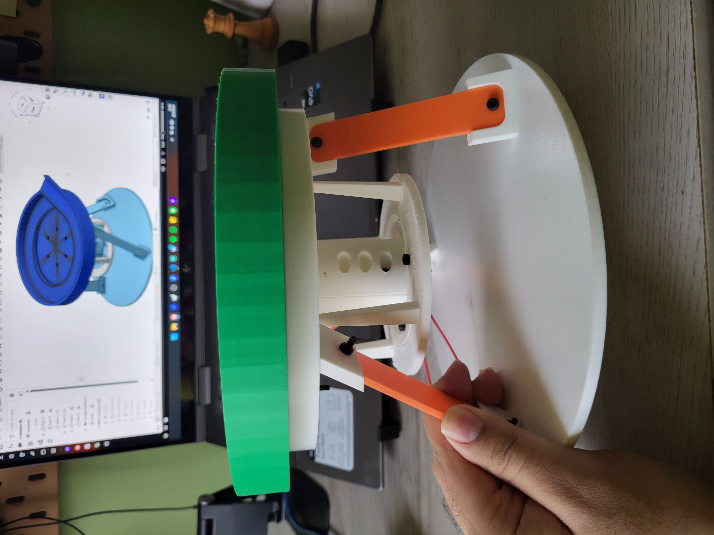
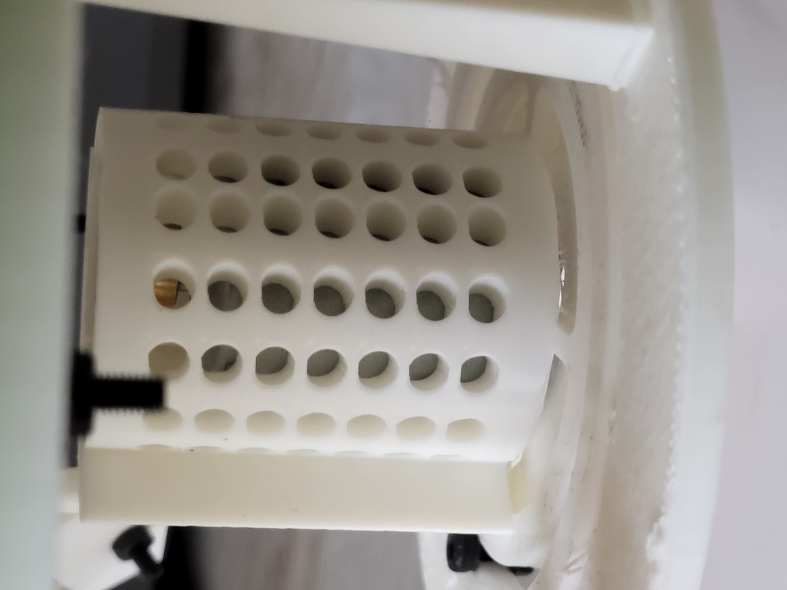

The focus for development will first be on the vibration bowl feeder, as that is the more difficult thing to prototype between the vibration bowl feeder and the conveyor belt system. 

## Version 1.1 (Bowl Feeder)

A design relatively similar to those found in industry and automation will try to be emulated, as it has strong proof of concept. Below is a list of either designed or sourced components to build the bowl feeder:

* Bowl
* 3x 1027 Vibration Motors
* Underside Bowl Motor Holder (to ensure motors are pressed against bowl to transfer vibrations)
* 3x Shims set 120 degrees apart (to add dampening to system)
* Hardware

 

### CAD

Pictures of Components and Assembly (Click thumbnail to enlarge):

<!-- Lightbox overlay -->

  <button id="prevBtn" style="position:absolute; left:20px; color:white; font-size:2rem; background:none; border:none; cursor:pointer;">&#10094;</button>
  
  <button id="nextBtn" style="position:absolute; right:20px; color:white; font-size:2rem; background:none; border:none; cursor:pointer;">&#10095;</button>

 

### Testing

No images/videos are present after the very brief testing session I had with Version 1.1. Below I have written out some observations of the test.

Observations:

* Prototype was easy to assembly (minus any soldering that had to be done due to the tiny wires and my inexperience)
* Despite using 3 1027 vibration motors, the objects did not move at all.
* The vibration power was way too low to be able to get the objects to vibrate. This was after testing various kinds of objects with various weights.

Conclusions:

* I severly underestimated the power of a 1027 vibration motor. They are best used to give haptic feedback, but not great for vibrating an entired bowl and any components within.
* This development path *might* have some scope, but is yet to be seen.

Path Forward:

* Source a stronger vibration motor that can also work with higher voltages.
* Adjust design to be able to accomodate new motor in such a way to add some dampening to ensure the right parts are vibrating. 

## Version 1.2 (Bowl Feeder)

This design is iterated on from Version 1.1, instead focusing on using a stronger vibration motor to be able to hopefully send objects up the correct path. 

Only major changes from this version and last are as follows:

a. Stronger motor to be used for this version, similar to [this](https://www.amazon.com/BOJACK-Vibration-Powerful-Electric-Vibrating/dp/B09XDWPMHY?crid=344LZIOIJ2UMH&dib=eyJ2IjoiMSJ9.4yqE2nAsITNwGBaFFFZvBsvEe7R-BjQ2ylXm4YD-Kknhh8Q8sYr3qxoCE1yOcaQgiWF-xtW98S4MtWq4IzyZXIZF2rXuENizKRC6hiC3bEMZDtXB1mLDbAWZqofBj6DDsn7Su8uR7_VbgZWrMUGFG8ot62ig7DEj_ZijLlYtwuXxS4VxSw609LC56gq2COmqZ60u1AKPNo2ExM18nlbVlWEtlCAjfmJ9-WUtZtsX9KsxXMjtsrz6CTv3t_eqnFNWIxBD41QBkcTvmV8tKh7V0lSsJ0UdSLQrs3PfR-YKqNY.117149ohpb2kpMDt-QEpF8PgknT2ZwcELosqVc5E2U8&dib_tag=se&keywords=vibration+motors+uxcell&qid=1759446219&sprefix=vibration+motors+uxcel%2Caps%2C151&sr=8-16) one from Amazon. 

b. Any related design changes made to be able to accomodate motors, which meant a redesign of the underside area of the bowl itself. 

List of components included in this design below:

* Bowl (same as before)
* Eccentric Rotating Mass Vibration Motor
* Motor Grip
* Motor Housing
* 3x Shims set 120 degrees apart (same as before)
* Hardware

### CAD

Pictures of Components and Assembly (Click thumbnail to enlarge):

<!-- Lightbox overlay -->

  <button id="prevBtn2" style="position:absolute; left:20px; color:white; font-size:2rem; background:none; border:none; cursor:pointer;">&#10094;</button>
  
  <button id="nextBtn2" style="position:absolute; right:20px; color:white; font-size:2rem; background:none; border:none; cursor:pointer;">&#10095;</button>

 

### Testing

A few images are included below to show the final result of the assembly, along with my obvervations for the test.

  
  
  
  

Observations:

* Prototype was easy to assemble, relatively similar to the last version with now more components.
* Motor was significantly more powerful, and I had to end up holding it down while I was doing my testing initially.
* Despite placing the motor horizontally in an effort to reduce the vertical attentuation, there was still significant vertical movement in the objects and the table I was testing on. A litle bit of vertical vibrations was to be expected and in fact, welcome, due to the fact the objects had to rotate up. 
* The objects made it about 1/4 of the way up before the vibrations were bouncing up and down way too much, and would either fall back down the ramp or fly out of the bowl. 
* After trying several voltages (ranging from 3.3V to 9V), the same things occured, which means that the concept is inherently limited.

Post-Test Actions:

* I don't have too much knowledge of vibrations and dampening apart from a spring mass damper system that I was taught in controls class. 
* I was expecting a concept that seemed easy to tune and get working to be very plug and play, when in fact, there are a lot more factors that go into the design than was expected.
* To try to fix the issue, I went online and tried to research what could be done with the motor placement. All I found was that the angle that it is placed at matters, but that is something that has to be extensively tested with the setup I have currently.

Conclusions:

* This concept has potential to work, however, it would either require: 
    1. Extensive testing on my side
    2. Another person to be working alongside me to solely focus on tuning my current setup (ideally someone with more knowledge than me on the matter)
    3. A complete design overhaul of something that has nothing to do with either object detection, object sorting, or playing with more YOLO models

Path Forward:

Based on the conclusions and the results of the testing, it is best to go down a different concept path that has more potential to be proven and to redefine the scope of the project. While object feeding would be nice, it is NOT a necessary part to get a minimum viable product up and running. Despite the system not auto feeding, I believe that something like this can still reduce object sorting times, and there is scope for object feeding to be added.

Because of what is mentioned above, this concept is now deemed *shelved* and is put aside for an unspecified amount of time, and will most likely be revisited when drawing conclusions for the overall project.